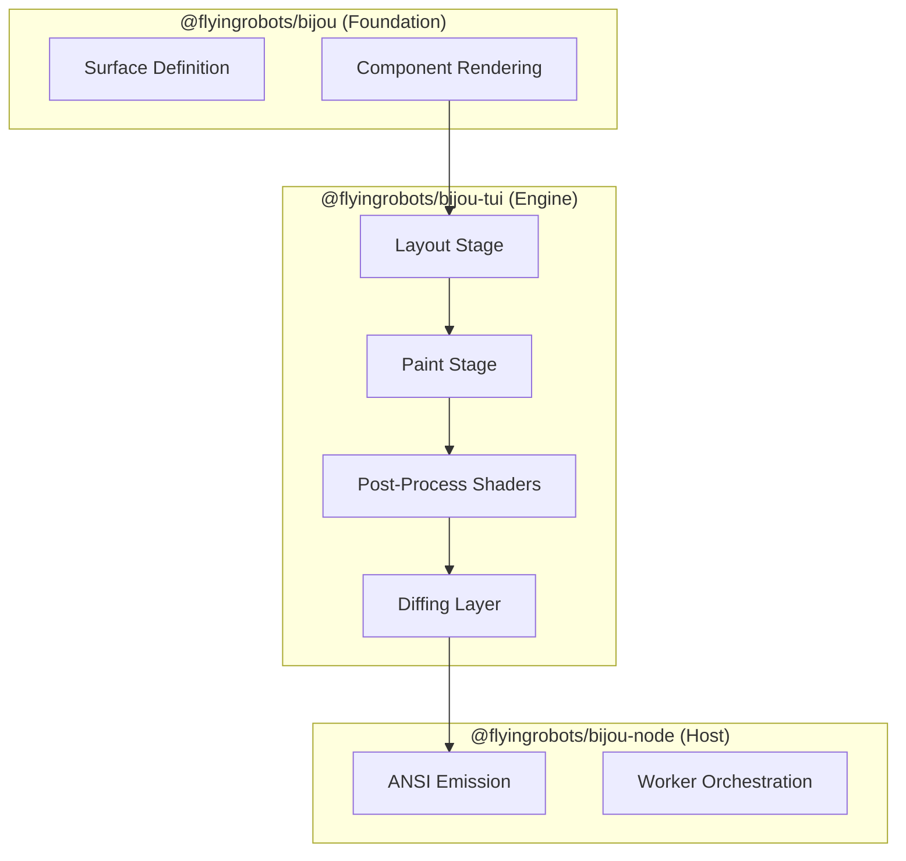

# Advanced Guide — Bijou

This is the second-track manual for Bijou.

Use the root [README](./README.md) and the package `GUIDE.md` files when you
want the productive-fast path. Use this guide when you need the deeper
doctrine, the proving surfaces, or the repo workflows that sit behind the
public quick starts.

## What Belongs Here

This guide is for topics like:

- bytes-only internal rendering rules and explicit string boundaries
- shell doctrine and `createFramedApp()` ownership
- programmable pipeline, shaders, paint, transforms, and middleware seams
- DOGFOOD as the canonical proving surface
- performance and soak workflows
- localization workflows and bidirectionality posture
- worker/runtime boundaries and scripted capture
- smoke, PTY, canary, and release-readiness expectations

## Reading Order

Use this sequence when you need repo-truth beyond the quick path:

1. Read the [Root README](./README.md) for the package map and public posture.
2. Read the package guide you are actively using.
3. Read the matching package `ADVANCED_GUIDE.md`.
4. Use DOGFOOD, the performance docs, and the strategy/spec docs as the
   proving surfaces for the subsystem you are touching.

## Package Lanes

- Core advanced work: [packages/bijou/ADVANCED_GUIDE.md](./packages/bijou/ADVANCED_GUIDE.md)
- Runtime advanced work: [packages/bijou-tui/ADVANCED_GUIDE.md](./packages/bijou-tui/ADVANCED_GUIDE.md)
- Node/runtime-boundary work: [packages/bijou-node/ADVANCED_GUIDE.md](./packages/bijou-node/ADVANCED_GUIDE.md)
- Localization runtime: [packages/bijou-i18n/README.md](./packages/bijou-i18n/README.md)
- Localization tooling: [packages/bijou-i18n-tools/README.md](./packages/bijou-i18n-tools/README.md)
- Filesystem exchange tooling: [packages/bijou-i18n-tools-node/README.md](./packages/bijou-i18n-tools-node/README.md)
- Spreadsheet exchange tooling: [packages/bijou-i18n-tools-xlsx/README.md](./packages/bijou-i18n-tools-xlsx/README.md)

## Rendering Doctrine

The core rendering posture is simple:

- structured terminal UI should stay on the `Surface` path
- strings are explicit boundary output, not the internal runtime model
- themes, backgrounds, and shell chrome should resolve to bytes before the hot
  render loop, not by reparsing strings every frame
- lowering back to text is allowed, but it should happen deliberately at the
  boundary

Start here when that doctrine matters:

- [packages/bijou/ADVANCED_GUIDE.md](./packages/bijou/ADVANCED_GUIDE.md)
- [packages/bijou-tui/ADVANCED_GUIDE.md](./packages/bijou-tui/ADVANCED_GUIDE.md)
- [Byte-Pipeline Recovery](./docs/perf/RE-017-byte-pipeline.md)
- [Low-Allocation Renderer](./docs/strategy/low-allocation-renderer.md)
- [Rendering Pipeline Spec](./docs/specs/rendering-pipeline.spec.json)

## Shells, DOGFOOD, And Proving Apps

DOGFOOD is not a side example. It is the canonical human-facing docs and shell
proving surface for the repo.

Use these docs when you are shaping shell behavior, shell-owned overlays,
settings, notification review, or documentation posture:

- [DOGFOOD](./docs/DOGFOOD.md)
- [DOGFOOD strategy note](./docs/strategy/dogfood.md)
- [Humane Shell](./docs/strategy/humane-shell.md)
- [Settings Belong To The Shell](./docs/strategy/settings-belong-to-the-shell.md)
- [Notification History Belongs To The Shell](./docs/strategy/notification-history-belongs-to-the-shell.md)
- [packages/bijou-tui/ADVANCED_GUIDE.md](./packages/bijou-tui/ADVANCED_GUIDE.md)

Useful proving surfaces:

- [examples/docs/app.ts](./examples/docs/app.ts)
- [examples/release-workbench/main.ts](./examples/release-workbench/main.ts)
- [scripts/docs-preview.test.ts](./scripts/docs-preview.test.ts)
- [tests/cycles/RE-017/frame-shell-theme-dogfood-demo.test.ts](./tests/cycles/RE-017/frame-shell-theme-dogfood-demo.test.ts)

## Pipeline, Shaders, Painting, And Transforms

If you are touching frame-to-frame rendering, post-process effects, or shader
behavior, do not stop at the API entrypoints. Read the doctrine and the
implementation seams together.

Start here:

- [packages/bijou-tui/ADVANCED_GUIDE.md](./packages/bijou-tui/ADVANCED_GUIDE.md)
- [packages/bijou-tui/src/pipeline/pipeline.ts](./packages/bijou-tui/src/pipeline/pipeline.ts)
- [paint middleware](./packages/bijou-tui/src/pipeline/middleware/paint.ts)
- [motion middleware](./packages/bijou-tui/src/pipeline/middleware/motion.ts)
- [css middleware](./packages/bijou-tui/src/pipeline/middleware/css.ts)
- [grayscale middleware](./packages/bijou-tui/src/pipeline/middleware/grayscale.ts)
- [transition shaders](./packages/bijou-tui/src/transition-shaders.ts)
- [Shader V2 Spec](./docs/specs/shader-v2.spec.json)
- [Render Pipeline guide backlog note](./docs/method/backlog/inbox/DX_008-render-pipeline-guide.md)

## Performance And Soak Work

Bijou treats performance as a product surface, not as a cleanup pass.

The current performance and soak lane is spread across:

- [examples/perf-gradient/main.ts](./examples/perf-gradient/main.ts)
- [perf overlay](./packages/bijou/src/core/components/perf-overlay.ts)
- [Byte-Pipeline Recovery](./docs/perf/RE-017-byte-pipeline.md)
- [4.4.0 release notes](./docs/releases/4.4.0/whats-new.md)
- [Debug Performance Overlay Component](./docs/method/backlog/cool-ideas/DX_006-debug-performance-overlay-component.md)

That is the lane to read when you are investigating hot-loop cost, proving a
new optimization, or deciding whether a feature belongs in the runtime,
middleware, or shell.

## Localization And I18n Workflows

Localization is not only string substitution. The repo posture includes
directionality, shell copy, proving surfaces, and exchange workflows.

Start here:

- [Localization and Bidirectionality](./docs/strategy/localization-and-bidirectionality.md)
- [packages/bijou-i18n/README.md](./packages/bijou-i18n/README.md)
- [packages/bijou-i18n-tools/README.md](./packages/bijou-i18n-tools/README.md)
- [packages/bijou-i18n-tools-node/README.md](./packages/bijou-i18n-tools-node/README.md)
- [packages/bijou-i18n-tools-xlsx/README.md](./packages/bijou-i18n-tools-xlsx/README.md)
- [LX-001 runtime package design](./docs/design/LX-001-bijou-i18n-runtime-package.md)
- [LX-002 tooling package design](./docs/design/LX-002-bijou-i18n-tools-package.md)

When validating localization work, also look at the proving surfaces:

- [examples/docs/app.ts](./examples/docs/app.ts)
- [scripts/docs-preview.test.ts](./scripts/docs-preview.test.ts)
- [tests/cycles/LX-008/localized-shell-and-dogfood.test.ts](./tests/cycles/LX-008/localized-shell-and-dogfood.test.ts)

## Runtime Boundaries, Workers, And Capture

If the question is about Node ownership, worker threads, recorder flows, or how
Bijou crosses the runtime boundary, read the Node lane directly:

- [packages/bijou-node/ADVANCED_GUIDE.md](./packages/bijou-node/ADVANCED_GUIDE.md)
- [worker runtime spec](./docs/specs/worker-runtime.spec.json)
- [examples/v3-worker/README.md](./examples/v3-worker/README.md)
- [examples/v3-worker/main.ts](./examples/v3-worker/main.ts)
- [examples/v3-worker/record.ts](./examples/v3-worker/record.ts)

## Testing, PTY, And Release Proof

The advanced bar in Bijou is not “unit tests only.” Real proof usually spans:

- deterministic package tests
- DOGFOOD/docs preview tests
- PTY or canary smoke coverage
- release-readiness and release-preflight
- targeted performance probes when render-path work changes

Useful anchors:

- [scripts/smoke-canaries.ts](./scripts/smoke-canaries.ts)
- [scripts/smoke-dogfood.test.ts](./scripts/smoke-dogfood.test.ts)
- [scripts/docs-preview.test.ts](./scripts/docs-preview.test.ts)
- [docs/release.md](./docs/release.md)
- [docs/method/release-runbook.md](./docs/method/release-runbook.md)

## Rule Of Thumb

If the public `GUIDE.md` got you productive, stay there.

If you are asking “how does the shell own this,” “where should this render-path
decision live,” “how do we prove this in DOGFOOD,” or “what workflow keeps this
truthful across runtime modes,” you are in `ADVANCED_GUIDE` territory.
