# bijou

**The hexagonal toolkit for beautiful, bulletproof terminal interfaces.**

`bijou` is a professional-grade TUI framework for TypeScript. Inspired by the Go-based Charm ecosystem (**Bubble Tea**, **Lip Gloss**), `bijou` brings rigorous software engineering to terminal output through a zero-dependency core, a "Ports and Adapters" architecture, and intelligent graceful degradation.

---

## 💎 Why bijou?

*   **Hexagonal Architecture:** The core logic is decoupled from the runtime. Swap Node.js for Bun, Deno, or a custom WASM host by providing three simple "Ports" (I/O, Style, Runtime).
*   **Zero-Dependency Core:** `@flyingrobots/bijou` is pure TypeScript with no external dependencies. Security and stability by design.
*   **Intelligent Output Modes:** Your CLI automatically adapts its rendering based on the environment (TTY, CI, Piped, or Accessible).
*   **"Tests ARE the Spec":** Every feature is defined by its tests. Acceptance criteria are written as test descriptions first, ensuring 100% deterministic behavior across modes.
*   **Theme Engine:** First-class support for RGB/Hex colors, gradients, and **DTCG (Design Tokens Community Group)** interop.

---

## 🎨 Design Systems & DTCG

`bijou` isn't just about terminal colors; it's a bridge to your professional design system. By following the **Design Tokens Community Group (DTCG)** specification, `bijou` works natively with the industry's leading tools:

- **[Tokens Studio for Figma](https://tokens.studio/):** Design your CLI theme in Figma and export it directly to `bijou`.
- **[Style Dictionary](https://styledictionary.com/):** Use Amazon's Style Dictionary to transform your enterprise tokens into `bijou`-ready DTCG JSON.

### Built-in Presets
`bijou` ships with professional presets that go beyond basic ANSI:
- `nord`: The arctic, clean Polar Night aesthetic.
- `catppuccin`: Modern, vibrant, and high-contrast (Mocha variant).
- `cyan-magenta`: The classic high-energy `bijou` default.

---

## 📂 Custom Themes

Themes in `bijou` are 100% data-driven. You can drop a JSON file into your project and load it instantly without a single line of code change.

### Loading via Environment Variable
Point `BIJOU_THEME` to a local file path:
```bash
BIJOU_THEME=./themes/my-brand.json node my-cli.js
```

### Theme Schema (DTCG)
A simple `my-theme.json` looks like this:
```json
{
  "name": { "$value": "my-theme" },
  "status": {
    "success": { "$type": "color", "$value": "#00ff00" },
    "error": { "$type": "color", "$value": "#ff0000" }
  },
  "gradient": {
    "brand": {
      "$type": "gradient",
      "$value": [
        { "pos": 0, "color": "#00ffff" },
        { "pos": 1, "color": "#ff00ff" }
      ]
    }
  }
}
```

---

## 🧩 Extending Themes

Building a CLI on top of bijou? Use `extendTheme()` to add domain-specific status/ui/gradient keys without cloning entire theme objects, and `styled()`/`styledStatus()` to apply them without reaching through the context.

```typescript
import {
  extendTheme, styled, styledStatus, tv,
  CYAN_MAGENTA, createThemeResolver,
} from '@flyingrobots/bijou';

// 1. Extend a base theme with your domain keys
const myTheme = extendTheme(CYAN_MAGENTA, {
  status: {
    DEPLOYED:    tv('#34d399'),
    ROLLING_BACK: tv('#f97316'),
    CANCELLED:   tv('#6b7280', ['strikethrough']),
  },
  ui: {
    clusterName: tv('#60a5fa', ['bold']),
  },
});

// 2. Register it with the theme resolver
const resolver = createThemeResolver({
  presets: { 'my-theme': myTheme },
  fallback: myTheme,
});

// 3. Use freestanding helpers — no getDefaultContext() boilerplate
console.log(styledStatus('DEPLOYED', 'All pods healthy'));
console.log(styled(tv('#ff00ff', ['bold']), 'Highlighted text'));
```

### Helpers at a glance

| Export | Purpose |
| :--- | :--- |
| `extendTheme(base, { status?, ui?, gradient? })` | Shallow-merge new keys onto a base theme |
| `styled(token, text)` | Apply a `TokenValue` via the default context's `StylePort` |
| `styledStatus(status, text?)` | Look up `theme.status[key]` (falls back to `muted`) |
| `tv(hex, modifiers?)` | Shorthand to construct a `TokenValue` |

---

## 🚀 Quick Start

```bash
npm install @flyingrobots/bijou @flyingrobots/bijou-node
```

```typescript
import { initDefaultContext } from '@flyingrobots/bijou-node';
import { box, headerBox, gradientText } from '@flyingrobots/bijou';

// 1. Initialize Node.js adapters (auto-detects TTY, CI, NO_COLOR)
const ctx = initDefaultContext();

// 2. Use high-level components
console.log(headerBox('Bijou CLI', { detail: 'v1.0.0' }));

// 3. Create stunning visuals with zero effort
const rainbow = [
  { pos: 0, color: [0, 200, 255] },
  { pos: 1, color: [255, 0, 128] },
];

console.log(
  box(gradientText('Beautifully degraded terminal output.', rainbow), {
    padding: { left: 2, right: 2, top: 1, bottom: 1 }
  })
);
```

---

## 🧱 Components

Every component gracefully degrades across all four output modes — full Unicode in interactive, plain text in pipe, screen-reader friendly in accessible.

### Layout

```
box()                           headerBox()
┌──────────────────┐            ┌─ Deploy ─────────────┐
│  Hello, world!   │            │  v2.1.0 → production  │
└──────────────────┘            └───────────────────────┘

separator()
──────────── New Section ─────────────
```

### Elements

```
badge()                         kbd()
 SUCCESS   ERROR   WARNING       ⌘   Shift   P

alert()
┌─ ✓ Success ──────────────────┐
│  Operation completed.        │
└──────────────────────────────┘

skeleton()
░░░░░░░░░░░░░░░░░░░░
░░░░░░░░░░░░░░░░░░░░
```

### Data

```
table()                              tree()
┌──────────┬──────────┐              src
│ Name     │ Status   │              ├─ components
├──────────┼──────────┤              │  ├─ box.ts
│ api      │ Active   │              │  └─ table.ts
│ worker   │ Pending  │              └─ index.ts
└──────────┴──────────┘

accordion()                          timeline()
▼ Getting Started                    ● Deploy started
  npm install @flyingrobots/bijou    │
▶ Configuration                      ● Tests passing
▶ API Reference                      │
                                     ○ Awaiting review
```

### Navigation

```
tabs()
 ● Dashboard  │  Settings  │  Users (3)

breadcrumb()
Home › Settings › Profile

stepper()                            paginator()
 ✓ Account ── ● Payment ── ○ Confirm  ● ○ ○ ○
```

### Animation & Progress

```
spinner()                       progressBar()
⠋ Loading dependencies...       75%  ████████████░░░░
```

`createSpinner()` and `createProgressBar()` provide live-updating controllers. `gradientText()` paints any string with a multi-stop color gradient. `loadRandomLogo()` renders ASCII art logos at `small`, `medium`, or `large` sizes.

### Forms

```
input()                              select()
? Your name: █                       ? Pick a framework:
                                       ● Next.js
confirm()                              ○ Remix
? Continue? (Y/n): █                   ○ Astro

multiselect()                        group()
? Select features:                   Chains multiple prompts
  ☑ TypeScript                       into a single result object.
  ☐ ESLint
  ☑ Prettier
```

All form components support validation, defaults, and degrade to numbered-list selection in pipe/CI modes.

### Demos

Two runnable demos showcase every component:

- **`demo.ts`** — Static CLI showcase: themes, boxes, badges, alerts, trees, timelines, and more
- **`demo-tui.ts`** — Interactive TUI: 5-tab explorer with live spinners, animated progress bars, and theme cycling (press `t`)

```bash
npx tsx demo.ts
npx tsx demo-tui.ts
```

### Roadmap

These components are planned for future releases:

| Component | Category | Description |
| :--- | :--- | :--- |
| `modal()` | Overlay | Centered dialog with backdrop |
| `toast()` | Overlay | Auto-dismissing notification popup |
| `drawer()` | Overlay | Slide-in side panel |
| `commandPalette()` | Navigation | Fuzzy-searchable action picker |
| `viewport()` | Layout | Scrollable content pane |
| `place()` | Layout | 2D text placement with alignment |
| `list()` | Data | Ordered/unordered lists with custom bullets |
| `markdown()` | Data | Render markdown with syntax highlighting |
| `textarea()` | Forms | Multi-line input with scroll and line numbers |
| `appFrame()` | TUI | Full app shell with tabs, help overlay, and scroll state |

---

## 🏗️ Architecture

`bijou` is split into a runtime-agnostic **Core** and specific **Adapters**.

```mermaid
graph LR
  subgraph Core ["@flyingrobots/bijou (zero deps)"]
    Components["Components<br />box · table · spinner<br />progress · gradient"]
    Theme["Theme Engine<br />presets · DTCG"]
    Forms["Forms<br />input · select · confirm"]
    Ports((Ports))
    Components --- Ports
    Theme --- Ports
    Forms --- Ports
  end

  subgraph Adapters ["Platform Adapters"]
    Node["@flyingrobots/bijou-node<br />(Chalk · Readline · Process)"]
    Test["Test Adapters<br />(MockIO · PlainStyle)"]
  end

  Ports -- RuntimePort --> Node
  Ports -- IOPort --> Node
  Ports -- StylePort --> Node

  Ports -- RuntimePort --> Test
  Ports -- IOPort --> Test
  Ports -- StylePort --> Test
```



### Intelligent Output Modes

`bijou` detects the environment and changes behavior to ensure your CLI never breaks.

| Mode | Trigger | Behavior |
| :--- | :--- | :--- |
| **Interactive** | Standard TTY | Full RGB colors, unicode borders, animations. |
| **Static** | `CI=true` | Single-frame rendering, animations disabled. |
| **Pipe** | `TERM=dumb` or Piped | Plain text, ASCII fallbacks, no decorations. |
| **Accessible** | `BIJOU_ACCESSIBLE=1` | Screen-reader friendly prompts and layouts. |

---

## 🆚 bijou vs. The World

| Feature | **bijou** | **Ink** (React) | **Clack / Enquirer** | **Chalk / Kleur** |
| :--- | :--- | :--- | :--- | :--- |
| **Architecture** | **Hexagonal (Ports)** | Component Tree | Imperative | Functional |
| **Core Dependencies** | **Zero** | 50+ (React/Yoga) | 5-10 | Zero |
| **Pluggable Runtime** | **Yes** (Node, Bun, WASM) | No (Node only) | No (Node only) | Yes |
| **Auto-Degradation** | **Built-in** (4 modes) | Manual/Limited | Manual | Manual |
| **Accessible Mode** | **Native** | No | No | No |
| **State Pattern** | **TEA** (Elm Architecture) | Hooks (React) | Callbacks | N/A |
| **Theme System** | **DTCG** (Design Tokens) | Inline Styles | Hardcoded | Manual |

### The "Jenkins Log" Test
Most TUI libraries output "garbage" ANSI escape codes when piped to a file or a CI log. `bijou` detects the lack of a TTY and automatically switches to `pipe` mode (plain text) or `static` mode. Your logs remain searchable and readable without extra effort.

### Testing without Mocks
Because `bijou` uses Ports, you don't have to mock `process.stdout` or use complex TTY simulators. You simply pass a `MockIO` port to your component and assert on the string buffer. This makes your UI tests fast, deterministic, and isolated.

---

## 🛠️ Project Structure

*   **`@flyingrobots/bijou`**: The zero-dependency core. Contains the theme engine, pure-view components, and port interfaces.
*   **`@flyingrobots/bijou-node`**: The official Node.js adapter. Bridges `process`, `readline`, and `chalk` to the core ports.
*   **`@flyingrobots/bijou-tui`**: An experimental **TEA (The Elm Architecture)** runtime for building complex, stateful terminal applications.

---

## 📜 Philosophy: Tests as Spec

In `bijou`, we don't just "write tests"—the tests are the formal specification of the library's behavior. We use a "Red -> Green" cycle where every UI component is validated across all four output modes using `mockIO` and `plainStyle` adapters.

This ensures that if a component looks good in your terminal, it is **guaranteed** to be readable in a Jenkins log or a screen reader.

---

## 📄 License

MIT © [James Ross](mailto:james@flyingrobots.dev)
