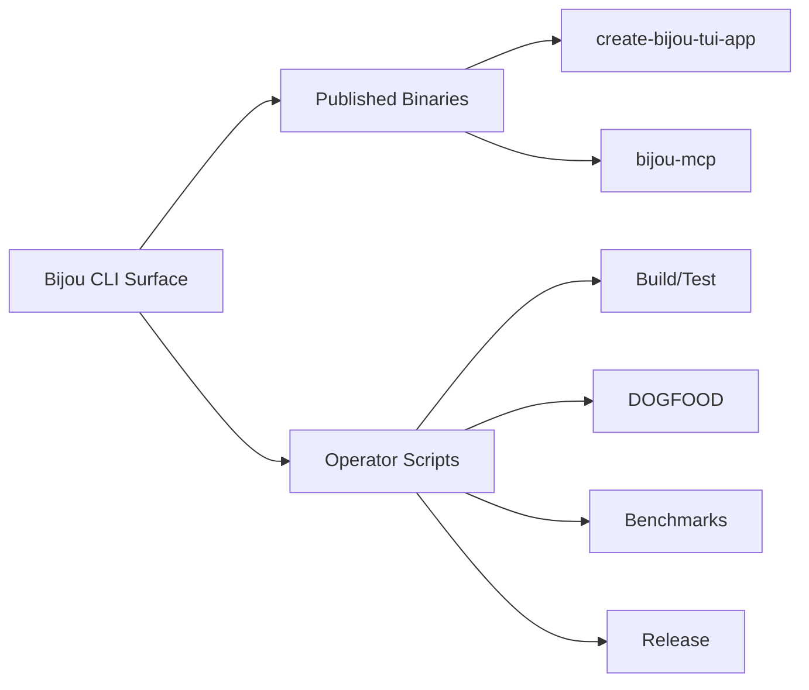

# CLI

The Bijou command surface is a composite of published binaries and repo-local operator scripts.



## Published Binaries

### `create-bijou-tui-app`
Scaffold a new high-fidelity TUI workspace.
```bash
npm create bijou-tui-app@latest my-app
```

### `bijou-mcp`
Run the MCP server exposing Bijou rendering tools over stdio.
```bash
node node_modules/@flyingrobots/bijou-mcp/bin/bijou-mcp.js
```

## Operator Scripts
Execute these from the monorepo root.

### Build & Test
- `npm run build`: Compile the workspace.
- `npm run test`: Execute the test suite.
- `npm run lint`: Run linting and type-checks.

### DOGFOOD & Proving
- `npm run dogfood`: Launch the documentation TUI.
- `npm run smoke:dogfood`: Run the DOGFOOD smoke tests.
- `npm run smoke:canaries`: Execute scaffolding canary tests.

### Performance & Benchmarks
- `npm run bench`: Execute the benchmark suite.
- `npm run bench:ci:gradient`: Run the fixed gradient stress lane used in CI.
- `npm run bench:compare`: Compare results against a baseline.
- `npm run soak`: Run long-duration soak tests.

`npm run bench -- run` now supports:
- `--tag=...` for scenario provenance filtering
- `--format=json` for nested `bench.v2` output
- `--format=jsonl` / `--format=flat` for agent-first flat metric records

---
**The release truth is maintained in [`docs/release.md`](./release.md).**
