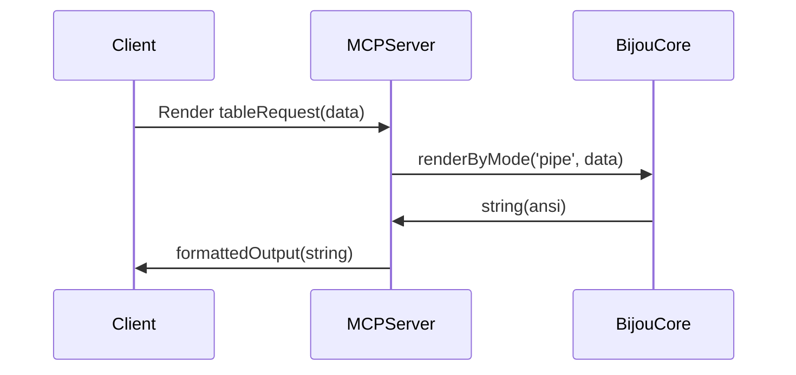

# MCP

This signpost covers Bijou's current MCP surface.



## What Ships Today

Bijou currently ships one MCP package:

- [`@flyingrobots/bijou-mcp`](../packages/bijou-mcp/README.md)

It exposes Bijou terminal components as rendering tools over stdio so an MCP
client can ask for structured terminal output without needing a live TTY.

## What It Is Good For

Use the MCP server when you want:

- box-drawn or structured terminal output inside a chat or agent context
- Unicode-rich output without ANSI escape codes
- component rendering as a tool surface rather than as a fullscreen runtime

## What It Is Not

The MCP package is not the fullscreen app runtime.

It does not own:

- `createFramedApp()`
- shell behavior, pane focus, help, settings, notifications, or quit flow
- animation, motion, diffed terminal rendering, or interactive input routing

For those, use the normal package/runtime docs instead:

- [packages/bijou-tui/GUIDE.md](../packages/bijou-tui/GUIDE.md)
- [packages/bijou-tui/ADVANCED_GUIDE.md](../packages/bijou-tui/ADVANCED_GUIDE.md)

## Configure It

Typical MCP config:

```json
{
  "mcpServers": {
    "bijou": {
      "command": "node",
      "args": ["node_modules/@flyingrobots/bijou-mcp/bin/bijou-mcp.js"]
    }
  }
}
```

The package README has the fuller install/config reference:

- [packages/bijou-mcp/README.md](../packages/bijou-mcp/README.md)

## Tool Families

The current tool surface is grouped around:

- data and structure: tables, trees, DAGs, enumerated lists
- containers and layout: boxes, header boxes, separators, constrain
- feedback and status: alerts, progress, stepper, timeline, logs, badges
- navigation: tabs, breadcrumb, paginator
- rich panels: explainability, inspector, accordion
- utility: keyboard indicators, hyperlinks, skeletons

For the exact tool list and examples, use the package README.

## Read Next

- exact tool catalog and example output:
  [packages/bijou-mcp/README.md](../packages/bijou-mcp/README.md)
- repo command surfaces:
  [docs/CLI.md](./CLI.md)
- architecture and boundaries:
  [ARCHITECTURE.md](../ARCHITECTURE.md)
