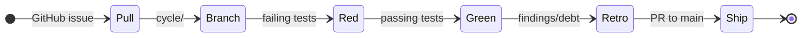

# METHOD

The Bijou work doctrine: an issue tracker, an evidence ledger, a loop, and
honest bookkeeping.

## Principles

- **GitHub Issues are the live tracker.** Labels carry lane, type, priority, and legend state; issue bodies carry the work card.
- **The filesystem is the evidence ledger.** Design docs, witnesses, retros, and changelog entries preserve decisions and proof.
- **Tests are the executable spec.** Design names the problem; tests prove the answer.
- **Reproducibility is the definition of done.** Results must be re-runnable proof, not static artifacts.
- **Process is calm.** No sprints or velocity theater. Work is tracked through issue labels, cycles, and signposts.

## Structure

| Signpost | Role |
| :--- | :--- |
| **`README.md`** | Public front door and package map. |
| **`docs/BEARING.md`** | Current direction and active tensions. |
| **`docs/VISION.md`** | Core tenets and project identity. |
| **`docs/DOGFOOD.md`** | Canonical human-facing docs and proving surface. |
| **`docs/CHANGELOG.md`** | Historical truth of merged behavior. |
| **`docs/METHOD.md`** | Repo work doctrine (this document). |

## Live Tracker

New intake starts as a GitHub Issue. Use the repo issue forms so every card
names:

- the decision summary
- the hill
- sponsored human and agent perspectives
- current truth and the exact problem
- scope and out-of-scope boundaries
- runtime/API or product-surface contract
- lower-mode, accessibility, localization, and inspectability posture
- implementation slices and tests to write first
- acceptance criteria
- expected tests, playback, docs, and retro/closeout evidence
- Method artifact links for design, witness, retro, and PR

Labels are canonical tracker metadata. Maintainers and agents apply them after
triage; contributors may request labels in the issue body.

## Design Document Intake

Issue templates are the default shaping enforcement. The work-item form should
produce an issue body that can be lifted into a design document without
inventing missing sections after the fact.

For implementation work, the issue or design document must name at least one
behavior/software proof against an actual product surface: package API, runtime
behavior, rendered output, scripted app flow, command behavior, schema
validation, lower-mode output, or CI/tooling behavior. Documentation-only proof
is acceptable only for documentation/process work.

Do not block every commit on branch-name-to-design-doc matching. Hotfixes, CI
repairs, dependency repairs, and small maintenance work may not have a full
design doc. Branch/design matching can become a targeted pre-push or CI guard
later for issues explicitly marked `needs-design`, but it should not be the
default commit gate.

## Lane Labels

| Lane | Purpose |
| :--- | :--- |
| **`lane:inbox`** | Raw intake that still needs triage or shaping. |
| **`lane:asap`** | Imminent work to pull into the next cycle. |
| **`lane:bad-code`** | Technical debt or anti-pattern cleanup. |
| **`lane:cool-ideas`** | Uncommitted experiments and optional explorations. |
| **`lane:release`** | Release-boundary shaping or blockers. |

Supporting state labels:

- **`work-in-progress`** means a branch or PR is actively carrying the issue.
- **`blocked`** means a decision or external state is preventing progress.
- **`needs-design`**, **`needs-witness`**, and **`needs-retro`** mean the
  evidence ledger is missing a required artifact.

`docs/method/backlog/` remains in the repo as historical evidence and release
lineage. It is not the first intake path for new work unless a release lane
explicitly says otherwise.

## Closure Archives

| Directory | Purpose |
| :--- | :--- |
| **`docs/method/retro/`** | Finished ideas with shipped or otherwise completed dispositions. These are historical retros, not live backlog. |
| **`docs/method/graveyard/`** | Superseded or abandoned ideas that should not be mistaken for current queue work. |

When searching for current work, start with open GitHub Issues and their
labels. Use repo files to recover context, evidence, and history.

## The Cycle Loop

1. **Pull**: Select a shaped GitHub issue, usually from `lane:asap`.
   Create or link the design artifact under `docs/design/` when the work needs
   a design record.
2. **Branch**: Create `cycle/<cycle_name>`.
3. **Red**: Write failing tests based on the design's playback questions.
4. **Green**: Implement the solution until tests pass.
5. **Retro**: Document findings and follow-on debt in the cycle doc.
6. **Ship**: Push the cycle branch and open a pull request to `main`.
   Link the PR from the issue and update `BEARING.md` and `CHANGELOG.md` when
   the change affects direction or user-facing behavior.

## Naming Convention
Design and retro files follow: `<LEGEND>-<id>-<slug>.md`
Example: `RE-007-migrate-framed-shell-onto-runtime-engine-seams.md`
