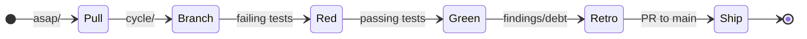

# METHOD

The Bijou work doctrine: A backlog, a loop, and honest bookkeeping.

## Principles

- **The filesystem is the coordination layer.** Directories are priorities; filenames are identities; moves are decisions.
- **Tests are the executable spec.** Design names the problem; tests prove the answer.
- **Reproducibility is the definition of done.** Results must be re-runnable proof, not static artifacts.
- **Process is calm.** No sprints or velocity theater. Work is tracked through lanes, cycles, and signposts.

## Structure

| Signpost | Role |
| :--- | :--- |
| **`README.md`** | Public front door and package map. |
| **`docs/BEARING.md`** | Current direction and active tensions. |
| **`docs/VISION.md`** | Core tenets and project identity. |
| **`docs/DOGFOOD.md`** | Canonical human-facing docs and proving surface. |
| **`docs/CHANGELOG.md`** | Historical truth of merged behavior. |
| **`docs/METHOD.md`** | Repo work doctrine (this document). |

## Backlog Lanes

| Lane | Purpose |
| :--- | :--- |
| **`asap/`** | Imminent work; pull into the next cycle. |
| **`up-next/`** | Queued after `asap/`. |
| **`cool-ideas/`** | Uncommitted experiments. |
| **`bad-code/`** | Technical debt that must be addressed. |
| **`inbox/`** | Raw ideas. |

## Closure Archives

| Directory | Purpose |
| :--- | :--- |
| **`docs/method/retro/`** | Finished ideas with shipped or otherwise completed dispositions. These are historical retros, not live backlog. |
| **`docs/method/graveyard/`** | Superseded or abandoned ideas that should not be mistaken for current queue work. |

## The Cycle Loop

1. **Pull**: Move an item from `asap/` to `docs/design/`.
2. **Branch**: Create `cycle/<cycle_name>`.
3. **Red**: Write failing tests based on the design's playback questions.
4. **Green**: Implement the solution until tests pass.
5. **Retro**: Document findings and follow-on debt in the cycle doc.
6. **Ship**: Push the cycle branch and open a pull request to `main`.
   Update `BEARING.md` and `CHANGELOG.md` after merge.

## Naming Convention
Backlog and cycle files follow: `<LEGEND>-<id>-<slug>.md`
Example: `RE-007-migrate-framed-shell-onto-runtime-engine-seams.md`
