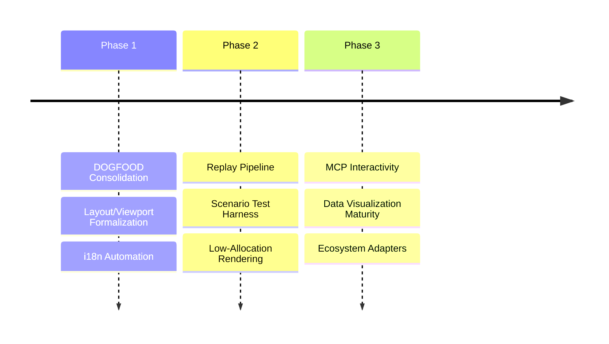

# ROADMAP

This file is a reference-only strategic horizon.

Active execution does not start here. Current work is tracked through:

- `docs/METHOD.md` for workflow doctrine
- `docs/method/backlog/` for live backlog capture
- `docs/design/` for cycle-owned design truth
- `docs/BEARING.md` for current directional tension

Use this page to understand long-range direction, not to infer the current queue.

## Strategic Horizon

### Phase 1: Foundation Integrity
- **DOGFOOD Consolidation**: Unify documentation, story protocols, and component explorers.
- **Layout & Viewport Formalization**: Ensure split panes and scroll regions share a unified interaction model.
- **i18n Automation**: Implement a built-in catalog loader to simplify the localization pipeline.

### Phase 2: Deterministic DX
- **Replay & Scenario Pipeline**: Capture and replay deterministic runtime artifacts.
- **Surface Scenario Test Harness**: Scripted input driving and frame assertions for visual verification.
- **Low-Allocation Rendering**: Optimize the hot render loop via reusable framebuffers.

### Phase 3: Ecosystem & Reach
- **Machine-Readable Interactivity**: Deeper MCP tool integration for AI agents.
- **Data Visualization Maturity**: Implementation of interactive and high-density chart types.
- **Ecosystem Adapters**: Exploration of browser-native and Wasm runtimes.

---
**The goal is inevitably. Every feature is defined by its tests.**
