# Bijou Technical Teardown

This document is an end-to-end explanation of the Bijou repository as it stands
on June 1, 2026. It assumes no prior knowledge of Bijou, terminal UI engines,
The Elm Architecture, or the repository's history.

## Orientation

### Table Of Contents

- [Executive Summary](#executive-summary)
- [A "Domain Dictionary" (Glossary)](#a-domain-dictionary-glossary)
- [Where This Project Stands](#where-this-project-stands)
- [Package Overview](#package-overview)
- [External Dependencies And Borders](#external-dependencies-and-borders)
- [Bootstrapping And Runtime](#bootstrapping-and-runtime)
- [The Entry Point](#the-entry-point)
- [The Data Source Of Truth](#the-data-source-of-truth)
- [Anatomy Of A Payload](#anatomy-of-a-payload)
- [Golden Paths](#golden-paths)
- [Unhappy Paths And Error Handling](#unhappy-paths-and-error-handling)
- [Concurrency And Asynchronous Flows](#concurrency-and-asynchronous-flows)
- [Extreme Detail And Highlights](#extreme-detail-and-highlights)
- [Test Coverage](#test-coverage)
- [Use Cases](#use-cases)
- [Why Did We Build It This Way?](#why-did-we-build-it-this-way)
- [Key Features And Notable Design Decisions](#key-features-and-notable-design-decisions)
- [Conclusion](#conclusion)
- [References](#references)
- [Appendices](#appendices)
- [Open Questions](#open-questions)
- [Future Work](#future-work)

### System Mind Map

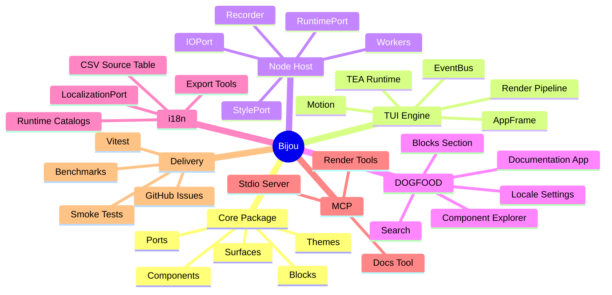

### Reading Strategy

Bijou is easiest to understand in layers. First, treat it as a toolkit that
turns data into terminal output. Next, treat it as a runtime that repeatedly
turns input messages into a new in-memory model and a new rendered frame.
Finally, treat it as a product system: DOGFOOD is a real documentation
application built with the same primitives it documents.

The rest of this teardown follows that progression. It starts with vocabulary,
then package boundaries, then exact entry points, then concrete execution paths,
then the details that make the system unusual.

## Executive Summary

### What This Repository Contains

Bijou is a TypeScript monorepo for building serious terminal software. The core
idea is that terminal output should not be assembled as loose strings with
escape codes sprinkled through them. Instead, Bijou models terminal output as a
two-dimensional grid of cells called a `Surface`, where each cell carries a
glyph, foreground color, background color, modifiers, and opacity-like
rendering metadata.

The repository contains the core rendering toolkit, a full-screen terminal UI
runtime, official Node.js host adapters, an opinionated framed application
shell, a project scaffolder, a localization runtime and toolchain, an MCP
server, benchmark tooling, examples, DOGFOOD documentation, and a large test
corpus.

The packages are versioned in lockstep. The current package version in the
workspace manifests is `5.0.0`. The changelog contains a large `Unreleased`
section, and the current roadmap is shaping the next release boundary as
`v6.0.0`.

### How It Works At A Glance

At the lowest level, `@flyingrobots/bijou` defines pure data structures and
rendering helpers. It knows what a cell is, what a surface is, how a component
should lower for interactive, static, pipe, or accessible output, and how theme
tokens resolve. It does not own the real terminal.

At the runtime level, `@flyingrobots/bijou-tui` runs applications using The Elm
Architecture. An application provides `init`, `update`, and `view`. Input events
become messages. `update` returns the next model plus commands. `view` converts
the model into a `Surface` or `LayoutNode`. The render pipeline paints that
result into a target surface, diffs it against the previous surface, and emits
the smallest practical ANSI update to the terminal.

At the host level, `@flyingrobots/bijou-node` supplies Node-backed ports for
environment facts, I/O, files, styling, timers, and terminal geometry. This
package is the boundary where Bijou intentionally touches `process.stdin`,
`process.stdout`, `fs`, `path`, `readline`, and third-party host libraries such
as `chalk`.

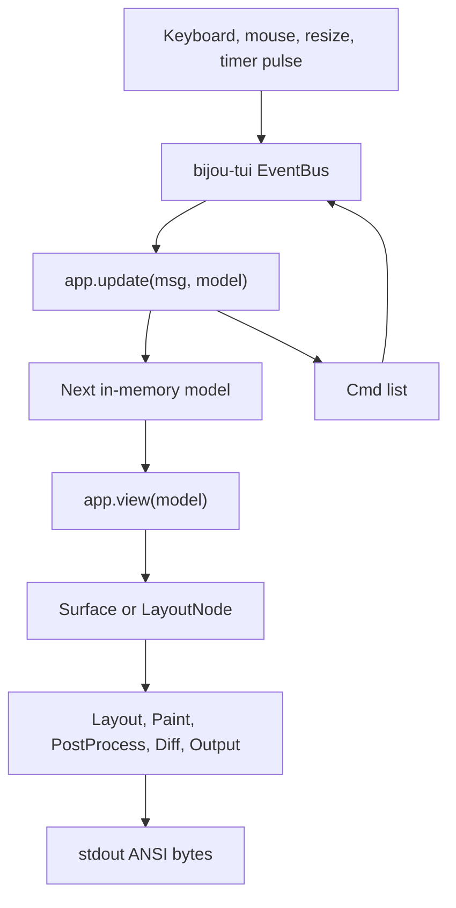

### Current Version And Next Work

Every workspace package manifest currently declares version `5.0.0`. The next
planned release horizon is `v6.0.0`, and the current release thesis is layout
truth plus standard Blocks. The open `v6.0.0` issues named in `docs/ROADMAP.md`
are `#180` for mandatory layout envelope and constraint negotiation, `#181` for
standard Bijou blocks, `#182` for declarative view data binding, and `#186` for
boundary-aware pointer selection and copy.

The project is already far beyond a toy library. It has a live docs
application, a component story catalog, a command/search surface, a localization
workflow, a Mode-aware rendering strategy, a render pipeline with diagnostics,
an MCP server, benchmark scenarios, and a Method-based work tracker. The most
important remaining tension is that the semantic architecture is ahead of some
visible product surfaces. The next release needs to close that gap without
widening into every queued DOGFOOD and component-family audit.

## A "Domain Dictionary" (Glossary)

### Glossary Table

| Term | Definition |
| :--- | :--- |
| [Surface](#surface-cells-and-packed-rendering) | A rectangular terminal cell grid. It is the fundamental rendered value in Bijou. |
| [Cell](#surface-cells-and-packed-rendering) | One position in a `Surface`, containing a character plus style, color, and rendering metadata. |
| [LayoutNode](#render-payloads) | A tree node that describes geometry and optional child surfaces before final painting into a `Surface`. |
| [BijouContext](#setup-phase) | The dependency-injection bundle that carries theme, output mode, runtime facts, I/O, style adapter, and optional clock. |
| [Port](#package-roles-in-the-domain) | A narrow interface that describes what Bijou needs from the outside world without binding the core to Node or a terminal. |
| [Adapter](#package-roles-in-the-domain) | A host implementation of a port. `nodeRuntime`, `nodeIO`, and `chalkStyle` are Node adapters. |
| [TEA](#golden-path-1-tiny-app-startup) | The Elm Architecture: `init` creates state, `update` transforms state from messages, and `view` renders state. |
| [Model](#application-model-state) | The application-owned in-memory source of truth for what the UI should show. |
| [Msg](#tea-message-payloads) | A typed event delivered to `update`, such as a keypress, resize, pulse, mouse event, or app-defined event. |
| [Cmd](#command-execution) | A side-effect function that can run asynchronously and later emit another message, a quit signal, cleanup handle, or nothing. |
| [DOGFOOD](#golden-path-2-dogfood-startup-and-navigation) | Bijou's canonical human-facing documentation app and proving ground. |
| [Block](#blocks-binding-and-semantic-product-surfaces) | A semantic product-surface contract with metadata, data requirements, command intents, modes, and render behavior. |
| [BindingFrame](#blocks-binding-and-semantic-product-surfaces) | A data-binding assembly that records requirements, provider resolutions, facts, and status for semantic views. |
| [Mode lowering](#golden-path-4-table-rendering-and-lowering) | Rendering the same semantic component differently for interactive, static, pipe, and accessible output. |
| [AppFrame](#golden-path-3-documentation-search) | The framed shell system that owns pages, tabs, panes, overlays, settings, search, command palette, and shell chrome. |
| [MCP](#golden-path-5-mcp-component-rendering) | Model Context Protocol. Bijou exposes a stdio MCP server for structured component rendering tools. |
| [i18n Catalog](#localization-payloads) | A namespace-scoped set of localized entries used by the runtime localization system. |
| [Render Pipeline](#render-pipeline-timing-and-framebuffers) | The synchronous stage chain that turns a model's view output into terminal output. |
| [DOGFOOD Search](#golden-path-3-documentation-search) | The `/` search surface that indexes component stories and documentation pages and can jump across top-level pages. |

### Terms In Context

The most important distinction is between rendering vocabulary and product
semantics. Components such as tables, boxes, markdown, badges, timelines, and
trees are the leaf vocabulary. Blocks are larger semantic contracts that say
what a product surface means, what data it requires, what commands it can emit,
and how it lowers outside a rich terminal.

That distinction matters because Bijou is trying to avoid the common terminal UI
failure mode where each screen becomes a pile of one-off string builders. The
component layer should stay general. The Block layer should carry application
meaning. DOGFOOD exists to keep testing whether that distinction survives real
product pressure.

### Naming And Package Boundaries

Package names describe ownership rather than complexity. `@flyingrobots/bijou`
is the foundation. `@flyingrobots/bijou-tui` is the runtime engine.
`@flyingrobots/bijou-node` is the host. `@flyingrobots/bijou-tui-app` is an
opinionated shell builder. The i18n packages split runtime lookup from authoring
and exchange tooling. The MCP package exposes selected core components through
a tool protocol instead of a live terminal.

## Where This Project Stands

### Current State

Bijou is a mature TypeScript terminal UI engine in active pre-release-line
development. It is not merely a component catalog. It has a real runtime,
rendering pipeline, framed application shell, localization runtime, MCP server,
scaffolder, DOGFOOD application, and large verification suite.

The published package line in the manifests is `5.0.0`. The documentation now
points current planning at GitHub Issues and milestones, with `docs/ROADMAP.md`
as a human-readable mirror. The current execution gravity in `docs/BEARING.md`
is to close the `v6.0.0` boundary without letting queued `v7.0.0` DOGFOOD and
component audit work expand the release.

### Notable Achievements

The major achievement is architectural coherence. The core is pure TypeScript
and does not need Node process globals. The runtime consumes ports rather than
reaching directly into the host. Rendering is surface-based rather than
string-first. The runtime diff path uses double buffering and an optional
pooled byte buffer. DOGFOOD is not a static demo; it is a real application
running through the same APIs it documents.

Another important achievement is the recent table work. The string `table()`
component now defaults to fitting human-mode output to available terminal width,
supports word wrapping, exposes multiple visual variants, and keeps TSV as the
default pipe format while allowing CSV, Markdown, and ASCII grid lowerings.

### Active Tensions

The main tension is release scope. `v6.0.0` is close enough that it is tempting
to absorb nearby product polish, but the current documents are explicit that
the release should close, split, or move the remaining issues instead of
becoming a catch-all.

The second tension is geometry truth. Some product surfaces are already
semantic Blocks, but the roadmap still calls out mandatory layout envelope and
constraint negotiation as the structural release keystone. The architecture is
positioned for that work, but the release should prove the geometry contract
rather than treat layout as ad hoc surface measurement.

## Package Overview

### Package Stack

| Package | Role | Key Dependencies |
| :--- | :--- | :--- |
| `@flyingrobots/bijou` | Pure core: ports, surfaces, components, themes, Blocks, binding contracts, mode lowering. | Runtime dependencies: none. |
| `@flyingrobots/bijou-tui` | Full-screen TEA runtime, EventBus, render pipeline, frame shell, motion, overlays, input routing. | `@flyingrobots/bijou-i18n`. |
| `@flyingrobots/bijou-node` | Node host adapters, default context bootstrap, worker helpers, recorder utilities. | `@flyingrobots/bijou-tui`, `chalk`, `gifenc`, `oled-font-5x7`. |
| `@flyingrobots/bijou-tui-app` | Higher-level framed-shell starter for tabbed apps and common shell chrome. | `@flyingrobots/bijou`, `@flyingrobots/bijou-tui`. |
| `create-bijou-tui-app` | CLI scaffolder for creating external Bijou TUI projects. | No runtime package dependencies in the manifest. |
| `@flyingrobots/bijou-i18n` | In-memory localization runtime and `LocalizationPort`. | Runtime dependencies: none. |
| `@flyingrobots/bijou-i18n-tools` | Provider-neutral source table, exchange, catalog, and pseudo-localization tooling. | `@flyingrobots/bijou-i18n`. |
| `@flyingrobots/bijou-i18n-tools-node` | Node file adapters for localization workflow files and bundles. | `@flyingrobots/bijou-i18n`, `@flyingrobots/bijou-i18n-tools`. |
| `@flyingrobots/bijou-i18n-tools-xlsx` | XLSX workbook adapters for spreadsheet-driven localization exchange. | `@flyingrobots/bijou-i18n-tools`, SheetJS `xlsx`. |
| `@flyingrobots/bijou-mcp` | MCP stdio server exposing Bijou render tools and docs metadata. | `@modelcontextprotocol/sdk`, `zod`. |
| `@flyingrobots/bijou-bench` | Private benchmark package for paint, diff, wall-time, and soak scenarios. | Bijou workspace packages. |

### Dependency Posture

The core package deliberately has zero runtime dependencies. That is a strong
architectural choice: terminal cell modeling, theme resolution, Block metadata,
mode lowering, and component rendering remain testable without a host.

The runtime package depends on the i18n runtime because the framed shell and
app-level UI need localized shell text. The Node host package is where platform
libraries belong. The MCP package is deliberately separate because MCP is a
protocol border with its own SDK and schema validation layer.

### Package Roles In The Domain

Bijou's domain is terminal application construction. The package split maps to
the questions an application author asks as their app grows.

If the author needs structured output, they start with `@flyingrobots/bijou`.
If they need an interactive loop, they add `@flyingrobots/bijou-tui`. If they
are running on Node, they use `@flyingrobots/bijou-node`. If they want a
multi-page shell with overlays and command discovery, they reach for
`@flyingrobots/bijou-tui-app` or the lower-level `createFramedApp` API.

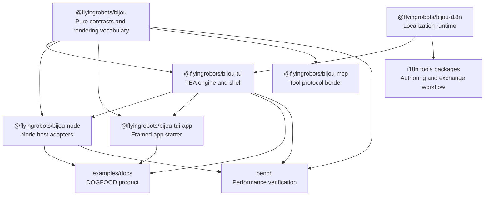

## External Dependencies And Borders

### Runtime Libraries

Most runtime behavior is first-party. The root workspace uses TypeScript,
Vitest, and `tsx` for development. The Node adapter uses `chalk` for styling,
`gifenc` and `oled-font-5x7` for recorder-related output, and Node's standard
library for `fs`, `path`, `readline`, process streams, timers, and terminal
geometry.

The i18n XLSX adapter uses SheetJS `xlsx` from a tarball URL. The MCP package
uses `@modelcontextprotocol/sdk` to speak MCP over stdio and `zod` to describe
and validate tool inputs.

### Third-Party APIs And MCP

The MCP server is a border, not the main runtime. It registers tools with the
MCP SDK and communicates over stdio. Each tool accepts structured JSON, renders
with Bijou using a plain, ANSI-free context, and returns text and optionally
machine-readable structured content.

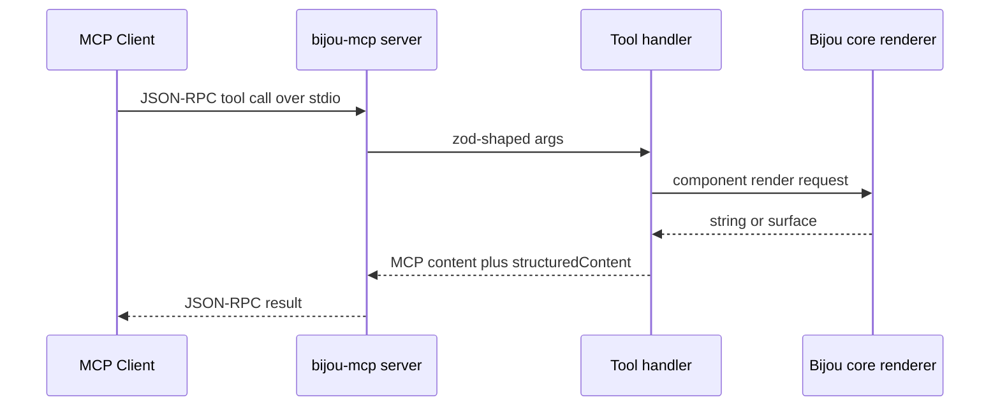

### Operating System Constraints

The repository supports Node.js `>=18`, with Node.js 22 recommended for local
development. CI policy tests Node 18, 20, and 22 on Ubuntu, plus Node 22 on
macOS and Windows. The supported host path is intentionally Node-first for
contributor scripts; release and benchmark workflows may still rely on
Linux-hosted shell behavior where that workflow is explicitly platform-specific.

Terminal behavior remains constrained by the host terminal. Features such as
alternate screen mode, raw input, SGR mouse reporting, truecolor output, resize
events, and cursor control are all ultimately terminal capabilities.

### Security Boundaries And Auth Flows

Bijou does not implement user authentication, JWT handling, session cookies, or
permission grants. There is no auth lifecycle to trace through the core runtime.
The security boundaries are local-process boundaries: which code can access
stdin/stdout, which code can read files, what paths a host adapter is allowed to
touch, and what structured payloads are accepted across protocol borders.

The most explicit security boundary is `scopedNodeIO`. It resolves requested
paths against a root, follows existing path components through realpaths, and
rejects reads or joins that escape the root. MCP tools use schema validation at
the protocol boundary. Localization resource payloads are deep-frozen and
restricted to JSON-shaped values, rejecting functions, symbols, sparse arrays,
accessors, cycles, and class instances.

## Bootstrapping And Runtime

### Setup Phase

Bootstrapping is the phase before the application starts reacting to user
events. In DOGFOOD, this begins in `examples/docs/main.ts`. The code initializes
the default Node context, checks terminal readiness, prints a terminal notice,
constructs the docs app, and passes it to `run`.

The Node bootstrap path is concentrated in `@flyingrobots/bijou-node`.
`createNodeContext` builds a `BijouContext` from `nodeRuntime`, `nodeIO`, and
`chalkStyle`. `initDefaultContext` registers the first context globally unless
an existing safe context is already present. `startApp` is the high-level
convenience wrapper that initializes a context and runs an `App`.

### Runtime Phase

Runtime begins once `run(app, options)` has a model and an EventBus. In
interactive mode, the runtime enters alternate screen mode, optionally enables
mouse tracking, connects raw input and resize sources, starts a pulse timer,
renders the initial frame, and then handles every message through one
subscription.

The app model is the source of truth. The visible terminal is only a projection
of that model through `view`, the render pipeline, the diff algorithm, and
stdout. Commands are the sanctioned path for side effects. A command may run
asynchronously, emit messages, return a message, return a cleanup handle, return
the quit sentinel, or resolve to nothing.

### Configuration And Environment Tuning

Configuration is intentionally small and host-centered.

| Variable Or Option | Owner | Effect |
| :--- | :--- | :--- |
| `NO_COLOR` | Node style adapter | Disables color output by setting the style level to `0`. |
| `BIJOU_THEME` | Node context theme selection | Selects a named preset or theme path when theme selection is not overridden. |
| `BIJOU_FPS` | Node runtime | Overrides detected refresh rate used by pulse scheduling. |
| `LANG`, `LANGUAGE`, `LC_ALL`, `LC_MESSAGES` | DOGFOOD locale adapter | Seed the initial DOGFOOD locale if no saved preference wins first. |
| `HOME`, `XDG_STATE_HOME` | DOGFOOD locale adapter | Determine the default path for saving the selected DOGFOOD locale. |
| `RunOptions.mouse` | TUI runtime | Enables SGR mouse reporting and parsing. |
| `RunOptions.commandBackpressureThreshold` | TUI runtime | Sets the pending-command warning threshold. `0` disables the warning. |
| `RunOptions.surfaceBudget` | TUI runtime | Enables non-fatal surface budget warnings after render. |
| `RunOptions.css` | TUI runtime | Installs BCSS resolver and middleware for component styling. |

Tuning these levers changes host behavior without changing component code. For
example, increasing `BIJOU_FPS` increases pulse frequency, which can make motion
feel smoother but also increases update pressure. Lowering
`commandBackpressureThreshold` makes command pileups visible earlier.

## The Entry Point

### Exact DOGFOOD Entry Point

The concrete entry point for the canonical documentation app is
`examples/docs/main.ts`.

```ts
const ctx = initDefaultContext();
const readiness = dogfoodTerminalReadiness(ctx);
if (!readiness.ok) {
  process.stderr.write(readiness.message);
  process.exit(1);
}
process.stderr.write(DOGFOOD_TERMINAL_NOTICE);
await run(createNodeDocsApp(ctx), { ctx, mouse: true });
```

This entry point is intentionally not `startApp(app)`. DOGFOOD needs explicit
composition before entering the runtime. It initializes the host context, checks
whether the terminal is suitable for a full-screen interactive docs app,
constructs a Node-backed locale port, and enables mouse input.

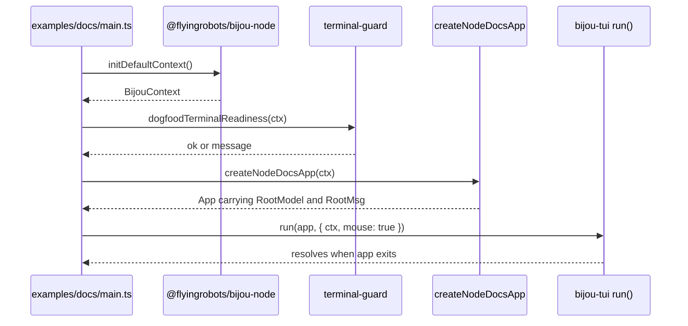

### Library Entry Points

The public package entry points are export barrels. `packages/bijou/src/index.ts`
exports ports, surfaces, context helpers, theme helpers, components, Blocks,
binding primitives, mode rendering, and test adapters. `packages/bijou-tui/src/index.ts`
exports TEA types, runtime functions, EventBus, pipeline types, screen helpers,
commands, shell infrastructure, layout helpers, motion, and AppFrame APIs.

For application authors, the practical entry points are:

| Tier | Entry Point | Best Use |
| :--- | :--- | :--- |
| 1 | `startApp(app)` from `@flyingrobots/bijou-node` | Fast hosted Node app startup. |
| 2 | `run(app, { ctx })` from `@flyingrobots/bijou-tui` | Explicit runtime composition, custom context, mouse, CSS, or pipeline options. |
| 3 | `createFramedApp(config)` | Multi-page shell with panes, overlays, settings, search, command palette, and shell chrome. |

### MCP And Scaffolder Entry Points

The MCP binary is `packages/bijou-mcp/bin/bijou-mcp.js`, which imports
`../dist/server.js`. The actual server code creates an `McpServer`, registers
rendering tools, registers the `bijou_docs` documentation tool, and connects to
`StdioServerTransport`.

The scaffolder binary is `create-bijou-tui-app`. Its CLI entry point parses
arguments, calls `scaffoldProject`, optionally installs dependencies, and prints
platform-aware next steps. It is not part of the runtime loop; it is a project
creation tool.

## The Data Source Of Truth

### Application Model State

During runtime, application state lives in memory in the model value returned by
`init` and updated by `update`. For DOGFOOD, the root model contains route,
viewport dimensions, landing state, and the framed docs model. Each page has a
page model with layout variant, focused list state, selected guide or story,
locale, preview time, settings hints, and Block demo state.

The terminal is never the source of truth. It is a rendered projection. If the
terminal is resized, a resize message updates model and framebuffers. If the
user presses `/`, the model opens a search palette. If the user changes locale,
the i18n runtime and page models are updated, and the next render projects that
new state.

### Rendering State

Rendering state lives in memory for one frame at a time. The interactive
runtime owns a front `currentSurface`, a back `nextSurface`, and a pooled
`Uint8Array` output buffer sized to the viewport. During a render, the
pipeline receives a `RenderState` containing the model, context, `dt`,
current surface, target surface, layout map, and a scratch `data` bag.

```ts
interface RenderState {
  model: unknown;
  ctx: BijouContext;
  dt: number;
  readonly currentSurface: Surface;
  targetSurface: Surface;
  outBuf?: Uint8Array;
  layoutMap: Map<string, unknown>;
  data: Record<string, unknown>;
}
```

After the Diff stage writes terminal bytes, the Output stage swaps the buffers.
The previous target becomes the current visible truth, and the old front buffer
can be reused as the next target buffer.

### Persistent And External State

Most Bijou state is in memory. Persistent state appears at adapter boundaries.
DOGFOOD locale preference can be saved to a small state file under
`$XDG_STATE_HOME/bijou/dogfood-locale` or `$HOME/.local/state/bijou/dogfood-locale`.
The i18n source table is committed as CSV under
`examples/docs/i18n/source/dogfood-strings.csv`, and generated runtime catalogs
live under `examples/docs/i18n/catalogs/<locale>/`.

Planning state lives outside runtime. GitHub Issues and milestones are the live
tracker. `docs/ROADMAP.md` is a mirror, not the source of truth.

## Anatomy Of A Payload

### TEA Message Payloads

The EventBus carries built-in runtime messages and app-defined messages. A
keypress arrives as a small object, not as raw terminal bytes by the time it
reaches `update`.

```json
{
  "type": "key",
  "key": "enter",
  "ctrl": false,
  "alt": false,
  "shift": false
}
```

A resize payload carries terminal dimensions in columns and rows:

```json
{
  "type": "resize",
  "columns": 120,
  "rows": 32
}
```

DOGFOOD also defines app messages such as selecting a story, cycling locale, or
activating a guide:

```json
{
  "type": "select-guide",
  "guideId": "package-bijou-tui"
}
```

### Render Payloads

A `Surface` is not normally serialized as JSON during runtime, but conceptually
it is a width, height, and flattened cell array.

```ts
interface Cell {
  char: string;
  fg?: ColorRef;
  bg?: ColorRef;
  fgRGB?: readonly [number, number, number];
  bgRGB?: readonly [number, number, number];
  modifiers?: string[];
  empty?: boolean;
  opacity?: number;
}

interface Surface {
  readonly width: number;
  readonly height: number;
  readonly cells: Cell[];
}
```

A `LayoutNode` is a higher-level payload. It says where something belongs
before paint converts it to cells.

```json
{
  "id": "guide-content",
  "type": "Pane",
  "classes": ["docs-pane"],
  "rect": { "x": 32, "y": 2, "width": 88, "height": 26 },
  "children": [],
  "surface": "<Surface>"
}
```

### Localization Payloads

The i18n runtime returns structured localization objects rather than naked
strings at the port boundary. That preserves status, issues, locale, fallback
locale, and facts.

```json
{
  "key": { "namespace": "bijou.dogfood", "id": "docs.search.title" },
  "locale": "fr",
  "fallbackLocale": "en",
  "direction": "ltr",
  "kind": "message",
  "status": "translated",
  "value": "Rechercher la documentation",
  "issues": [],
  "facts": [
    { "kind": "locale", "key": "locale", "value": "fr" },
    { "kind": "direction", "key": "direction", "value": "ltr" },
    { "kind": "localization-status", "key": "status", "value": "translated" },
    { "kind": "entry-kind", "key": "kind", "value": "message" }
  ]
}
```

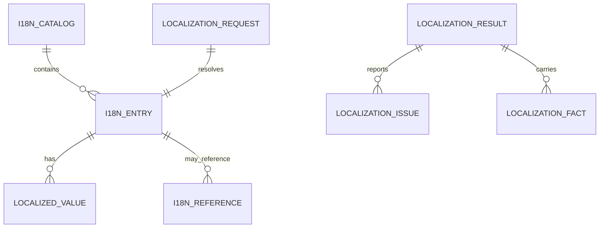

### MCP Tool Payloads

MCP tool calls are structured JSON crossing a protocol boundary. A table tool
payload can request a rendered table and optionally ask for text, data, or both.

```json
{
  "columns": [
    { "header": "Field" },
    { "header": "Value", "weight": 3 }
  ],
  "rows": [
    ["State", "MERGED"],
    ["Merge method", "Normal merge commit via gh pr merge --merge --admin"]
  ],
  "variant": "ruled",
  "output": "both"
}
```

The result may contain visible text content and `structuredContent` with the
rendered output and semantic data. That split is important because agents may
need inspectable payloads even when they do not need text rendered into the
conversation.

## Golden Paths

### Golden Path 1: Tiny App Startup

The smallest application imports `startApp`, defines an `App`, and returns a
surface from `view`. The `examples/hello/hello.ts` path demonstrates this.
`startApp` checks whether the app is self-running, initializes or creates a
Node context, registers the default context when needed, and calls `run`.

For the reader new to this domain, the important idea is that the app never
mutates the terminal directly. It declares state transitions and rendering.
The runtime owns terminal setup, input, timers, diffing, and cleanup.

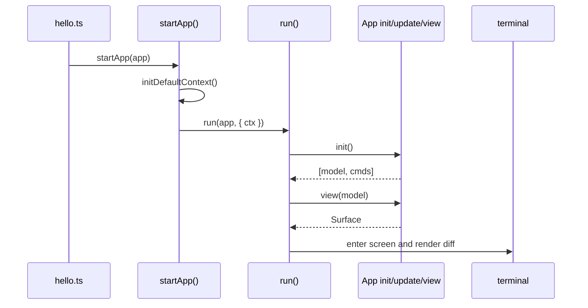

### Golden Path 2: DOGFOOD Startup And Navigation

DOGFOOD starts with the same runtime primitives but with more composition. It
loads text assets, package docs, architecture docs, release docs, component
stories, Block inventories, i18n catalogs, and DOGFOOD-specific shell pages.
`createNodeDocsApp` injects a Node locale port. `createDocsApp` constructs the
application and its framed pages.

When a user navigates DOGFOOD, input is handled as ordinary messages. Focused
lists are updated in memory. The selected guide or story is written into the
page model. The next render reads that model and paints the appropriate page.

### Golden Path 3: Documentation Search

The DOGFOOD `/` key opens page-scoped search through the AppFrame command
palette machinery. DOGFOOD supplies `searchTitle` and `searchItems` on every
page. Those search items combine component stories and guide documents. Each
item carries a visible label, description, category, hidden `searchText`,
action, and target page id.

When the user types `table`, the command palette filters by label, category,
description, hidden search text, id, and shortcut. Direct label matches rank
ahead of incidental body matches. When the user presses Enter, AppFrame closes
the palette, activates the target page when necessary, synchronizes frame
state, and emits the selected page action.

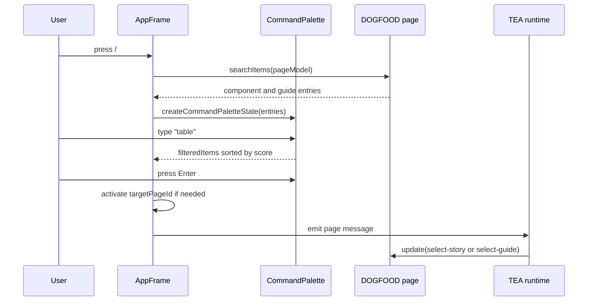

### Golden Path 4: Table Rendering And Lowering

The `table()` component is a good example of mode-aware rendering. In
interactive and static modes it produces visual tables. In pipe mode it
serializes by default as TSV and can explicitly serialize as CSV, Markdown, or
ASCII grid. In accessible mode it linearizes rows as named field/value text.

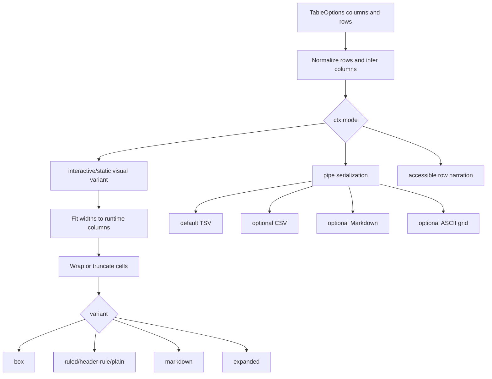

The implementation measures visible widths without counting ANSI sequences,
handles grapheme clusters, preserves OSC8 hyperlink escapes, respects column
`minWidth`, `maxWidth`, `width`, and `weight`, and uses word wrapping by
default for constrained cells.

### Golden Path 5: MCP Component Rendering

The MCP server path is not interactive. A client calls a tool such as
`bijou_table`, `bijou_box`, or `bijou_docs`. The server validates the structured
arguments, calls the first-party component renderer with an MCP-safe context,
and returns the result over stdio.

This is useful for agents because they can ask Bijou to render structured
terminal output without taking over the user's terminal. It is deliberately not
the same thing as DOGFOOD or `createFramedApp`.

## Unhappy Paths And Error Handling

### Terminal Bootstrap Failures

`initDefaultContext` checks whether stdout reports zero columns or rows. If it
does, it throws `BijouBootstrapError` with a reason and hint. Other bootstrap
failures are wrapped in the same structured error type. For example, raw mode
failure gets a hint that the caller should run in an interactive terminal rather
than a non-TTY pipeline.

DOGFOOD adds another guard. It checks that stdin and stdout are attached to a
suitable terminal before launching the full-screen app. If not, it prints a
message and exits instead of leaving a terminal takeover half-started.

### Render And Update Crashes

The runtime protects `app.update` and `app.view`. If `update` throws, the
runtime enters crash mode for the update phase. If view or render pipeline
execution throws fatally, it enters crash mode for render. The crash surface
shows the phase, error detail, and a JSON-formatted model snapshot when
serialization succeeds.

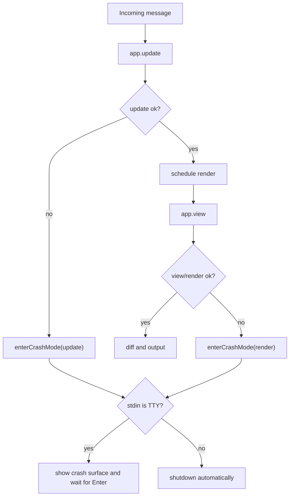

### Command Rejections And Backpressure

Commands run through the EventBus. A rejected command is caught and routed
through `onCommandRejected` or `onError`, avoiding unhandled promise rejections.
The runtime also exposes command queue diagnostics. When pending commands cross
the configured threshold, it writes a warning and can route a runtime issue back
into the application.

This is a pragmatic guardrail. It does not prevent every possible command storm,
but it makes queue pressure visible before a UI silently becomes sluggish or
unbounded.

### Malformed Boundary Data

Malformed boundary data is handled differently depending on the boundary. Block
metadata validation throws with a readable report when required fields, modes,
slots, variants, config options, examples, or duplicate ids are wrong. Schema
bound Blocks return structured issues when parsing fails. Localization resource
payloads are rejected if they are not JSON-shaped. MCP inputs are validated by
`zod` schemas before handlers execute.

## Concurrency And Asynchronous Flows

### Command Execution

Commands are the main asynchronous unit. They receive an `emit` callback and a
capability object containing pulse subscription, sleep, defer, and time helpers.
They may emit intermediate messages, then resolve to a final message, cleanup
handle, quit signal, or nothing.

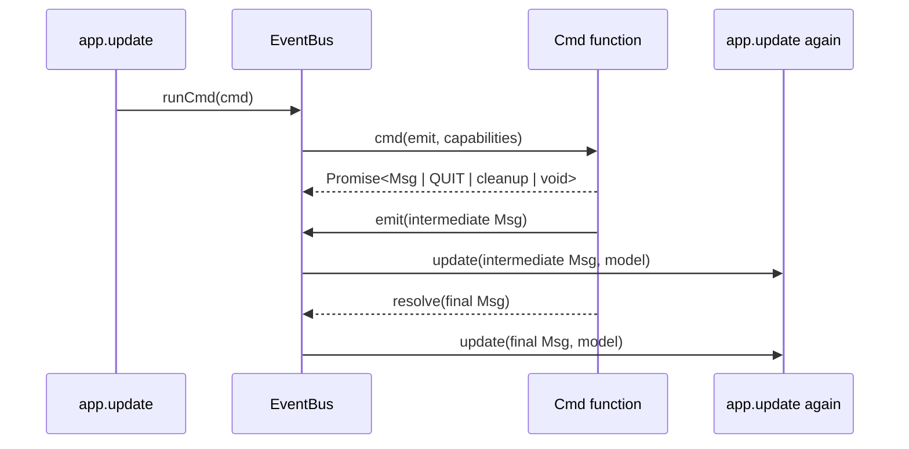

The main thread tracks pending commands as a count and retains cleanup handles
for long-lived effects. During shutdown, it waits for the command queue to
drain, with a timeout to avoid hanging forever.

### Timers, Pulses, And Motion

The EventBus owns a pulse timer driven by the runtime clock and refresh rate.
Pulse messages carry `dt`, the elapsed time in seconds. Motion systems,
animations, landing graphics, and Block demos use this timing without owning
their own global render loop.

The trade-off is explicit: a shared pulse keeps animation deterministic and
testable, but it means expensive update or render work can affect perceived
smoothness. The render pipeline therefore remains synchronous and bounded.

### Worker And Recorder Borders

`@flyingrobots/bijou-node` exports worker utilities for multi-threaded
applications and recorder utilities for surface capture and GIF output. These
are host-adapter features, not core assumptions. Keeping them in the Node
package prevents the pure core and runtime type surfaces from depending on
worker-thread or file-output details.

### Why Rendering Stays Synchronous

The render pipeline explicitly warns when middleware returns a Promise.
Asynchronous render middleware can resume out of frame order, destroy the
bounded frame budget, or stall output on unrelated I/O. Bijou's answer is to
move I/O into commands, receive results as messages, update the model, and
render synchronously from that model.

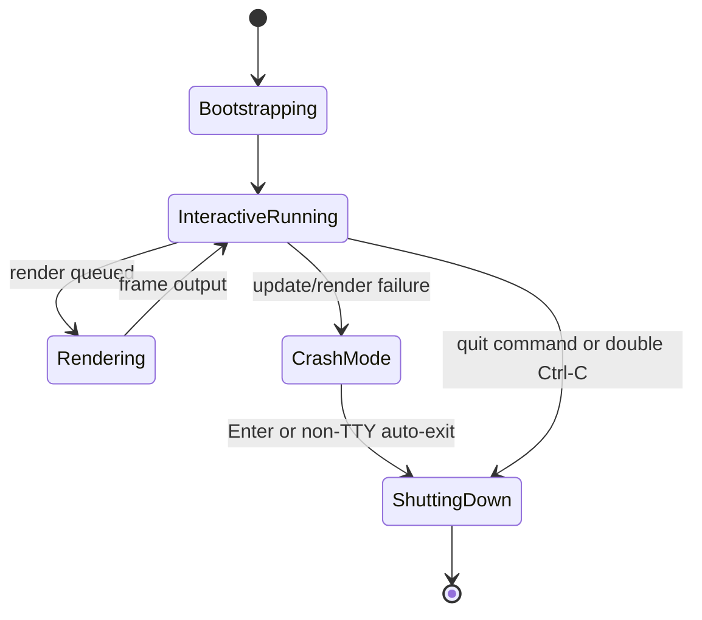

## Extreme Detail And Highlights

### Surface Cells And Packed Rendering

The most distinctive low-level design is the `Surface`. A surface is a grid of
cells with explicit width and height. Its operations include `get`, `set`,
`setRGB`, `fill`, `blit`, `transform`, row access, and cloning. The `setRGB`
method exists for hot paths that should avoid object allocation and hex parsing
for every cell.

This is the core bet of Bijou: a terminal app should be able to reason about
geometry and pixels-of-text as data. Once output is just a string, hit testing,
diffing, clipping, accessibility, layout, and responsive behavior become much
harder to make reliable.

### Render Pipeline Timing And Framebuffers

The default interactive render pipeline has five stages: `Layout`, `Paint`,
`PostProcess`, `Diff`, and `Output`. The runtime installs built-ins that call
`view`, reconcile motion, optionally apply BCSS, paint the resolved layout tree,
diff the target surface against the current surface, and then swap buffers.

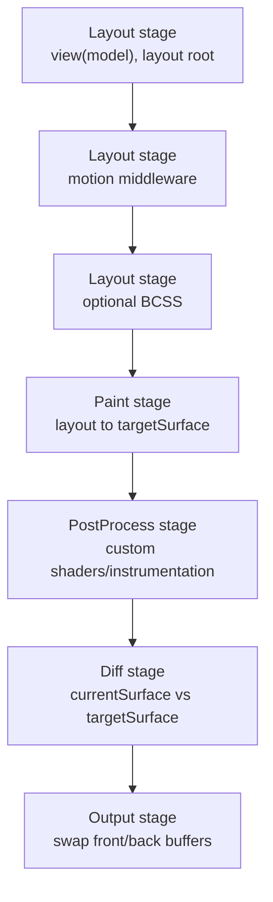

The runtime collects per-stage timings in `RenderState.data`. This makes render
cost inspectable without turning timing into global mutable state. Surface
budget warnings can be evaluated after render and routed as runtime issues.

### Blocks, Binding, And Semantic Product Surfaces

Blocks are a second major design feature. A Block definition is not just a
function that returns output. It carries package name, block name, family,
scale, supported modes, docs metadata, slots, variants, config options,
composed components, semantic facts, story ids, examples, optional data
contracts, optional command intents, and a render function.

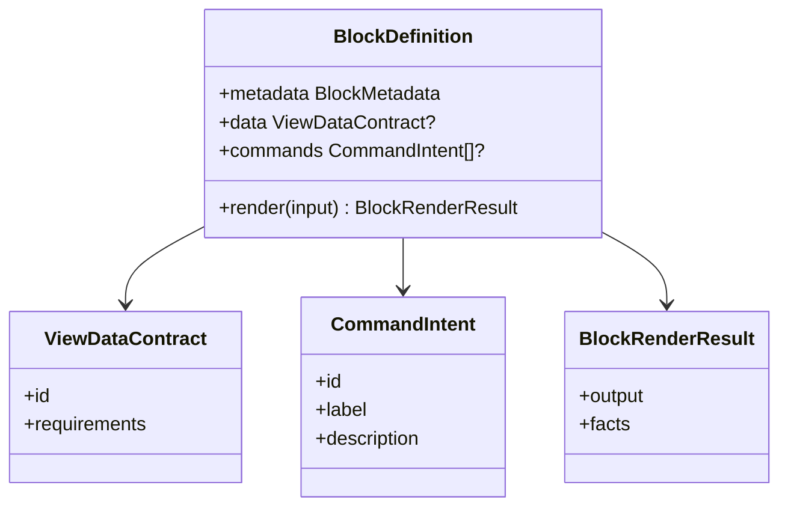

The trade-off is extra ceremony. The benefit is that product surfaces become
inspectable. DOGFOOD can list its own surface Blocks, describe data
requirements, show command intents, and lower semantic output for non-rich
modes.

### Responsive Tables And Mode Lowering

The responsive `table()` implementation is a compact example of the whole
project philosophy. It accepts structured column and row data, fits widths to a
target terminal width, honors constraints, wraps or truncates cell content,
preserves ANSI/hyperlink escapes, and renders different variants for different
contexts.

This is why calling the feature "just ASCII table output" undersells it. The
component is a small layout engine with output-mode policy. In human modes it
optimizes for scanability. In pipe mode it optimizes for machine consumption.
In accessible mode it optimizes for linear narration.

## Test Coverage

### Test Harness Shape

The repository uses Vitest with a root config that includes package tests,
bench tests, script tests, and cycle tests. The tests are not limited to unit
tests. They include unit tests for components and helpers, runtime tests for
EventBus and the TEA loop, integration-style DOGFOOD tests, issue-cycle tests,
script tests, smoke tests, frame regression tests, MCP tests, i18n workflow
tests, fuzz-style tests for forms and theme parsing, and benchmark harness
tests.

The `bijou-tui` `driver.ts` file also exposes an inspectable `testRuntime`
harness. It can render an initial frame, step keys, mouse events, resize
events, pulses, and custom messages, then assert on snapshots, command
records, emitted messages, and final model state.

### Current Metrics

At the time of this teardown, the repository contains 315 `*.test.ts` files.
The full root test command discovers 3581 tests. The default command is:

```bash
npm test
```

The root `pretest` script runs `npm run build` first, so a normal test run also
verifies TypeScript project references build before Vitest starts. The default
Vitest invocation reports test-file and test-case counts, but it does not emit
line, branch, or function coverage percentages. Any coverage percentage would
therefore need a separate coverage configuration rather than being inferred
from the normal test command.

### Interesting Suites

The DOGFOOD suites are unusually important because they test the product
surface that humans use to understand the system. `scripts/docs-preview.test.ts`
imports the DOGFOOD app through the same path used by `npm run dogfood` and
asserts story navigation, search, footer hints, localization, and visible frame
behavior.

The cycle tests under `tests/cycles/` are also distinctive. They preserve the
Method lineage of delivered work. Some of them verify that historical release
signposts remain present, which prevents current planning rewrites from erasing
landed release context.

The table tests, command palette tests, AppFrame tests, EventBus tests, pipeline
tests, and i18n runtime tests are the high-value technical suites for current
architecture. They protect responsive layout behavior, search ranking and
activation, shell routing, command diagnostics, synchronous render pipeline
semantics, and structured localization boundaries.

### Coverage Caveats

Test count is not the same as behavioral completeness. The current roadmap
still names open work around layout envelope negotiation, standard Blocks,
declarative view data binding, and boundary-aware pointer selection/copy. Those
issues indicate that the project has strong coverage around shipped behavior
while still carrying intentional release-boundary gaps.

## Use Cases

### Ten Concrete Use Cases

| # | Use Case | Best Starting Point |
| ---: | :--- | :--- |
| 1 | A CLI tool that prints structured tables, boxes, badges, and progress without owning a full-screen app. | `@flyingrobots/bijou` |
| 2 | A small interactive counter, picker, or form that exits after user input. | `startApp(app)` |
| 3 | A full-screen terminal dashboard with keyboard input, resize handling, and animation. | `@flyingrobots/bijou-tui` |
| 4 | A multi-page terminal app with tabs, panes, overlays, settings, help, search, and command palette. | `createFramedApp` |
| 5 | A generated starter project for a new external app. | `npm create bijou-tui-app@latest` |
| 6 | A localized terminal product with runtime catalog lookup and fallback behavior. | `@flyingrobots/bijou-i18n` |
| 7 | A spreadsheet or CSV-driven translation workflow for terminal UI copy. | `@flyingrobots/bijou-i18n-tools` packages |
| 8 | An agent-facing tool that renders structured terminal components over MCP. | `@flyingrobots/bijou-mcp` |
| 9 | A design-system documentation app that proves components in their real host shell. | DOGFOOD |
| 10 | A benchmarked terminal renderer where paint and diff costs are tracked over time. | `bench` package |

### Choosing The Right API

The simplest rule is to start lower than you think. If you only need output,
use the core. If you need input and state, use `startApp`. If you need custom
startup composition, use `run`. If you need multiple pages and shell chrome,
use `createFramedApp` or the framed app skeleton.

This progression keeps small tools from paying for a full shell while letting
large apps graduate into the runtime features they need.

### When Bijou Is The Wrong Tool

Bijou is not the right choice when the output target is primarily a browser,
when the UI depends on pixel graphics rather than terminal cells, when the app
needs web authentication flows as a first-class lifecycle, or when a single
plain log line is enough. The system is powerful because it treats terminal UI
as real application infrastructure, and that power has complexity.

## Why Did We Build It This Way?

### Ports Over Globals

Ports make host behavior explicit. The core can render and test without
touching `process`, `fs`, or a real terminal. The trade-off is that app authors
must understand context earlier than they would in a small script. The benefit
is that terminal dimensions, I/O, style, files, and clocks become injectable
and testable.

### Surfaces Over Escape Strings

Strings are easy to print but hard to reason about. Surfaces are heavier, but
they let Bijou compute layout, clipping, diffs, hit testing, and lowering from a
structured representation. The project trades simpler one-off output code for
better long-term correctness in full-screen applications.

### Commands Over Hidden Effects

Commands force side effects to leave a trail. An update function returns the
next model and the effects it wants. That makes tests deterministic and avoids
view code secretly performing I/O. The cost is boilerplate around message
types and command return values. The gain is replayability, inspection, and a
clean boundary between state transitions and the outside world.

### DOGFOOD Over Static Showcase

DOGFOOD is more expensive than screenshots or static examples. It must stay
runnable, localized, searchable, navigable, and tested. The benefit is that it
keeps architecture honest. A component or Block that cannot survive DOGFOOD's
real shell pressure is not as mature as it looks in isolation.

## Key Features And Notable Design Decisions

### Key Features

Bijou's key features are surface-based rendering, mode-aware component
lowering, a TEA runtime, a synchronous render pipeline, command-based effects,
responsive terminal layout, a framed shell, global search and command palette,
Block metadata and binding contracts, structured localization, DOGFOOD docs,
MCP render tools, and benchmark support.

### Design Decisions Worth Carrying Forward

The zero-dependency core is worth preserving. The context and port boundaries
are worth preserving. The distinction between components and Blocks is worth
preserving. The synchronous render pipeline is worth preserving unless a future
design introduces a strict deterministic async stage model. DOGFOOD as the
canonical human-facing docs app is worth preserving because it continuously
tests the system under real product pressure.

### Decisions Still Under Pressure

The package split is powerful but cognitively expensive. DOGFOOD is useful but
large enough to overwhelm new contributors. Blocks are semantically rich but
could become ceremonial if every leaf component is wrapped indiscriminately.
The current roadmap correctly calls out layout envelope truth as a pressure
point because product polish cannot compensate for uncertain geometry
contracts.

## Conclusion

### Key Takeaway

Bijou is a serious terminal application platform. Its core contribution is not
one widget or one renderer; it is the combination of structured surfaces,
explicit ports, deterministic runtime flow, semantic Blocks, and a live docs
product that proves the architecture.

### Architectural Judgment

The architecture is coherent and intentionally layered. The most important
engineering risk is not lack of capability. It is maintaining clear boundaries
as the product surface grows. The core should remain pure, the host adapters
should own platform facts, the runtime should own event and render flow, and
DOGFOOD should prove product truth without becoming a dumping ground.

### Practical Next Step

The practical next step is to close the `v6.0.0` release boundary, beginning
with layout envelope and constraint negotiation. That work is the structural
dependency that makes the Block and DOGFOOD product layers more trustworthy.

## References

### Repository Documents

This teardown is based on local repository documents: `README.md`, `GUIDE.md`,
`ARCHITECTURE.md`, `docs/README.md`, `docs/DOGFOOD.md`, `docs/BEARING.md`,
`docs/ROADMAP.md`, `docs/METHOD.md`, `docs/CHANGELOG.md`, `docs/MCP.md`, and
`docs/guides/render-pipeline.md`.

No external web references were used.

### Source Entry Points

The main source entry points reviewed were `packages/bijou/src/index.ts`,
`packages/bijou-tui/src/runtime.ts`, `packages/bijou-tui/src/eventbus.ts`,
`packages/bijou-tui/src/pipeline/pipeline.ts`, `packages/bijou-node/src/index.ts`,
`packages/bijou-node/src/io.ts`, `packages/bijou-node/src/runtime.ts`,
`packages/bijou-i18n/src/runtime.ts`, `packages/bijou-mcp/src/server.ts`,
`examples/docs/main.ts`, `examples/docs/app.ts`, and `examples/docs/node-locale.ts`.

### Validation Commands

The relevant validation commands are:

```bash
npm run build
npm test
npm run lint
npm run docs:inventory
git diff --check
```

The normal root test command reports 315 test files and 3581 tests. It does not
emit line or branch coverage percentages by default.

## Appendices

### Appendix A: Package Dependency Table

| Area | Dependency | Why It Exists |
| :--- | :--- | :--- |
| Development | `typescript` | Project references, type checking, package builds. |
| Development | `vitest` | Unit, integration, script, and cycle tests. |
| Development | `tsx` | Running TypeScript scripts and examples directly. |
| Node host | `chalk` | Host style adapter implementation. |
| Node host | `gifenc` | Recorder GIF output. |
| Node host | `oled-font-5x7` | Recorder/raster text support. |
| MCP | `@modelcontextprotocol/sdk` | MCP stdio server and tool registration. |
| MCP | `zod` | Tool input and output schema definitions. |
| i18n XLSX | `xlsx` | Spreadsheet import/export adapter. |

### Appendix B: Environment Variables

| Variable | Scope | Notes |
| :--- | :--- | :--- |
| `NO_COLOR` | Node style | Disables rich color output. |
| `BIJOU_THEME` | Node theme selection | Selects a preset or theme file unless disabled by explicit override. |
| `BIJOU_FPS` | Runtime pulse | Positive integer override for refresh rate. |
| `LANG` | DOGFOOD locale | Initial locale candidate. |
| `LANGUAGE` | DOGFOOD locale | Initial locale candidate, colon-list aware. |
| `LC_ALL` | DOGFOOD locale | High-priority initial locale candidate. |
| `LC_MESSAGES` | DOGFOOD locale | Initial locale candidate. |
| `HOME` | DOGFOOD locale persistence | Used for default state-file path. |
| `XDG_STATE_HOME` | DOGFOOD locale persistence | Preferred state-file base path when present. |

### Appendix C: Representative Command Matrix

| Command | Purpose |
| :--- | :--- |
| `npm run hello` | Minimal hosted interactive app. |
| `npm run counter` | Small TEA counter app. |
| `npm run app-frame` | Intermediate framed-shell demo. |
| `npm run dogfood` | Canonical documentation app. |
| `npm run storybook` | Interactive story workstation. |
| `npm run storybook:index` | Deterministic story index/capture path. |
| `npm run dogfood:i18n:build` | Generate runtime catalogs from source string table. |
| `npm run dogfood:i18n:check` | Verify generated catalogs are current. |
| `npm run dogfood:i18n:debt` | Enforce source-level DOGFOOD localization debt baseline. |
| `npm run bench` | Run benchmark scenarios. |

## Open Questions

### Release Scope Questions

The main release question is whether all four open `v6.0.0` issues are still
required for the tag or whether some should be split or moved. `RE-035` looks
structural. `DX-031` and `DX-034` may need closeout triage because parts of
their architecture are already landed. `DX-030` should be judged by whether
boundary-aware copy is essential for the release thesis.

### Product Semantics Questions

The Block system is promising, but the project still needs discipline around
what deserves to become a Block. Product-scale surfaces should become Blocks
when they own semantics, data contracts, command intents, and lowering facts.
Leaf components should remain components unless a real semantic boundary
appears.

### Documentation Drift Questions

The tracker now lives in GitHub Issues, while the repository documents preserve
evidence, history, and mirrors. That split is correct, but it creates drift
risk. The open question is how much automation should enforce issue-to-roadmap
and issue-to-evidence consistency as the release cadence grows.

## Future Work

### v6.0.0 Release Closure

The immediate future is `v6.0.0`: layout envelope and constraint negotiation,
standard Blocks triage, declarative data binding triage, and boundary-aware
pointer selection/copy decision-making. This release should stay narrow.

### v7.0.0 Candidate Horizon

The initial `v7.0.0` milestone is a broad queue around DOGFOOD truth,
component-family audits, `tableSurface()` responsive parity, and scoped Node
I/O documentation. After v6 closes, v7 should be reshaped into a smaller thesis
before implementation begins.

### Beyond The Current Roadmap

The Beyond milestone contains future bets such as Mermaid surfaces, deterministic
time-travel debugging, DAG enhancements, multilingual workbench ideas, terminal
shader extensions, MCP-driven UI generation, and semantic list work. These
ideas should remain optional until they are pulled into a concrete milestone
with a clear product or architectural reason.
