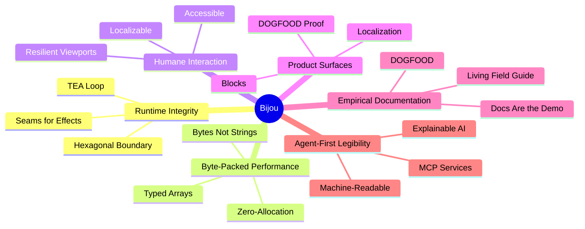

# VISION

Bijou is an industrial-grade TypeScript engine for terminal software where runtime truth, design language, and documentation are unified.

## Core Tenets

### 1. Runtime Integrity
A deterministic state-update-view loop (TEA) with explicit seams for effects and commands. Logic is isolated from platform IO via a strict hexagonal boundary.

### 2. Byte-Packed Performance
A rendering foundation built on typed arrays and zero-allocation hot paths. The surface layer speaks bytes, not strings, ensuring high-fidelity output at scale.

### 3. Humane Interaction
A shell model that remains truthful under the pressures of keyboard, mouse, compact viewports, and localization. Accessibility and internationalization are substrate properties, not afterthoughts.

### 4. Product Surfaces
Bijou's architecture becomes credible only when it survives visible product
surfaces. Blocks and localization are the current pressure points: Blocks must
move from contracts into real reusable product assemblies, and localization must
make DOGFOOD visibly usable without hiding missing translations behind copied
English fallback data.

### 5. Empirical Documentation
DOGFOOD is the canonical proving ground. Every component, Block, localization
flow, and pattern is verified in a living product surface within the repository.
Documentation should not merely describe the system; it should expose the system
working under real product pressure.

### 6. Agent-First Legibility
The system is designed to be codable and inspectable by both humans and AI. MCP rendering services and interactive documentation provide a machine-readable interface to the toolkit.

---
**The goal is not more terminal widgets. It is the geometric lawfulness of the terminal as a professional application bedrock.**
