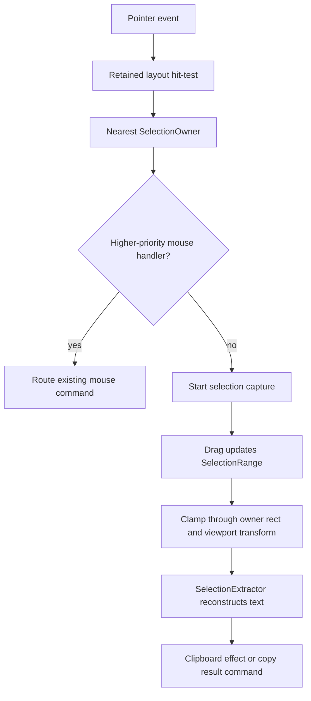

# DX-030 Add boundary-aware pointer selection and copy

## Framing

DOGFOOD currently depends on terminal-native selection. That is acceptable as
a host fallback, but it is not the Bijou model. A drag gesture in a framed docs
surface should not copy whatever cells happen to be painted across the whole
terminal. It should resolve the owning pane, clamp the drag to that pane's
geometry, and reconstruct text from the component's semantic content model.

This cycle defines the contract. It does not implement full runtime selection,
OS clipboard writes, or cross-pane rich extraction. Those pieces touch the
runtime engine, app frame, node adapter, pointer routing, viewports, and
component metadata. Shipping the contract first prevents the eventual runtime
work from becoming a hidden terminal-row scraper.

## Sponsored Users

- DOGFOOD readers who want to drag-copy docs text without selecting shell
  chrome, neighboring panes, or visual gutters.
- App authors who need copy behavior to respect pane and component boundaries.
- Maintainers who need a stable target for later pointer-routing, clipboard,
  and semantic extraction work.

## Hills

1. A reader can expect selection to stay inside the pane or component that owns
   the drag start.
2. A builder can declare selection metadata on a surface or layout node without
   giving rendering authority over geometry.
3. A maintainer can implement runtime selection later by following an explicit
   hit-test, range, extraction, and clipboard-effect protocol.

## Playback Questions

- What metadata can a surface or layout node expose for selection?
- How does retained layout geometry map a pointer drag to one owning component?
- How is copied output reconstructed for prose, tables, and mixed panes?
- How does the shell arbitrate selection against existing mouse routing?
- Where does clipboard IO live so copying remains an effect, not render logic?

## Requirements

- Selection ownership is opt-out default behavior for framed docs-style panes,
  but interactive controls may explicitly opt out or override drag handling.
- Hit-testing must start from retained layout geometry, not rendered strings.
- A drag starts from one `SelectionOwner` and remains bounded to that owner
  unless a future explicit multi-owner policy allows otherwise.
- Extraction reconstructs output from semantic content metadata, paragraph
  spans, table cells, or component-provided extractors, not raw terminal rows.
- Viewports must map screen coordinates through scroll offsets before forming
  content ranges.
- Copying to an OS clipboard is a host effect. Runtime selection should emit a
  command/effect fact; renderers should never write the clipboard.

## Contract

The contract introduces six conceptual records.

`SelectionOwner`

The component, pane, or layout node that owns a selectable region.

Required facts:

- stable owner id
- retained layout node id
- assigned screen rect
- optional viewport transform
- selection policy
- content model reference

`SelectionRegion`

The concrete selectable rectangle derived from layout truth.

Required facts:

- owner id
- screen rect
- content rect
- clipping rect
- z/layer order
- enabled/disabled state

`SelectionRange`

The normalized content-space range derived from a pointer drag.

Required facts:

- owner id
- anchor point
- focus point
- normalized start/end points
- direction
- drag source device

`SelectionContentModel`

The semantic model used to reconstruct selected text.

Supported first models:

- `prose`: paragraph and wrapped-line spans
- `surface`: cell spans with optional semantic line grouping
- `table`: row and column cells with header context
- `mixed`: ordered child regions with their own extractors

`SelectionExtractor`

The pure function that turns a `SelectionRange` and content model into copied
text.

Rules:

- prose unwraps soft wraps while preserving hard paragraph breaks
- tables preserve cell boundaries with tabs or another declared delimiter
- mixed panes concatenate child extractions in semantic order
- decorative chrome, gutters, scrollbars, and focus rails are excluded by
  default
- extraction must be deterministic and inspectable

`SelectionCoordinator`

The runtime service that arbitrates pointer selection.

Responsibilities:

- receive pointer down/drag/up facts
- hit-test the topmost retained layout region
- choose the nearest selectable owner
- respect higher-priority mouse handlers such as split dividers, buttons,
  drag/drop targets, and active overlays
- clamp movement to the owner region
- request extraction on release
- emit a clipboard effect or copy result command

## Runtime Flow

Selection is a pointer interaction that uses layout truth. It is not a render
phase and not a terminal-row scrape.

## Arbitration

Mouse routing keeps the same priority model as the rest of Bijou:

1. Active modal or overlay captures first.
2. Explicit drag handles and resize controls win over selection.
3. Component-owned pointer handlers win when the component declares a drag
   gesture, such as sliders, split panes, or draggable tabs.
4. Otherwise, the nearest selectable owner may start a selection capture.
5. Terminal-native selection remains a host fallback when Bijou is not in mouse
   mode or the app opts out.

The rule is deliberately conservative: selection should never steal a gesture
from an interactive control that already owns that drag.

## Extraction Rules

Prose extraction:

- maps pointer positions to paragraph spans
- unwraps soft wraps
- preserves hard line breaks, blank lines, and list boundaries
- excludes visible borders, scrollbars, and status gutters

Table extraction:

- maps selected cells through row and column coordinates
- preserves headers when the selection crosses enough columns to need context
- emits tab-delimited text by default
- leaves room for CSV/TSV policy later

Mixed pane extraction:

- clips each child to the owner range
- extracts children in semantic order
- inserts declared separators only where the component model says they exist
- refuses to infer meaning from visual adjacency alone

Viewport extraction:

- maps screen coordinates into content coordinates with scroll offsets
- respects clipped content
- may expose current scroll context in accessible copy, but copied prose should
  be the selected content, not the scrollbar state

## Non-Goals

This cycle does not:

- implement OS clipboard adapters
- implement drag selection in `createFramedApp()`
- define multi-pane selection
- define rich clipboard formats
- define image or shader-region copying
- make terminal-native selection disappear

Those are follow-on implementation slices once this contract has a stable
shape.

## Acceptance Criteria

- The contract names selection owners, regions, ranges, content models,
  extractors, and the coordinator.
- The contract states that hit-testing uses retained layout geometry.
- The contract states that copied output comes from semantic extraction, not
  raw terminal rows.
- The contract defines arbitration against overlays, drag handles, component
  pointer handlers, and terminal-native fallback.
- The v6 release lane points at this design closure instead of the backlog
  note.
- The DX legend records this as the latest completed selection/copy closure.

## Implementation Outline

1. Promote the backlog item into this design-cycle contract.
2. Add a focused DX-030 test that protects the selection metadata and
   arbitration vocabulary.
3. Update the v6 lane and DX legend pointers.
4. Leave runtime implementation to a later slice with this contract as the
   target.

## Playback

- RED: the backlog named the need, but no stable design artifact defined the
  selection owner, range, extraction, and clipboard-effect contract.
- GREEN: this cycle defines the records and runtime flow that future code can
  implement.
- The contract keeps selection bounded by retained layout truth.
- The contract keeps copying semantic and inspectable.
- The contract keeps clipboard writes outside render logic.

## Retrospective

This should not be rushed as a narrow DOGFOOD patch. Boundary-aware copy is a
runtime feature crossing layout, pointer routing, semantic content, viewports,
and host effects. The right first move is to make the contract boring, explicit,
and test-protected.
