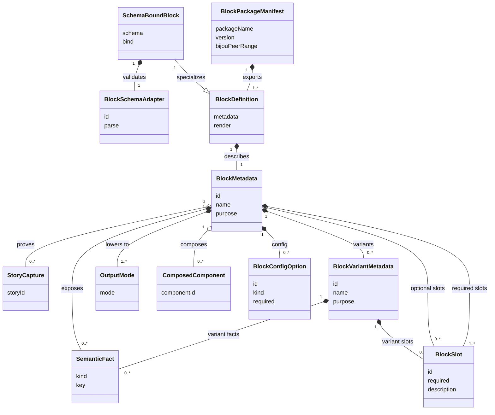

# DX-031 Standard Bijou Blocks

_Cycle for declaring reusable app-building blocks that compose Bijou
components into standard, inspectable surface patterns_

Legend:

- [DX - Developer Experience](../legends/DX-developer-experience.md)

Depends on:

- [DX-025 - Component Metadata Contract](./DX-025-component-metadata-contract.md)
- [DF-028 - Story Capture Matrix](./DF-028-story-capture-matrix.md)
- [DF-029 - Fixture-to-Docs Promotion Path](./DF-029-fixture-to-docs-promotion-path.md)
- [RE-035](./RE-035-mandatory-layout-envelope-and-constraint-negotiation.md)

## Why This Cycle Exists

Bijou has many capable components, but app builders still need to assemble
common surfaces by hand: shells, readers, inspectors, command palettes,
settings, modal stacks, notifications, and authentication flows.

Blocks standardize those common compositions without turning them into new
primitives.

A block is a named composition of Bijou components with a documented layout,
focus, input, mode-lowering, and semantic contract. Blocks are the layer a
builder reaches for when they want to build an app quickly without re-deciding
the same shell and workflow patterns every time.

## Boundary

- Blocks compose primitives.
- Blocks expose slots and semantic facts.
- Blocks lower across interactive, static, pipe, and accessible modes.
- Blocks do not mutate layout directly.
- Blocks do not replace RE layout primitives.
- Blocks do not become a hidden window manager.

## Relationship To RE-035

Blocks depend on layout truth, but they do not define it.

Each block should compile into ordinary visible nodes with mandatory layout
envelopes. The block owns composition, slot names, default behavior, and
semantic facts. The layout engine owns constraints, preferences, assigned
rectangles, and explanations.

That keeps the boundary simple:

- blocks choose what app surface exists
- layout chooses where each visible node fits
- focus and input consume retained layout facts
- renderers paint assigned rectangles
- modes lower semantic block facts

## Runtime Truth Vs App Truth

Blocks must preserve a hard boundary between primitive runtime truth and
semantic app truth.

Primitive runtime truth belongs to RE and adjacent runtime layers:

- layout envelope
- constraints
- preferences
- assigned rectangles
- fit policy
- focus regions
- hit regions
- viewport facts
- layer order
- command and effect facts

Semantic app truth belongs to blocks and app code:

- `ReaderSurface`
- `ProductDetails`
- `CheckoutFlow`
- `DashboardShell`
- `CommentsThread`
- `TerminalPanel`
- domain entities, statuses, actions, and relationships

The dependency direction only goes one way:

- semantic blocks compile into primitive runtime truth
- runtime primitives do not learn product, commerce, docs, or chat semantics
- app semantics do not mutate runtime geometry directly
- inspectors may relate both layers, but must label which layer they explain

This prevents business semantics from leaking into the layout engine and keeps
runtime primitives from becoming app-shaped.

## Human Users / Jobs / Hill

### Primary Human Users

- App builders assembling Bijou tools from common surface patterns.
- DOGFOOD maintainers turning docs, inspectors, settings, and command surfaces
  into reusable examples.
- Component authors who need a standard target for real-world composition
  stories.

### Human Jobs

1. Pick a block for a common app surface instead of starting from blank layout.
2. Fill named slots with app-owned content.
3. Trust the block's default focus, input, responsive, and mode-lowering
   behavior.
4. Inspect how a block composes lower-level components.

### Human Hill

A builder can create a useful Bijou app shell with navigation, content,
settings, help, notifications, and modal behavior by composing documented
blocks instead of hand-rolling every surface.

## Agent Users / Jobs / Hill

### Primary Agent Users

- Agents generating Bijou app scaffolds.
- Agents upgrading examples into DOGFOOD stories.
- Agents explaining how an app surface is composed.

### Agent Jobs

1. Select an appropriate block from a stable catalog.
2. Fill required slots and avoid unsupported private layout behavior.
3. Generate tests against block contracts instead of snapshot-only output.
4. Preserve semantic facts when lowering to pipe and accessible modes.

### Agent Hill

An agent can inspect a block definition, identify its slots and mode behavior,
and generate type-safe app code that uses the block without inventing new
layout or input conventions.

## Accessibility / Assistive Posture

Blocks must preserve semantic meaning when visual chrome lowers away.

Every standard block should identify:

- named regions
- active item or selected entity, when relevant
- available actions
- validation or warning facts
- modal or focus-trap state, when relevant
- whether hidden visual content remains available in accessible mode

Auth blocks must never expose secrets in accessible, pipe, static, or
diagnostic output.

## Localization / Directionality Posture

Blocks should describe layout in logical terms and inherit direction from the
host context unless a block explicitly owns a local direction boundary.

The first catalog should avoid physical left/right naming in slot contracts.
For example:

- use `navigation` instead of `leftNav`
- use `inspector` instead of `rightPane`
- use `primaryAction` and `secondaryActions` instead of button order names

Text, bidi, and locale-specific formatting stay outside this first blocks
cycle, but block slots must not make later localization harder.

## Agent Inspectability / Explainability Posture

Blocks should be inspectable as data before rendering. An agent should be able
to answer:

- which block is this?
- which slots are required?
- which slots are filled?
- which lower-level components does it compose?
- what semantic facts does it expose?
- how does it lower by mode?
- what are the expected focus and action surfaces?

The first implementation should prefer metadata and story captures over
snapshot-only proof.

## Linked Invariants

- [Docs Are the Demo](../invariants/docs-are-the-demo.md)
- [Runtime Truth Wins](../invariants/runtime-truth-wins.md)
- [Layout Owns Interaction Geometry](../invariants/layout-owns-interaction-geometry.md)
- [The Buffer Holds Facts](../invariants/buffer-holds-facts.md)
- [Commands Change State, Effects Do Not](../invariants/commands-change-state-effects-do-not.md)
- [Tests Are the Spec](../invariants/tests-are-the-spec.md)

## Block Contract

Every standard block should declare:

- purpose
- required slots
- optional slots
- variants
- configurable options
- composed components
- layout posture
- focus posture
- input posture
- responsive posture
- mode-lowering posture
- accessibility facts
- examples and story ids
- tests that define the contract

The eventual metadata can align with `defineComponentMetadata()` and story
capture records, but this cycle starts by standardizing the human-readable
catalog.

The entity relationship is:



Block package manifests expose definitions. Block metadata owns the contract.
Variants, config, modes, semantic facts, and story captures hang off the block
instead of being inferred from rendered output.

Metadata sketch:

```ts
type BlockScale =
  | 'app'
  | 'section'
  | 'panel'
  | 'control'
  | 'item'
  | 'data'
  | 'diagnostic';

interface BlockMetadataDocs {
  readonly summary: string;
  readonly useWhen?: readonly string[];
  readonly avoidWhen?: readonly string[];
  readonly relatedDocs?: readonly string[];
}

interface BlockSlot {
  readonly id: string;
  readonly label?: string;
  readonly required?: boolean;
  readonly description?: string;
}

interface BlockMetadata {
  readonly packageName: string;
  readonly blockName: string;
  readonly family: string;
  readonly scale: BlockScale;
  readonly modes: readonly ('interactive' | 'static' | 'pipe' | 'accessible')[];
  readonly docs: BlockMetadataDocs;
  readonly sourcePath?: string;
  readonly slots: readonly BlockSlot[];
  readonly variants?: readonly BlockVariantMetadata[];
  readonly configOptions?: readonly BlockConfigOption[];
  readonly composedComponents?: readonly string[];
  readonly semanticFacts?: readonly ModeLoweringFact[];
  readonly storyIds?: readonly string[];
  readonly examples?: readonly BlockExample[];
  readonly tags?: readonly string[];
}

interface BlockVariantMetadata {
  readonly id: string;
  readonly label: string;
  readonly description?: string;
  readonly requiredSlots?: readonly string[];
  readonly optionalSlots?: readonly string[];
  readonly facts?: readonly ModeLoweringFact[];
}

interface BlockConfigOption {
  readonly id: string;
  readonly label?: string;
  readonly kind: 'boolean' | 'enum' | 'number' | 'string' | 'adapter';
  readonly required?: boolean;
  readonly description?: string;
  readonly values?: readonly string[];
}

interface BlockExample {
  readonly id: string;
  readonly label: string;
  readonly path?: string;
  readonly command?: string;
}

type DeepReadonly<T> = T extends readonly (infer Item)[]
  ? readonly DeepReadonly<Item>[]
  : T extends object
    ? { readonly [Key in keyof T]: DeepReadonly<T[Key]> }
    : T;

type BlockSchemaResult<Data> =
  | { readonly ok: true; readonly data: DeepReadonly<Data> }
  | { readonly ok: false; readonly issues: readonly BlockSchemaIssue[] };

interface BlockSchemaIssue {
  readonly severity: 'info' | 'warning' | 'error';
  readonly code: string;
  readonly message: string;
  readonly path?: string;
}

interface BlockSchemaDescription {
  readonly requiredFields?: readonly string[];
  readonly optionalFields?: readonly string[];
  readonly redactedFields?: readonly string[];
  readonly facts?: readonly ModeLoweringFact[];
}

interface BlockDefinition<Config = unknown> {
  readonly metadata: BlockMetadata;
  readonly data?: ViewDataContract;
  readonly commands?: readonly CommandIntent[];
  readonly render: (input: BlockRenderInput<Config>) => BlockRenderResult;
}

interface BlockSchemaAdapter<Data> {
  readonly id: string;
  readonly parse: (input: unknown) => BlockSchemaResult<Data>;
  readonly describe?: () => BlockSchemaDescription;
}

interface SchemaBoundBlockDefinition<Data, Config = unknown> {
  readonly block: BlockDefinition<Config>;
  readonly schema: BlockSchemaAdapter<Data>;
  readonly bind: (
    data: DeepReadonly<Data>,
  ) => BlockRenderInput<Config> | {
    readonly input: BlockRenderInput<Config>;
    readonly facts?: readonly ModeLoweringFact[];
  };
}

interface BlockPackageManifest {
  readonly packageName: string;
  readonly version: string;
  readonly bijouPeerRange: string;
  readonly blocks: readonly string[];
  readonly docs?: readonly string[];
  readonly tags?: readonly string[];
}

declare function defineBlock<Config>(
  definition: BlockDefinition<Config>,
): BlockDefinition<Config>;

declare function validateBlockMetadata(
  metadata: BlockMetadata,
): BlockMetadataReport;

declare function blockMetadataSummary(metadata: BlockMetadata): string;

declare function defineSchemaBlock<Data, Config>(
  definition: SchemaBoundBlockDefinition<Data, Config>,
): SchemaBoundBlockDefinition<Data, Config>;

declare function bindSchemaBlockInput<Data, Config>(
  block: SchemaBoundBlockDefinition<Data, Config>,
  input: unknown,
): {
  readonly ok: true;
  readonly input: BlockRenderInput<Config>;
  readonly facts: readonly ModeLoweringFact[];
} | {
  readonly ok: false;
  readonly issues: readonly BlockSchemaIssue[];
  readonly facts: readonly ModeLoweringFact[];
};

declare function defineBlockPackage(
  manifest: BlockPackageManifest,
): BlockPackageManifest;
```

DX-031A lands this as a public metadata-first API in `@flyingrobots/bijou`.

DX-031B Schema-Bound Blocks lands the schema adapter layer as a public boundary
contract in `@flyingrobots/bijou`. Schema-bound blocks validate boundary data
before producing block render input or binding facts. They do not fetch,
subscribe, dispatch, compose runtime views, or render AppShell. The important
boundary is that a block and its schema are described before rendering, and their
slots, semantic facts, and validation facts are visible to tests, docs, DOGFOOD,
and agents.

## Public Block API And Distribution

Blocks should become a user-facing Bijou API, not an internal DOGFOOD-only
catalog.

The public API should let Bijou users and community authors:

- define a block with typed metadata and a render function
- validate block metadata before publishing
- attach examples, story captures, and mode-lowering facts
- package one or more blocks for reuse
- distribute blocks through ordinary NPM packages
- let apps import blocks without hidden registration side effects

The first distribution mechanism should be boring: NPM packages with a stable
manifest. A future block registry can index NPM metadata, docs, and story
captures, but the runtime should not need a central registry to use a block.

Recommended package shape:

```text
@scope/bijou-blocks-commerce
  package.json
  src/index.ts
  blocks/product-list.ts
  blocks/checkout-flow.ts
  stories/product-list.story.ts
  docs/README.md
```

Rules for shared block packages:

- depend on `@flyingrobots/bijou` as a peer dependency
- export block definitions explicitly from the package entrypoint
- avoid global registration or import-time mutation
- include block metadata and package metadata
- include at least one story or fixture per exported block
- declare supported output modes and semantic facts
- keep host effects behind adapters supplied by the consuming app
- never include secret values in metadata, stories, diagnostics, or snapshots

Example package entrypoint:

```ts
export const productListBlock = defineBlock({
  metadata: productListMetadata,
  render: productList,
});

export const checkoutFlowBlock = defineBlock({
  metadata: checkoutFlowMetadata,
  render: checkoutFlow,
});

export const commerceBlocks = defineBlockPackage({
  packageName: '@example/bijou-blocks-commerce',
  version: '1.0.0',
  bijouPeerRange: '^5.0.0',
  blocks: ['product-list', 'checkout-flow'],
  tags: ['commerce', 'catalog', 'checkout'],
});
```

Runtime-engine posture:

- a block renders into ordinary Bijou visible nodes
- visible nodes still resolve through RE-035 layout envelopes
- interaction still emits commands instead of mutating geometry
- modes lower semantic facts instead of parsing rendered cells
- host adapters own files, credentials, network, storage, and process effects

That keeps third-party blocks powerful without making them runtime plugins with
unbounded authority.

## Relationship To DX-034

[DX-034 - Declarative View Data Binding](./DX-034-declarative-view-data-binding.md)
is the design gate between metadata-only blocks and provider-bound AppShell
composition.

DX-031 answers:

- what is a block?
- what slots, variants, modes, facts, stories, and package metadata does it
  declare?
- how can tooling discover block contracts before rendering?

DX-034 answers:

- how does an active block or view declare the data it needs?
- which provider scope satisfies those requirements?
- what immutable snapshot is currently rendered?
- how do user interactions leave the view tree as Commands instead of direct
  data mutation?

Rendered AppShell work should build on both cycles. AppShell needs named block
slots, but it also needs a unidirectional data-binding loop so nested navigation,
content, inspector, status, and overlay blocks can render provider-backed
snapshots without owning business state.

## Schema-Bound Blocks

The schema-bound boundary for app builders should be direct:

1. define or import a schema
2. bind that schema to a block
3. pass a schema-compliant object
4. receive immutable block render input and validation facts

In app code, the target ergonomics should feel like:

```ts
const productDetailsBaseBlock = defineBlock({
  metadata: productDetailsMetadata,
  render: productDetails,
});

const productDetailsBlock = defineSchemaBlock({
  block: productDetailsBaseBlock,
  schema: zodBlockSchema(productDetailsSchema),
  bind: product => ({
    input: {
      slots: {
        title: product.name,
        summary: product.summary,
        specs: product.specs,
        reviews: product.reviews,
        primaryAction: { id: 'add-to-cart', label: 'Add to cart' },
      },
      config: {
        variant: 'purchase-detail',
      },
    },
    facts: [{ kind: 'entity', key: 'product', value: product.id }],
  }),
});

bindSchemaBlockInput(productDetailsBlock, {
  id: 'bijou-pro',
  name: 'Bijou Pro',
  summary: 'Runtime truth for terminal apps.',
  specs: [{ label: 'Mode', value: 'interactive' }],
  reviews: [],
});
```

That is the real DX target for this layer: give the schema-bound block an
unknown object and it should validate the boundary before producing immutable
render input, validation issues, and lower-mode facts. Rendering remains the
ordinary block renderer's job.

Zod can become the first optional authoring adapter because it is familiar in
the TypeScript ecosystem and Bijou already uses it in MCP tooling. The core
block contract is schema-adapter shaped so the runtime does not require Zod as a
hard dependency.

Recommended split:

- core block API accepts `BlockSchemaAdapter<Data>`
- optional Zod helper adapts Zod schemas into that adapter
- future helpers can adapt JSON Schema, Valibot, TypeBox, or generated schemas
- block packages can choose the adapter they publish with
- tooling can inspect schema facts when the adapter exposes them

Zod adapter sketch:

```ts
type ZodLikeResult<Data> =
  | { readonly success: true; readonly data: Data }
  | { readonly success: false; readonly error: unknown };

interface ZodLikeSchema<Data> {
  readonly safeParse: (input: unknown) => ZodLikeResult<Data>;
}

declare function zodBlockSchema<Data>(
  schema: ZodLikeSchema<Data>,
): BlockSchemaAdapter<Data>;
```

Schema-bound blocks should standardize:

- validation errors into `ErrorScreen`, `Banner`, or field-level facts
- defaults into config and slots
- object fields into named block slots
- object relationships into semantic facts
- mode-lowering facts without parsing rendered output
- docs, examples, and story captures from the same schema-bound fixture data

Rules:

- schema validation happens before rendering
- invalid data produces explicit validation facts, not partial mystery UI
- schema-bound blocks validate boundary data and do not fetch, subscribe,
  dispatch, compose runtime views, or render AppShell
- schema-bound blocks still render through ordinary Bijou layout envelopes
- schemas may describe data shape, but blocks still own presentation choices
- secret fields must be redacted before metadata, diagnostics, or captures

## Compiler Path: Schema To Blocks

The schema-bound API opens a larger tooling path:

```text
GraphQL schema / operations
  -> semantic model
  -> TypeScript types
  -> Zod or schema adapter
  -> block metadata
  -> schema-bound block package
  -> stories, captures, docs, and tests
```

This is not first-slice block runtime work, but it is a coherent future lane.
`~/git/wesley` already points in this direction: it has GraphQL schema lowering,
operation catalogs, TypeScript emission, and dialect seams that mention future
SQLite and other SQL targets. Bijou should be able to consume that kind of
semantic output and generate useful block packages.

Potential compiler outputs:

- Zod schemas or generic `BlockSchemaAdapter` objects
- TypeScript data types
- default block choices by schema shape
- candidate block metadata
- fixture data and story captures
- mode-lowering semantic facts
- docs tables for fields, relationships, and actions

Useful mappings:

- GraphQL object type -> `ProductDetails`, `UserInfo`, `ApplicationCard`
- GraphQL list query -> `ProductList`, `Grid`, `BlogGrid`, `Leaderboard`
- GraphQL mutation -> `FormPanel`, `CheckoutFlow`, `ButtonSet`
- GraphQL enum -> select, segmented control, or `SettingsPanel` row
- GraphQL relationship -> nested section, `CommentsThread`, or detail pane
- database table -> grid/list/detail blocks
- database view -> read-only dashboard or data visualization block

Local storage can enter through the same seam. A SQLite-backed app, local JSON
store, file-backed cache, or generated persistence adapter can provide the data
object. The block should not care whether the object came from GraphQL, SQLite,
REST, a file, or memory after it passes the schema adapter.

The compiler should produce suggestions, not magic authority. Generated blocks
still need:

- explicit metadata
- explicit schema adapters
- explicit slot binding
- explicit mode-lowering facts
- story captures with representative data
- human-reviewable output

The win is speed. A maintainer should be able to point a compiler at a semantic
schema and get a boring, inspectable first draft of a Bijou app: lists, details,
forms, dashboards, charts, empty/error states, and docs surfaces that already
obey the block contract.

## Tooling Payoff

A metadata-first block API should make future Bijou tooling much cheaper.

Tools should be able to index block packages and answer:

- which blocks exist?
- which slots are required?
- which variants are supported?
- which modes does a block lower to?
- which semantic facts does a block promise?
- which stories or captures prove the block?
- which components, themes, or adapters does the block depend on?

That directly supports:

- a Storybook-like block and component workstation
- theme token inspectors
- layout inspectors
- focus and input routing inspectors
- mode-lowering reports
- DOGFOOD block galleries
- MCP docs and block search payloads
- fixture-to-docs promotion tooling
- block package compatibility reports
- visual and semantic regression review

The important constraint is that tooling reads declared block facts first. It
may render stories, capture screenshots, inspect surfaces, or run assertions
afterward, but it should not need to scrape terminal output just to discover
what a block is.

## Variants And Configuration

Blocks should offer named variants when the job is stable but the surface shape
or input contract changes.

A variant is still the same block. It should keep the same broad purpose while
declaring any changed slots, focus rules, semantic facts, and mode-lowering
behavior.

Configuration is different from variants. Configuration changes parameters
inside a chosen variant.

Examples:

- `AppShell` can offer docs, workbench, and focused-task variants.
- `CommandPalette` can offer commands-only, commands-with-preview, and
  destination-search variants.
- `Hero` can offer compact, branded, docs-landing, and playable-demo variants.
- `LoadingScreen` can offer indeterminate, determinate, and staged-bootstrap
  variants.
- `TitleScreen` can offer press-enter, loading-gate, and auth-gateway variants.
- `PerfHud` can offer compact overlay, detailed panel, and recorder variants.
- `LoginForm` can offer manual-password, one-time-code, and credential-provider
  variants.
- `SignUpForm` can offer password, invite-code, and provider-handoff variants.

Rules:

- each variant must declare required slots and semantic facts
- each variant must lower across interactive, static, pipe, and accessible modes
- config must be inspectable without exposing secret values
- unsupported variants should fail clearly instead of silently degrading
- host adapters provide credentials, files, network access, and other effects

Secret-bearing config is not block metadata. The metadata may name a credential
provider capability, but the secret value stays in host-owned state.

Auth blocks should use a provider seam rather than hard-code a vault package.
A host can adapt a provider such as `@git-stunts/vault` behind that seam, but
the block contract should only see a named credential provider and its safe
status facts.

Sketch:

```ts
type LoginCredentialMode =
  | 'manual-password'
  | 'one-time-code'
  | 'credential-provider';

interface LoginBlockConfig {
  readonly credentialMode: LoginCredentialMode;
  readonly credentialProviderId?: string;
  readonly allowRememberIdentity?: boolean;
  readonly requireMfaCode?: boolean;
}
```

## Existing Proto-Blocks

Some Bijou componentry is already block-shaped. DX-031 should inventory and
promote that work instead of rebuilding it under new names.

A component or component group is a proto-block when it already has:

- a recognizable product job
- multiple composed lower-level pieces
- stable visible regions
- reusable input behavior
- mode-lowering expectations
- diagnostic or semantic facts worth testing

The promotion path should be:

1. identify the existing component or story
2. name the block job it already performs
3. declare slots, variants, config, modes, and semantic facts
4. add story captures and mode-lowering assertions
5. keep the implementation if it already fits the contract

The important rule is that "block" is a standardization level, not a rewrite
mandate. If existing componentry already satisfies the contract, promotion
should document and test it first.

## Block Scale

Blocks can exist at different scales. DX-031 should name the scale instead of
pretending every useful pattern is a full application shell.

Block scales:

- app blocks: whole app states or persistent shells
- section blocks: large content or product sections inside an app
- panel blocks: reusable panes, drawers, modals, and diagnostics
- control blocks: repeated input/action compositions
- item blocks: repeated cards, comments, rows, and list entries

Some names are component-like on purpose. `Button` and `Slider` may remain
primitive components, while `ButtonSet`, `ActionFooter`, or `SliderControl`
can be blocks when they standardize layout, labels, validation, focus, and
mode-lowering facts around those primitives.

## Block Families

The first catalog should group blocks by job rather than by implementation
package. That keeps the list usable for humans and selectable by agents.

App structure:

- AppShell
- DashboardShell
- HeaderBar
- FooterBar
- NavigationBar
- ReaderSurface
- NavigationList
- TableOfContents
- InspectorPanel
- TitleScreen
- HeroHeader
- Hero
- LoadingScreen

Content and marketing sections:

- FeatureBlock
- FeaturesSection
- FAQSection
- Banner
- CallToAction
- PricingTiers
- StatsPanel
- ComparisonPanel
- ErrorScreen
- CommentsThread
- Carousel
- Timeline

Command and assistance:

- CommandPalette
- HelpPanel
- SettingsPanel

Transient and blocking overlays:

- NotificationStack
- ModalDialogStack
- QuitConfirmationDialog

Forms and identity:

- UserInfo
- FormPanel
- LoginForm
- SignUpForm

Controls:

- ButtonSet
- SliderControl

Data and workbench candidates:

- Grid
- WorkbenchTable
- FormFlow
- ActivityLog
- EmptyErrorState
- DetailPane
- SearchResultsPane
- FileExplorerPane
- ApplicationCard
- ApplicationCardGrid
- DataVisualizationPanel
- ProductList
- ProductDetails
- ProductCategory
- ProductSpecsSheet
- BlogGrid
- BlogPost
- Leaderboard
- TerminalPanel

Commerce:

- ShoppingCart
- CheckoutFlow
- PaymentMethods
- OfferModal
- ReviewsBlock

Communication:

- ChatPanel

Runtime diagnostics:

- PerfHud
- LayoutInspectorPanel
- InputRoutingInspector
- SurfaceDiffPanel

## Initial Block Catalog

### AppShell

Standard top-level app frame.

Variants:

- docs shell
- workbench shell
- focused-task shell

Slots:

- header
- navigation
- content
- inspector
- status
- overlays

Behavior:

- owns the top-level app layout
- switches between narrow, standard, and wide variants
- keeps content primary in constrained terminals
- exposes named regions for focus and accessibility

### ReaderSurface

Standard long-form reading surface for docs, guides, release notes, and prose.

Variants:

- article reader
- reference page
- release notes

Slots:

- title
- breadcrumbs
- body
- table of contents
- source or provenance metadata
- actions

Behavior:

- preserves full semantic content in pipe mode
- reports current section and scroll facts in accessible mode
- can live inside `AppShell` as the primary content region

### NavigationList

Grouped navigation list for sidebars, drawers, and quick navigation surfaces.

Variants:

- grouped navigation
- flat navigation
- filtered navigation

Slots:

- groups
- items
- active item
- badges
- filter
- empty state

Behavior:

- keeps the active item visible when possible
- exposes grouped navigation facts
- lowers to source-order destinations in pipe mode

### InspectorPanel

Structured facts and contextual actions for selected entities, diagnostics,
layout nodes, focus maps, runtime records, or theme reports.

Variants:

- facts panel
- diagnostics panel
- action panel

Slots:

- title
- summary
- sections
- facts
- warnings
- actions
- footer

Behavior:

- renders stable key-value facts
- exposes warnings and actions semantically
- works as a pane, drawer, or modal body

### PerfHud

Performance and runtime health surface for development builds, diagnostics,
benchmarking, and DOGFOOD instrumentation.

Variants:

- compact overlay
- detailed panel
- recorder
- budget warning strip

Config:

- metric set
- sample interval
- budget thresholds
- history depth
- overlay position

Slots:

- title
- frame metrics
- render metrics
- memory metrics
- event-loop metrics
- budget warnings
- history sparkline
- actions

Behavior:

- can be promoted from existing Perf HUD componentry
- renders as overlay, panel, drawer, or status strip
- exposes current metrics as semantic facts
- lowers to stable metric lines in static and pipe modes
- reports threshold state in accessible mode

### CommandPalette

Searchable command and destination picker.

Variants:

- commands only
- commands with preview
- destination search

Slots:

- query
- grouped results
- selected result
- preview
- footer hints
- empty state

Behavior:

- keyboard-first command execution
- optional preview in wide layouts
- accessible combobox/listbox-style facts
- pipe mode can emit matching command ids and titles

### HelpPanel

Standard help and keybinding surface.

Variants:

- global help
- contextual help
- searchable keybindings

Slots:

- title
- context summary
- command groups
- shortcuts
- search/filter
- footer hints

Behavior:

- can render as a panel, drawer, or modal
- groups commands by context
- exposes available actions in accessible mode

### SettingsPanel

Standard preferences surface for theme, shell, density, mode, and app settings.

Variants:

- compact settings
- sectioned settings
- full-screen narrow settings

Slots:

- sections
- rows
- active section
- descriptions
- actions

Rows:

- toggle
- select
- segmented choice
- theme swatch
- numeric stepper
- readonly fact
- danger action

Behavior:

- aligns values consistently
- supports drawer or full-screen narrow presentation
- lowers to `key=value` facts in pipe mode

### NotificationStack

Stacked notifications and transient status messages.

Variants:

- transient toasts
- persistent history
- mixed severity stack

Slots:

- notifications
- active toast
- history
- actions

Behavior:

- keeps transient display separate from notification history
- exposes severity, title, body, and action facts
- should eventually route hit-testing through retained layout

### ModalDialogStack

Standard stacked modal surface for blocking overlays.

Variants:

- single blocking modal
- nested modal stack
- confirmation flow

Slots:

- modal stack
- active modal
- backdrop
- title
- body
- actions

Behavior:

- topmost modal receives input first
- lower app surfaces are blocked while active
- focus is trapped inside the active modal
- accessible mode reports modal title, body, and available actions

### QuitConfirmationDialog

Specialized modal for quitting, closing, or abandoning dirty work.

Variants:

- quit cleanly
- quit with dirty work
- save before quit

Slots:

- title
- message
- dirty summary
- confirm action
- cancel action
- optional save action

Behavior:

- defaults to cancel as the safer action
- reports destructive intent clearly
- can be hosted by `ModalDialogStack`

### LoadingScreen

Readiness surface for startup, connection, indexing, generation, or other
bounded and unbounded waits.

Variants:

- indeterminate loading
- determinate progress
- staged bootstrap
- retryable failure

Config:

- progress mode
- stage labels
- cancel policy
- retry policy
- timeout policy

Slots:

- title
- current stage
- progress value
- progress label
- detail message
- cancel action
- retry action

Behavior:

- exposes readiness and progress facts without relying on animation
- lowers to stable stage/progress text in static and pipe modes
- reports retryable failure state accessibly
- can be embedded inside `TitleScreen`

### TitleScreen

App entry surface before the main application shell becomes active.

Variants:

- press enter
- loading gate
- auth gateway
- profile chooser

Config:

- entry action
- startup state
- auth requirement
- default next route
- skip policy

Slots:

- title
- subtitle
- visual surface
- loading surface
- login form
- sign-up form
- primary action
- secondary actions
- status or version facts

Behavior:

- owns the app entry state before `AppShell` becomes active
- can compose `Hero`, `LoadingScreen`, `LoginForm`, and `SignUpForm`
- exposes whether the app is waiting, ready, blocked, or authenticated
- preserves title, readiness, and available actions in lower modes

### Hero

Opening/title surface for branded apps, demos, docs landing screens, and
playable examples.

Variants:

- compact hero
- branded hero
- docs landing hero
- playable demo hero

Slots:

- title
- subtitle
- visual surface
- primary action
- secondary actions
- status or version facts

Behavior:

- remains useful when visual ornamentation lowers away
- can host shader or canvas visuals inside a layout-owned envelope
- pipe and accessible modes preserve title, purpose, and actions

### LoginForm

Standard authentication form for email/password, token, or device-code flows.

Variants:

- manual password
- one-time code
- credential provider

Config:

- credential mode
- credential provider id
- remember identity policy
- MFA requirement

Slots:

- title
- fields
- credential input
- credential provider status
- validation summary
- submit action
- secondary actions
- provider options

Behavior:

- never hides validation facts in styling alone
- supports non-interactive pipe/accessibility summaries without exposing
  secrets
- can request credentials from a host-owned provider seam
- can adapt `@git-stunts/vault` through that seam without hard-coding it
- can compose with `FormFlow` later

### SignUpForm

Standard account creation form.

Variants:

- password signup
- invite-code signup
- provider handoff

Config:

- required field set
- consent policy
- provider id
- validation mode

Slots:

- title
- fields
- validation summary
- terms acknowledgement
- submit action
- secondary actions

Behavior:

- separates validation, consent, and submit states
- lowers field requirements and validation facts accessibly
- can share form-row contracts with `LoginForm`

## Additional Candidate Blocks

These blocks are useful enough to name now, but should follow the first
implementation set unless an existing proto-block is ready to promote.

### HeaderBar

Top chrome for application, section, or panel identity.

Variants:

- app header
- section header
- compact header
- hero header

Slots:

- title
- subtitle
- breadcrumbs
- primary action
- secondary actions
- status facts

Behavior:

- exposes heading level and current location semantically
- can host search, command, help, or account affordances
- lowers to title, location, status, and actions in pipe mode

### FooterBar

Bottom chrome for status, actions, navigation, or provenance.

Variants:

- status footer
- action footer
- pagination footer
- provenance footer

Slots:

- status
- primary action
- secondary actions
- pagination
- provenance
- shortcut hints

Behavior:

- keeps status and action facts separate
- can host `ButtonSet` without hiding actions in decoration
- lowers shortcut hints only when useful for the output mode

### TableOfContents

Structured navigation for long-form content.

Variants:

- flat contents
- nested contents
- scroll-synced contents
- filtered contents

Slots:

- sections
- active section
- progress facts
- filter

Behavior:

- exposes document structure and active section
- can live in `ReaderSurface`, drawer, or narrow navigation mode
- lowers to source-order section links in pipe mode

### HeroHeader

Header-scale opening region for pages that need title, pitch, status, and
actions without becoming a full `Hero`.

Variants:

- compact page hero
- product hero header
- docs hero header
- object hero header

Slots:

- title
- summary
- media or visual surface
- primary action
- secondary actions
- status facts

Behavior:

- keeps the title as the first semantic signal
- can degrade to an ordinary `HeaderBar`
- preserves actions and status in lower modes

### FeaturesSection

Grouped feature or capability presentation.

Variants:

- feature list
- feature grid
- comparison features
- checklist features

Slots:

- heading
- feature items
- icons or markers
- supporting text
- actions

Behavior:

- exposes each feature as a semantic item
- avoids relying on equal-height visual cards for meaning
- lowers to a stable ordered list

### FAQSection

Question and answer disclosure surface.

Variants:

- static FAQ
- accordion FAQ
- searchable FAQ
- categorized FAQ

Slots:

- questions
- answers
- active question
- categories
- search/filter

Behavior:

- exposes expanded/collapsed state
- preserves all answers in pipe mode by policy
- can lower to headings and paragraphs without visual chrome

### Banner

Inline announcement, warning, success, or callout surface.

Variants:

- info banner
- warning banner
- success banner
- error banner
- action banner

Slots:

- severity
- title
- body
- icon or marker
- actions
- dismiss action

Behavior:

- exposes severity as a semantic fact
- does not rely on color alone
- can promote to notification or modal behavior when configured

### ErrorScreen

Full-screen or panel-sized error recovery surface.

Variants:

- not found
- permission denied
- crashed
- offline
- retryable failure

Slots:

- title
- message
- diagnostic facts
- retry action
- fallback action
- report action

Behavior:

- separates user-facing message from diagnostic facts
- exposes recovery actions clearly
- lowers to stable error text and available actions

### UserInfo

Account, identity, profile, or actor summary.

Variants:

- compact identity
- profile summary
- account switcher item
- permission summary

Slots:

- display name
- handle or email
- avatar or marker
- role
- status
- actions

Behavior:

- keeps identity facts separate from authentication secrets
- can compose into headers, title screens, settings, and comments
- lowers to name, role, status, and actions

### FormPanel

General form composition for fields, validation, and actions.

Variants:

- single step form
- multi-step form
- review form
- readonly form summary

Slots:

- title
- field groups
- validation summary
- dirty state
- primary action
- secondary actions

Behavior:

- exposes required fields, validation state, and dirty state
- can compose `ButtonSet`, `SliderControl`, `LoginForm`, and `SignUpForm`
- lowers to field facts and validation facts without secret values

### ButtonSet

Grouped action controls with explicit priority and focus order.

Variants:

- primary and secondary
- toolbar buttons
- segmented action group
- destructive confirmation actions

Slots:

- primary action
- secondary actions
- destructive action
- disabled reasons
- shortcut hints

Behavior:

- exposes action priority and disabled reasons
- keeps destructive actions explicit
- lowers to action labels and availability facts

### SliderControl

Labeled numeric control with value, range, and validation semantics.

Variants:

- simple slider
- stepped slider
- range slider
- setting row slider

Slots:

- label
- value
- minimum
- maximum
- step
- help text
- validation state

Behavior:

- exposes value and range as semantic facts
- supports keyboard and pointer adjustment
- lowers to `label=value` with min, max, and step facts

### Grid

General cell or item grid for selectable and scannable collections.

Variants:

- fixed grid
- responsive grid
- selectable grid
- virtualized grid

Slots:

- items
- selected item
- empty state
- sort/filter controls
- pagination or viewport facts

Behavior:

- preserves source order and selection facts
- can host `ApplicationCard` or other item blocks
- lowers to list/table shape depending on mode

### ApplicationCard

Repeated app, tool, document, package, or integration summary.

Variants:

- compact card
- detailed card
- selectable card
- actionable card

Slots:

- title
- summary
- status
- metadata
- primary action
- secondary actions

Behavior:

- exposes title, status, metadata, and actions semantically
- avoids making visual card shape the only grouping signal
- can live in `ApplicationCardGrid`, search results, or dashboards

### ApplicationCardGrid

Grid of application cards with filtering, selection, and status.

Variants:

- app launcher
- integration gallery
- docs card grid
- selectable dashboard

Slots:

- cards
- filter
- sort
- selected card
- empty state

Behavior:

- composes `Grid` and `ApplicationCard`
- keeps selected card and active filter visible to agents
- lowers to ordered card summaries

### DataVisualizationPanel

Chart or graph panel with accessible facts and fallback summaries.

Variants:

- sparkline panel
- bar chart panel
- timeline panel
- graph summary panel

Slots:

- title
- visualization surface
- legend
- data summary
- selected datum
- actions

Behavior:

- exposes chart type, labels, values, and selected datum
- lowers to data summaries when visual rendering is unavailable
- does not make color or geometry the only carrier of meaning

### Carousel

Ordered slide or item viewer with optional animated transitions.

Variants:

- static carousel
- spring slide carousel
- paged carousel
- autoplay carousel

Config:

- active index
- transition policy
- spring preset
- autoplay policy
- motion preference

Slots:

- slides
- active slide
- previous action
- next action
- page indicators
- pause action

Behavior:

- exposes active slide, count, and navigation actions
- respects reduced-motion policy
- lowers to active slide plus ordered slide summaries
- treats spring animation as presentation, not semantic state

### CommentsThread

Conversation, review, or annotation surface.

Variants:

- flat comments
- threaded comments
- review comments
- composer with preview

Slots:

- comments
- focused comment
- author info
- timestamps
- reactions
- composer
- moderation actions

Behavior:

- preserves author, time, reply, and moderation facts
- can compose `UserInfo`, `FormPanel`, and `ButtonSet`
- lowers to source-order conversation text

## Application Domain Candidate Blocks

These blocks are broad app-building pieces. They should usually be cataloged
before implementation, then proven by the app family that needs them first.

### DashboardShell

Operational dashboard frame for metrics, feeds, actions, and drill-down panels.

Common variants:

- executive dashboard
- operations dashboard
- product analytics dashboard
- personal workspace dashboard

Composes:

- `HeaderBar`
- `NavigationBar`
- `StatsPanel`
- `DataVisualizationPanel`
- `ActivityLog`
- `Leaderboard`
- `DetailPane`

### NavigationBar

Horizontal or compact navigation chrome for app sections and top-level routes.

Common variants:

- top navbar
- compact navbar
- tab navbar
- account navbar

Composes:

- `HeaderBar`
- `UserInfo`
- `CommandPalette`
- `ButtonSet`

### FeatureBlock

Single feature item with title, support copy, marker, media, and action.

Common variants:

- compact feature
- illustrated feature
- checklist feature
- feature with proof point

Composes:

- `FeaturesSection`
- `ApplicationCard`
- `CallToAction`

### CallToAction

Focused conversion block for a primary next step.

Common variants:

- inline CTA
- banner CTA
- modal CTA
- footer CTA

Composes:

- `ButtonSet`
- `Banner`
- `OfferModal`

### PricingTiers

Plan comparison and purchase entry block.

Common variants:

- simple tiers
- feature matrix tiers
- usage-based tiers
- enterprise contact tier

Composes:

- `ComparisonPanel`
- `ProductSpecsSheet`
- `CheckoutFlow`
- `CallToAction`

### StatsPanel

Metric summary block for counts, deltas, health, and status.

Common variants:

- KPI strip
- metric cards
- trend stats
- budget stats

Composes:

- `DataVisualizationPanel`
- `PerfHud`
- `DashboardShell`

### ComparisonPanel

Side-by-side comparison block for products, options, plans, or entities.

Common variants:

- compare A vs B
- compare A vs B vs C
- feature matrix
- ranked comparison

Composes:

- `Grid`
- `ProductSpecsSheet`
- `PricingTiers`

### Timeline

Chronological event, release, activity, or process surface.

Common variants:

- release timeline
- activity timeline
- process timeline
- audit timeline

Composes:

- `ActivityLog`
- `UserInfo`
- `CommentsThread`

### ProductList

Browsable product collection with filters, sort, status, and actions.

Common variants:

- catalog list
- marketplace grid
- inventory list
- selectable product picker

Composes:

- `Grid`
- `ProductCategory`
- `ApplicationCard`
- `SearchResultsPane`

### ProductDetails

Detailed product page or panel for title, media, specs, reviews, and purchase
actions.

Common variants:

- product page
- product drawer
- product comparison detail
- purchase detail

Composes:

- `HeroHeader`
- `ProductSpecsSheet`
- `ReviewsBlock`
- `ShoppingCart`
- `CallToAction`

### ProductCategory

Category navigation and product grouping block.

Common variants:

- category list
- category landing
- faceted category
- nested category tree

Composes:

- `NavigationList`
- `ProductList`
- `Grid`

### ProductSpecsSheet

Structured product, plan, or object specifications.

Common variants:

- key-value specs
- grouped specs
- comparison specs
- technical sheet

Composes:

- `InspectorPanel`
- `ComparisonPanel`
- `ProductDetails`

### ReviewsBlock

Ratings, reviews, testimonials, or feedback surface.

Common variants:

- rating summary
- review list
- review composer
- testimonial carousel

Composes:

- `CommentsThread`
- `UserInfo`
- `Carousel`
- `FormPanel`

### ShoppingCart

Cart contents, quantities, totals, discounts, and checkout entry.

Common variants:

- compact cart
- full cart
- cart drawer
- saved cart

Composes:

- `ProductList`
- `PricingTiers`
- `OfferModal`
- `CheckoutFlow`

### CheckoutFlow

Purchase flow from cart review through payment and confirmation.

Common variants:

- single-page checkout
- stepped checkout
- invoice checkout
- confirmation summary

Composes:

- `FormPanel`
- `PaymentMethods`
- `ShoppingCart`
- `ErrorScreen`

### PaymentMethods

Payment method selection and validation block.

Common variants:

- saved methods
- card entry
- provider handoff
- invoice terms

Composes:

- `FormPanel`
- `ButtonSet`
- `CheckoutFlow`

### OfferModal

Promotional, upgrade, discount, or retention offer.

Common variants:

- upgrade offer
- coupon offer
- trial-ending offer
- retention offer

Composes:

- `ModalDialogStack`
- `CallToAction`
- `PricingTiers`

### BlogGrid

Collection of posts, guides, updates, or articles.

Common variants:

- publication grid
- release notes grid
- author archive
- topic archive

Composes:

- `Grid`
- `ApplicationCard`
- `BlogPost`

### BlogPost

Long-form article, update, or guide page.

Common variants:

- article
- release post
- tutorial
- changelog post

Composes:

- `ReaderSurface`
- `TableOfContents`
- `CommentsThread`
- `CallToAction`

### Leaderboard

Ranked list of users, runs, scores, packages, or entities.

Common variants:

- score leaderboard
- performance leaderboard
- contribution leaderboard
- ranked products

Composes:

- `Grid`
- `UserInfo`
- `StatsPanel`

### ChatPanel

Conversation surface for human chat, support, agents, or collaboration.

Common variants:

- support chat
- agent chat
- team chat
- command chat

Composes:

- `CommentsThread`
- `UserInfo`
- `FormPanel`
- `NotificationStack`

### TerminalPanel

Embedded terminal, command runner, REPL, log stream, or transcript viewer.

Common variants:

- terminal session
- command runner
- readonly transcript
- log tail

Composes:

- `AppShell`
- `CommandPalette`
- `ActivityLog`
- `PerfHud`

## Remaining Useful Candidates

With the current list, the catalog can cover most app scaffolds. The remaining
blocks I would still keep in reserve are:

- OnboardingFlow
- SearchFilterBar
- UploadDropzone
- FilePreview
- CalendarPanel
- KanbanBoard
- MapPanel
- PermissionsMatrix
- TeamMembersPanel
- AuditLog
- ImportExportPanel
- EmptyState
- ReleaseNotesPanel
- AIConversationPanel
- DiffViewer

## Second-Wave Blocks

These are likely useful, but should follow the first catalog once the block
contract is proven:

- DashboardShell
- NavigationBar
- HeaderBar
- FooterBar
- TableOfContents
- HeroHeader
- FeatureBlock
- FeaturesSection
- FAQSection
- Banner
- CallToAction
- PricingTiers
- StatsPanel
- ComparisonPanel
- ErrorScreen
- UserInfo
- FormPanel
- ButtonSet
- SliderControl
- Grid
- ApplicationCard
- ApplicationCardGrid
- DataVisualizationPanel
- Carousel
- CommentsThread
- Timeline
- ProductList
- ProductDetails
- ProductCategory
- ProductSpecsSheet
- ReviewsBlock
- ShoppingCart
- CheckoutFlow
- PaymentMethods
- OfferModal
- BlogGrid
- BlogPost
- Leaderboard
- ChatPanel
- TerminalPanel
- WorkbenchTable
- FormFlow
- ActivityLog
- EmptyErrorState
- DetailPane
- SearchResultsPane
- FileExplorerPane

## First Implementation Set

The first implementation should be small:

1. AppShell
2. ReaderSurface
3. InspectorPanel

These prove shell/content/inspectable composition without dragging in auth,
workspace docking, or complex table behavior.

## Terminal Screen Sketches

These sketches are not renderer snapshots. They are shape contracts for the
kind of TUI surfaces the first blocks should make easy to assemble.

`TitleScreen` with a simple press-enter gate:

```text
+------------------------------------------+
|                                          |
|                 BIJOU                    |
|        Terminal apps with runtime truth   |
|                                          |
|              Press Enter                 |
|                                          |
|  v5.0.0                         Help     |
+------------------------------------------+
```

`TitleScreen` composing `LoadingScreen`:

```text
+ Bijou --------------------------------------------------- startup: loading +
|                                                                          |
|                         Preparing workspace                              |
|                                                                          |
|  [############----------------------------]  32%                          |
|                                                                          |
|  stage 2/5: indexing docs                                                |
|                                                                          |
|  Cancel                                                                  |
+ static output reports stage and progress, not animation frames ----------+
```

`TitleScreen` with an auth gateway:

```text
+ Bijou -------------------------------------------------- account required +
| Welcome back                                                             |
|                                                                          |
| Email                                                                    |
| [james@example.com                    ]                                  |
|                                                                          |
| Password                                                                 |
| [********************************      ]                                  |
|                                                                          |
| [Sign in]     [Create account]                                  Help     |
+ lower modes expose available actions without exposing credentials --------+
```

Wide `AppShell` with `ReaderSurface` and `InspectorPanel`:

```text
+ Bijou Docs ---------------------------------------------- mode: interactive +
| Nav                     | Reader                         | Inspector        |
| > Guide                 | # Layout envelopes             | node docs.body   |
|   API                   |                                | role viewport    |
|   Examples              | Every visible node resolves    | inline 24..72    |
|                         | a layout envelope before       | block 1..21      |
|                         | rendering.                     | reason stack     |
|                         |                                | actions          |
|                         |                                | - explain        |
|                         |                                | - copy facts     |
+ status: section 2/8 ------------------------------ notifications: 1 pending +
```

Narrow `AppShell` preserving primary content:

```text
+ Bijou Docs ------------------------------+
| # Layout envelopes                       |
|                                          |
| Every visible node resolves a layout     |
| envelope before rendering.               |
|                                          |
| [nav] [search] [help] [inspect]          |
+ section 2/8 -----------------------------+
```

`CommandPalette` hosted by `ModalDialogStack`:

```text
| App content is inert while the modal stack owns focus                  |
|                                                                        |
|   + Command Palette ------------------------------------------------+  |
|   | > layout                                                       |  |
|   |                                                                |  |
|   | Commands                                                       |  |
|   |   Explain current layout node                                  |  |
|   |   Toggle layout inspector                                      |  |
|   |   Copy layout facts                                            |  |
|   |                                                                |  |
|   | Destinations                                                    |  |
|   |   Layout envelopes                                              |  |
|   |   Viewports and overflow                                        |  |
|   + enter run --------------------------------------------- esc close +  |
```

`LoginForm` credential variants:

```text
+ Sign in: manual password ----------------+
| Email                                    |
| [james@example.com                    ]  |
|                                          |
| Password                                 |
| [********************************      ]  |
|                                          |
| [Sign in]                         Help   |
+ static/pipe output must not expose secret+

+ Sign in: one-time code ------------------+
| Email                                    |
| [james@example.com                    ]  |
|                                          |
| Code                                     |
| [123456                              ]   |
|                                          |
| [Verify]                  Resend    Help |
+ accessible output exposes expiry, not code+

+ Sign in: credential provider ------------+
| Account                                  |
| james@example.com                        |
|                                          |
| Provider                                 |
| @git-stunts/vault adapter: available     |
|                                          |
| [Unlock]                         Cancel  |
+ block sees provider status, not secret   +
```

## SVG Block Mockups

These SVGs are visual mockups of TUI block shapes. They are not layout
diagrams, renderer snapshots, or pixel-perfect specs. The point is to make
common block compositions easier to scan in docs and reviews.

<figure>
<svg
  role="img"
  aria-labelledby="dx031-app-blocks-title dx031-app-blocks-desc"
  viewBox="0 0 960 540"
  width="100%"
  height="540"
  xmlns="http://www.w3.org/2000/svg"
>
  <title id="dx031-app-blocks-title">App structure block mockups</title>
  <desc id="dx031-app-blocks-desc">
    Wide and narrow app shell mockups showing navigation, reader, and inspector
    blocks.
  </desc>
  <rect x="20" y="20" width="920" height="500" rx="8" fill="#f8fafc" />
  <g
    font-family="ui-monospace, SFMono-Regular, Menlo, monospace"
    font-size="13"
    fill="#0f172a"
  >
    <text x="44" y="52" font-size="16">AppShell wide</text>
    <rect x="44" y="72" width="560" height="250" rx="6" fill="#ffffff" stroke="#94a3b8" />
    <rect x="44" y="72" width="560" height="30" rx="6" fill="#e0f2fe" stroke="#0284c7" />
    <text x="62" y="92">Bijou Docs</text>
    <text x="500" y="92">interactive</text>

    <rect x="44" y="102" width="130" height="190" fill="#dbeafe" stroke="#2563eb" />
    <text x="58" y="126">NavigationList</text>
    <text x="58" y="152">&gt; Guide</text>
    <text x="58" y="174">  API</text>
    <text x="58" y="196">  Examples</text>

    <rect x="174" y="102" width="280" height="190" fill="#ffffff" stroke="#94a3b8" />
    <text x="192" y="126">ReaderSurface</text>
    <text x="192" y="154"># Layout envelopes</text>
    <text x="192" y="178">Every visible node</text>
    <text x="192" y="200">resolves layout truth</text>
    <text x="192" y="222">before rendering.</text>

    <rect x="454" y="102" width="150" height="190" fill="#fae8ff" stroke="#9333ea" />
    <text x="468" y="126">InspectorPanel</text>
    <text x="468" y="154">node docs.body</text>
    <text x="468" y="176">role viewport</text>
    <text x="468" y="198">reason stack</text>
    <text x="468" y="232">- explain</text>
    <text x="468" y="254">- copy facts</text>

    <rect x="44" y="292" width="560" height="30" rx="6" fill="#f1f5f9" stroke="#94a3b8" />
    <text x="62" y="312">status: section 2/8</text>
    <text x="390" y="312">notifications: 1</text>

    <text x="644" y="52" font-size="16">AppShell narrow</text>
    <rect x="644" y="72" width="250" height="250" rx="6" fill="#ffffff" stroke="#94a3b8" />
    <rect x="644" y="72" width="250" height="30" rx="6" fill="#e0f2fe" stroke="#0284c7" />
    <text x="660" y="92">Bijou Docs</text>
    <text x="660" y="130">ReaderSurface</text>
    <text x="660" y="158"># Layout envelopes</text>
    <text x="660" y="186">Primary content stays</text>
    <text x="660" y="208">visible on small terms.</text>
    <rect x="660" y="250" width="46" height="28" rx="4" fill="#dbeafe" stroke="#2563eb" />
    <text x="672" y="268">nav</text>
    <rect x="712" y="250" width="62" height="28" rx="4" fill="#dcfce7" stroke="#16a34a" />
    <text x="724" y="268">search</text>
    <rect x="780" y="250" width="52" height="28" rx="4" fill="#fef3c7" stroke="#ca8a04" />
    <text x="792" y="268">help</text>
    <rect x="838" y="250" width="40" height="28" rx="4" fill="#fae8ff" stroke="#9333ea" />
    <text x="850" y="268">ins</text>
    <rect x="644" y="292" width="250" height="30" rx="6" fill="#f1f5f9" stroke="#94a3b8" />
    <text x="660" y="312">section 2/8</text>

    <text x="44" y="370" font-size="16">Navigation drawer variant</text>
    <rect x="44" y="392" width="330" height="92" rx="6" fill="#ffffff" stroke="#94a3b8" />
    <rect x="44" y="392" width="115" height="92" rx="6" fill="#dbeafe" stroke="#2563eb" />
    <text x="58" y="418">Navigation</text>
    <text x="58" y="444">&gt; Current</text>
    <text x="58" y="466">  Search</text>
    <text x="178" y="432">Drawer overlays content</text>
    <text x="178" y="456">focus and source order stay explicit</text>

    <text x="424" y="370" font-size="16">Inspector as modal body</text>
    <rect x="424" y="392" width="330" height="92" rx="6" fill="#ffffff" stroke="#94a3b8" />
    <rect x="468" y="408" width="240" height="60" rx="6" fill="#fae8ff" stroke="#9333ea" />
    <text x="486" y="432">InspectorPanel</text>
    <text x="486" y="456">same facts, different host</text>
  </g>
</svg>
<figcaption>
App structure blocks show the same semantic regions in wide, narrow, drawer,
and modal-hosted forms.
</figcaption>
</figure>

<figure>
<svg
  role="img"
  aria-labelledby="dx031-entry-blocks-title dx031-entry-blocks-desc"
  viewBox="0 0 960 620"
  width="100%"
  height="620"
  xmlns="http://www.w3.org/2000/svg"
>
  <title id="dx031-entry-blocks-title">Entry and readiness block mockups</title>
  <desc id="dx031-entry-blocks-desc">
    Title, hero, and loading screen variants for app entry flows.
  </desc>
  <rect x="20" y="20" width="920" height="560" rx="8" fill="#f8fafc" />
  <g
    font-family="ui-monospace, SFMono-Regular, Menlo, monospace"
    font-size="13"
    fill="#0f172a"
  >
    <text x="44" y="52" font-size="16">TitleScreen: press enter</text>
    <rect x="44" y="72" width="250" height="180" rx="6" fill="#ffffff" stroke="#94a3b8" />
    <text x="142" y="122" font-size="22">BIJOU</text>
    <text x="72" y="152">runtime truth for terminals</text>
    <rect x="92" y="182" width="154" height="32" rx="4" fill="#e0f2fe" stroke="#0284c7" />
    <text x="126" y="202">Press Enter</text>
    <text x="66" y="232">v5.0.0</text>
    <text x="232" y="232">Help</text>

    <text x="354" y="52" font-size="16">TitleScreen + LoadingScreen</text>
    <rect x="354" y="72" width="250" height="180" rx="6" fill="#ffffff" stroke="#94a3b8" />
    <text x="408" y="118">Preparing workspace</text>
    <rect x="398" y="142" width="162" height="16" rx="4" fill="#e2e8f0" stroke="#94a3b8" />
    <rect x="398" y="142" width="62" height="16" rx="4" fill="#38bdf8" />
    <text x="418" y="182">stage 2/5: indexing docs</text>
    <text x="462" y="214">Cancel</text>

    <text x="664" y="52" font-size="16">TitleScreen: auth gateway</text>
    <rect x="664" y="72" width="250" height="180" rx="6" fill="#ffffff" stroke="#94a3b8" />
    <text x="690" y="110">Welcome back</text>
    <text x="690" y="138">Email</text>
    <rect x="690" y="148" width="176" height="22" rx="4" fill="#f8fafc" stroke="#94a3b8" />
    <text x="700" y="164">james@example.com</text>
    <text x="690" y="190">Password</text>
    <rect x="690" y="200" width="176" height="22" rx="4" fill="#f8fafc" stroke="#94a3b8" />
    <text x="700" y="216">************</text>
    <text x="692" y="242">Sign in  Create account</text>

    <text x="44" y="306" font-size="16">Hero: docs landing</text>
    <rect x="44" y="326" width="250" height="180" rx="6" fill="#ffffff" stroke="#94a3b8" />
    <rect x="62" y="344" width="214" height="62" rx="6" fill="#dcfce7" stroke="#16a34a" />
    <text x="102" y="382" font-size="18">Bijou Guide</text>
    <text x="72" y="432">Learn by running DOGFOOD.</text>
    <rect x="72" y="456" width="88" height="28" rx="4" fill="#e0f2fe" stroke="#0284c7" />
    <text x="92" y="474">Open</text>
    <rect x="170" y="456" width="88" height="28" rx="4" fill="#f8fafc" stroke="#94a3b8" />
    <text x="190" y="474">Browse</text>

    <text x="354" y="306" font-size="16">LoadingScreen: retryable failure</text>
    <rect x="354" y="326" width="250" height="180" rx="6" fill="#ffffff" stroke="#94a3b8" />
    <text x="384" y="366">Workspace unavailable</text>
    <rect x="386" y="390" width="184" height="34" rx="4" fill="#fee2e2" stroke="#dc2626" />
    <text x="404" y="412">retryable failure</text>
    <rect x="400" y="452" width="72" height="28" rx="4" fill="#e0f2fe" stroke="#0284c7" />
    <text x="418" y="470">Retry</text>
    <rect x="486" y="452" width="72" height="28" rx="4" fill="#f8fafc" stroke="#94a3b8" />
    <text x="504" y="470">Quit</text>

    <text x="664" y="306" font-size="16">TitleScreen: profile chooser</text>
    <rect x="664" y="326" width="250" height="180" rx="6" fill="#ffffff" stroke="#94a3b8" />
    <text x="690" y="364">Choose profile</text>
    <rect x="690" y="384" width="176" height="28" rx="4" fill="#dbeafe" stroke="#2563eb" />
    <text x="704" y="402">&gt; James</text>
    <rect x="690" y="420" width="176" height="28" rx="4" fill="#f8fafc" stroke="#94a3b8" />
    <text x="704" y="438">  Guest</text>
    <text x="690" y="476">Enter select   Esc quit</text>
  </g>
</svg>
<figcaption>
Entry blocks separate title, hero, readiness, authentication, and profile
selection while allowing those surfaces to compose.
</figcaption>
</figure>

<figure>
<svg
  role="img"
  aria-labelledby="dx031-auth-blocks-title dx031-auth-blocks-desc"
  viewBox="0 0 960 560"
  width="100%"
  height="560"
  xmlns="http://www.w3.org/2000/svg"
>
  <title id="dx031-auth-blocks-title">Authentication block mockups</title>
  <desc id="dx031-auth-blocks-desc">
    Login and sign-up variants covering password, one-time code, provider, and
    invite flows.
  </desc>
  <rect x="20" y="20" width="920" height="500" rx="8" fill="#f8fafc" />
  <g
    font-family="ui-monospace, SFMono-Regular, Menlo, monospace"
    font-size="13"
    fill="#0f172a"
  >
    <text x="44" y="52" font-size="16">LoginForm: manual password</text>
    <rect x="44" y="72" width="250" height="190" rx="6" fill="#ffffff" stroke="#94a3b8" />
    <text x="70" y="108">Email</text>
    <rect x="70" y="118" width="176" height="24" rx="4" fill="#f8fafc" stroke="#94a3b8" />
    <text x="80" y="135">james@example.com</text>
    <text x="70" y="164">Password</text>
    <rect x="70" y="174" width="176" height="24" rx="4" fill="#f8fafc" stroke="#94a3b8" />
    <text x="80" y="191">************</text>
    <rect x="70" y="218" width="82" height="28" rx="4" fill="#e0f2fe" stroke="#0284c7" />
    <text x="88" y="236">Sign in</text>
    <text x="214" y="236">Help</text>

    <text x="354" y="52" font-size="16">LoginForm: one-time code</text>
    <rect x="354" y="72" width="250" height="190" rx="6" fill="#ffffff" stroke="#94a3b8" />
    <text x="380" y="108">Email</text>
    <rect x="380" y="118" width="176" height="24" rx="4" fill="#f8fafc" stroke="#94a3b8" />
    <text x="390" y="135">james@example.com</text>
    <text x="380" y="164">Code</text>
    <rect x="380" y="174" width="84" height="24" rx="4" fill="#f8fafc" stroke="#94a3b8" />
    <text x="400" y="191">123456</text>
    <text x="380" y="214">expires in 02:00</text>
    <rect x="380" y="230" width="72" height="24" rx="4" fill="#e0f2fe" stroke="#0284c7" />
    <text x="394" y="247">Verify</text>
    <text x="486" y="247">Resend</text>

    <text x="664" y="52" font-size="16">LoginForm: credential provider</text>
    <rect x="664" y="72" width="250" height="190" rx="6" fill="#ffffff" stroke="#94a3b8" />
    <text x="690" y="110">Account</text>
    <text x="690" y="132">james@example.com</text>
    <text x="690" y="164">Provider</text>
    <rect x="690" y="174" width="190" height="28" rx="4" fill="#dcfce7" stroke="#16a34a" />
    <text x="702" y="192">@git-stunts/vault ready</text>
    <rect x="690" y="224" width="82" height="28" rx="4" fill="#e0f2fe" stroke="#0284c7" />
    <text x="708" y="242">Unlock</text>
    <text x="820" y="242">Cancel</text>

    <text x="44" y="316" font-size="16">SignUpForm: password signup</text>
    <rect x="44" y="336" width="250" height="150" rx="6" fill="#ffffff" stroke="#94a3b8" />
    <text x="70" y="372">Email</text>
    <rect x="70" y="382" width="176" height="22" rx="4" fill="#f8fafc" stroke="#94a3b8" />
    <text x="70" y="426">Password + confirm</text>
    <rect x="70" y="438" width="176" height="22" rx="4" fill="#f8fafc" stroke="#94a3b8" />
    <text x="70" y="474">Create account</text>

    <text x="354" y="316" font-size="16">SignUpForm: invite code</text>
    <rect x="354" y="336" width="250" height="150" rx="6" fill="#ffffff" stroke="#94a3b8" />
    <text x="380" y="374">Invite code</text>
    <rect x="380" y="386" width="176" height="24" rx="4" fill="#f8fafc" stroke="#94a3b8" />
    <text x="390" y="403">BIJOU-2026</text>
    <text x="380" y="436">Terms accepted: yes</text>
    <text x="380" y="468">Continue</text>

    <text x="664" y="316" font-size="16">SignUpForm: provider handoff</text>
    <rect x="664" y="336" width="250" height="150" rx="6" fill="#ffffff" stroke="#94a3b8" />
    <text x="690" y="374">Create with provider</text>
    <rect x="690" y="396" width="176" height="28" rx="4" fill="#e0f2fe" stroke="#0284c7" />
    <text x="722" y="414">Use workspace SSO</text>
    <text x="690" y="454">Consent required before handoff</text>
  </g>
</svg>
<figcaption>
Authentication blocks expose credential modes and provider state without
putting secret values into metadata, diagnostics, or lower-mode output.
</figcaption>
</figure>

<figure>
<svg
  role="img"
  aria-labelledby="dx031-command-blocks-title dx031-command-blocks-desc"
  viewBox="0 0 960 620"
  width="100%"
  height="620"
  xmlns="http://www.w3.org/2000/svg"
>
  <title id="dx031-command-blocks-title">Command and overlay block mockups</title>
  <desc id="dx031-command-blocks-desc">
    Command palette, help, settings, notifications, modal, and quit dialog
    block forms.
  </desc>
  <rect x="20" y="20" width="920" height="560" rx="8" fill="#f8fafc" />
  <g
    font-family="ui-monospace, SFMono-Regular, Menlo, monospace"
    font-size="13"
    fill="#0f172a"
  >
    <text x="44" y="52" font-size="16">CommandPalette with preview</text>
    <rect x="44" y="72" width="400" height="205" rx="6" fill="#ffffff" stroke="#94a3b8" />
    <rect x="66" y="96" width="352" height="26" rx="4" fill="#f8fafc" stroke="#94a3b8" />
    <text x="78" y="114">&gt; layout</text>
    <text x="72" y="146">Commands</text>
    <rect x="72" y="158" width="170" height="28" rx="4" fill="#dbeafe" stroke="#2563eb" />
    <text x="84" y="176">Explain layout node</text>
    <text x="84" y="208">Toggle inspector</text>
    <text x="84" y="234">Copy layout facts</text>
    <rect x="260" y="146" width="138" height="96" rx="4" fill="#fae8ff" stroke="#9333ea" />
    <text x="276" y="168">Preview</text>
    <text x="276" y="192">node docs.body</text>
    <text x="276" y="214">assigned 72x22</text>
    <text x="72" y="260">enter run  esc close</text>

    <text x="504" y="52" font-size="16">HelpPanel and SettingsPanel</text>
    <rect x="504" y="72" width="190" height="205" rx="6" fill="#ffffff" stroke="#94a3b8" />
    <text x="526" y="104">HelpPanel</text>
    <text x="526" y="136">Navigation</text>
    <text x="526" y="160">Enter: open</text>
    <text x="526" y="184">/: search</text>
    <text x="526" y="208">?: help</text>
    <rect x="724" y="72" width="190" height="205" rx="6" fill="#ffffff" stroke="#94a3b8" />
    <text x="746" y="104">SettingsPanel</text>
    <text x="746" y="136">Theme    [dark]</text>
    <text x="746" y="160">Density  [cozy]</text>
    <text x="746" y="184">Mode     [auto]</text>
    <rect x="746" y="222" width="82" height="28" rx="4" fill="#e0f2fe" stroke="#0284c7" />
    <text x="764" y="240">Apply</text>

    <text x="44" y="330" font-size="16">NotificationStack</text>
    <rect x="44" y="350" width="250" height="170" rx="6" fill="#ffffff" stroke="#94a3b8" />
    <rect x="68" y="376" width="200" height="34" rx="4" fill="#dcfce7" stroke="#16a34a" />
    <text x="82" y="398">Saved workspace</text>
    <rect x="68" y="420" width="200" height="34" rx="4" fill="#fef3c7" stroke="#ca8a04" />
    <text x="82" y="442">Index still running</text>
    <rect x="68" y="464" width="200" height="34" rx="4" fill="#fee2e2" stroke="#dc2626" />
    <text x="82" y="486">Sync failed: retry</text>

    <text x="354" y="330" font-size="16">ModalDialogStack</text>
    <rect x="354" y="350" width="250" height="170" rx="6" fill="#e2e8f0" stroke="#94a3b8" />
    <rect x="386" y="382" width="186" height="106" rx="6" fill="#ffffff" stroke="#475569" />
    <text x="408" y="412">Active modal</text>
    <text x="408" y="438">focus is trapped</text>
    <text x="408" y="462">lower app blocked</text>

    <text x="664" y="330" font-size="16">QuitConfirmationDialog</text>
    <rect x="664" y="350" width="250" height="170" rx="6" fill="#ffffff" stroke="#94a3b8" />
    <text x="690" y="390">Quit with unsaved work?</text>
    <text x="690" y="420">2 docs changed</text>
    <rect x="690" y="454" width="70" height="28" rx="4" fill="#fee2e2" stroke="#dc2626" />
    <text x="708" y="472">Quit</text>
    <rect x="772" y="454" width="72" height="28" rx="4" fill="#dcfce7" stroke="#16a34a" />
    <text x="790" y="472">Save</text>
    <text x="854" y="472">Cancel</text>
  </g>
</svg>
<figcaption>
Command, assistance, notification, and modal blocks show focus ownership and
available actions as explicit surface facts.
</figcaption>
</figure>

<figure>
<svg
  role="img"
  aria-labelledby="dx031-diagnostic-blocks-title dx031-diagnostic-blocks-desc"
  viewBox="0 0 960 420"
  width="100%"
  height="420"
  xmlns="http://www.w3.org/2000/svg"
>
  <title id="dx031-diagnostic-blocks-title">Runtime diagnostic block mockups</title>
  <desc id="dx031-diagnostic-blocks-desc">
    Performance HUD variants showing compact overlay, detailed panel, recorder,
    and budget warning strip forms.
  </desc>
  <rect x="20" y="20" width="920" height="360" rx="8" fill="#f8fafc" />
  <g
    font-family="ui-monospace, SFMono-Regular, Menlo, monospace"
    font-size="13"
    fill="#0f172a"
  >
    <text x="44" y="52" font-size="16">PerfHud: compact overlay</text>
    <rect x="44" y="72" width="250" height="140" rx="6" fill="#ffffff" stroke="#94a3b8" />
    <rect x="164" y="92" width="104" height="60" rx="6" fill="#0f172a" opacity="0.88" />
    <text x="176" y="116" fill="#e2e8f0">fps 60</text>
    <text x="176" y="136" fill="#e2e8f0">frame 7ms</text>
    <text x="176" y="156" fill="#e2e8f0">heap 42MB</text>
    <text x="64" y="190">App content stays behind HUD</text>

    <text x="354" y="52" font-size="16">PerfHud: detailed panel</text>
    <rect x="354" y="72" width="250" height="140" rx="6" fill="#ffffff" stroke="#94a3b8" />
    <text x="380" y="104">Runtime metrics</text>
    <text x="380" y="130">render     7ms</text>
    <text x="380" y="152">layout     2ms</text>
    <text x="380" y="174">input      1ms</text>
    <text x="380" y="196">heap      42MB</text>

    <text x="664" y="52" font-size="16">PerfHud: recorder</text>
    <rect x="664" y="72" width="250" height="140" rx="6" fill="#ffffff" stroke="#94a3b8" />
    <text x="690" y="104">Capture performance</text>
    <rect x="690" y="126" width="76" height="28" rx="4" fill="#fee2e2" stroke="#dc2626" />
    <text x="710" y="144">Record</text>
    <rect x="780" y="126" width="76" height="28" rx="4" fill="#f8fafc" stroke="#94a3b8" />
    <text x="804" y="144">Mark</text>
    <text x="690" y="184">samples: 240</text>
    <text x="690" y="204">last spike: render</text>

    <text x="44" y="270" font-size="16">PerfHud: budget warning strip</text>
    <rect x="44" y="292" width="870" height="48" rx="6" fill="#fff7ed" stroke="#ea580c" />
    <text x="68" y="322">layout budget exceeded: 18ms &gt; 12ms</text>
    <text x="520" y="322">actions: explain  copy metrics  hide</text>
  </g>
</svg>
<figcaption>
Diagnostic blocks are often existing componentry promoted into explicit slots,
variants, config, mode-lowering facts, and story captures.
</figcaption>
</figure>

<figure>
<svg
  role="img"
  aria-labelledby="dx031-section-blocks-title dx031-section-blocks-desc"
  viewBox="0 0 960 700"
  width="100%"
  height="700"
  xmlns="http://www.w3.org/2000/svg"
>
  <title id="dx031-section-blocks-title">Section and control block mockups</title>
  <desc id="dx031-section-blocks-desc">
    Header, footer, cards, grids, forms, controls, chart, carousel, FAQ, banner,
    error, table of contents, and comments block forms.
  </desc>
  <rect x="20" y="20" width="920" height="640" rx="8" fill="#f8fafc" />
  <g
    font-family="ui-monospace, SFMono-Regular, Menlo, monospace"
    font-size="13"
    fill="#0f172a"
  >
    <text x="44" y="52" font-size="16">HeaderBar + FooterBar</text>
    <rect x="44" y="72" width="250" height="150" rx="6" fill="#ffffff" stroke="#94a3b8" />
    <rect x="44" y="72" width="250" height="32" rx="6" fill="#e0f2fe" stroke="#0284c7" />
    <text x="62" y="92">Project Atlas</text>
    <text x="216" y="92">Help</text>
    <text x="64" y="138">content region</text>
    <rect x="44" y="190" width="250" height="32" rx="6" fill="#f1f5f9" stroke="#94a3b8" />
    <text x="62" y="210">status ready</text>
    <text x="196" y="210">Save</text>

    <text x="354" y="52" font-size="16">Grid + ApplicationCard</text>
    <rect x="354" y="72" width="250" height="150" rx="6" fill="#ffffff" stroke="#94a3b8" />
    <rect x="376" y="96" width="86" height="46" rx="6" fill="#dbeafe" stroke="#2563eb" />
    <text x="390" y="122">Docs</text>
    <rect x="478" y="96" width="86" height="46" rx="6" fill="#dcfce7" stroke="#16a34a" />
    <text x="490" y="122">Bench</text>
    <rect x="376" y="156" width="86" height="46" rx="6" fill="#fae8ff" stroke="#9333ea" />
    <text x="388" y="182">MCP</text>
    <rect x="478" y="156" width="86" height="46" rx="6" fill="#fef3c7" stroke="#ca8a04" />
    <text x="492" y="182">TUI</text>

    <text x="664" y="52" font-size="16">HeroHeader + Banner</text>
    <rect x="664" y="72" width="250" height="150" rx="6" fill="#ffffff" stroke="#94a3b8" />
    <text x="690" y="110" font-size="18">Runtime docs</text>
    <text x="690" y="134">Learn layout truth</text>
    <rect x="690" y="154" width="188" height="34" rx="4" fill="#fff7ed" stroke="#ea580c" />
    <text x="704" y="176">New RE-035 draft</text>
    <text x="690" y="208">Open  Compare</text>

    <text x="44" y="286" font-size="16">FormPanel + controls</text>
    <rect x="44" y="306" width="250" height="160" rx="6" fill="#ffffff" stroke="#94a3b8" />
    <text x="70" y="338">Preferences</text>
    <text x="70" y="366">Density</text>
    <rect x="150" y="356" width="96" height="12" rx="6" fill="#e2e8f0" stroke="#94a3b8" />
    <rect x="150" y="356" width="58" height="12" rx="6" fill="#38bdf8" />
    <circle cx="208" cy="362" r="7" fill="#0284c7" />
    <text x="70" y="404">Mode [auto]</text>
    <rect x="70" y="426" width="60" height="26" rx="4" fill="#e0f2fe" stroke="#0284c7" />
    <text x="86" y="444">Save</text>
    <text x="148" y="444">Cancel</text>

    <text x="354" y="286" font-size="16">DataVisualizationPanel</text>
    <rect x="354" y="306" width="250" height="160" rx="6" fill="#ffffff" stroke="#94a3b8" />
    <text x="380" y="338">Frame time</text>
    <rect x="384" y="376" width="28" height="54" fill="#dbeafe" stroke="#2563eb" />
    <rect x="426" y="352" width="28" height="78" fill="#dcfce7" stroke="#16a34a" />
    <rect x="468" y="394" width="28" height="36" fill="#fef3c7" stroke="#ca8a04" />
    <rect x="510" y="340" width="28" height="90" fill="#fee2e2" stroke="#dc2626" />
    <text x="380" y="452">selected: render 18ms</text>

    <text x="664" y="286" font-size="16">Carousel with spring motion</text>
    <rect x="664" y="306" width="250" height="160" rx="6" fill="#ffffff" stroke="#94a3b8" />
    <text x="690" y="338">Feature tour</text>
    <rect x="700" y="360" width="150" height="64" rx="6" fill="#dbeafe" stroke="#2563eb" />
    <text x="734" y="398">Slide 2 of 5</text>
    <text x="690" y="450">&lt; Prev    Next &gt;    Pause</text>

    <text x="44" y="530" font-size="16">TOC + FAQ + Comments</text>
    <rect x="44" y="550" width="250" height="78" rx="6" fill="#ffffff" stroke="#94a3b8" />
    <text x="64" y="576">TOC: Overview  Layout  Blocks</text>
    <text x="64" y="600">FAQ: What is a block?</text>
    <text x="64" y="620">Comments: James replied</text>

    <text x="354" y="530" font-size="16">ErrorScreen</text>
    <rect x="354" y="550" width="250" height="78" rx="6" fill="#fee2e2" stroke="#dc2626" />
    <text x="380" y="580">Could not load workspace</text>
    <text x="380" y="606">Retry   Open logs   Quit</text>

    <text x="664" y="530" font-size="16">FeaturesSection</text>
    <rect x="664" y="550" width="250" height="78" rx="6" fill="#ffffff" stroke="#94a3b8" />
    <text x="690" y="580">- retained layout facts</text>
    <text x="690" y="604">- mode lowering</text>
    <text x="690" y="624">- inspector-friendly contracts</text>
  </g>
</svg>
<figcaption>
Section, control, item, and data blocks standardize recurring app content
without making primitive buttons or sliders pretend to be full app blocks.
</figcaption>
</figure>

<figure>
<svg
  role="img"
  aria-labelledby="dx031-domain-blocks-title dx031-domain-blocks-desc"
  viewBox="0 0 960 700"
  width="100%"
  height="700"
  xmlns="http://www.w3.org/2000/svg"
>
  <title id="dx031-domain-blocks-title">Application domain block mockups</title>
  <desc id="dx031-domain-blocks-desc">
    Product, commerce, publishing, dashboard, leaderboard, chat, and terminal
    block forms.
  </desc>
  <rect x="20" y="20" width="920" height="640" rx="8" fill="#f8fafc" />
  <g
    font-family="ui-monospace, SFMono-Regular, Menlo, monospace"
    font-size="13"
    fill="#0f172a"
  >
    <text x="44" y="52" font-size="16">ProductList + ProductCategory</text>
    <rect x="44" y="72" width="250" height="150" rx="6" fill="#ffffff" stroke="#94a3b8" />
    <text x="64" y="104">Category: Components</text>
    <rect x="66" y="126" width="84" height="34" rx="4" fill="#dbeafe" stroke="#2563eb" />
    <text x="78" y="148">Runtime</text>
    <rect x="164" y="126" width="84" height="34" rx="4" fill="#dcfce7" stroke="#16a34a" />
    <text x="180" y="148">DOGFOOD</text>
    <text x="64" y="194">filter  sort  compare</text>

    <text x="354" y="52" font-size="16">ProductDetails + specs</text>
    <rect x="354" y="72" width="250" height="150" rx="6" fill="#ffffff" stroke="#94a3b8" />
    <text x="380" y="104">Bijou Pro</text>
    <text x="380" y="132">status available</text>
    <text x="380" y="156">specs: 12 facts</text>
    <text x="380" y="180">reviews: 4.8 / 5</text>
    <text x="380" y="206">Add to cart  Compare</text>

    <text x="664" y="52" font-size="16">PricingTiers + CTA</text>
    <rect x="664" y="72" width="250" height="150" rx="6" fill="#ffffff" stroke="#94a3b8" />
    <rect x="684" y="100" width="62" height="84" rx="4" fill="#f8fafc" stroke="#94a3b8" />
    <text x="696" y="126">Free</text>
    <text x="696" y="154">$0</text>
    <rect x="758" y="92" width="72" height="100" rx="4" fill="#dbeafe" stroke="#2563eb" />
    <text x="774" y="122">Pro</text>
    <text x="774" y="152">$20</text>
    <rect x="842" y="100" width="52" height="84" rx="4" fill="#f8fafc" stroke="#94a3b8" />
    <text x="850" y="126">Ent</text>
    <text x="690" y="210">Start trial</text>

    <text x="44" y="286" font-size="16">ShoppingCart + CheckoutFlow</text>
    <rect x="44" y="306" width="250" height="150" rx="6" fill="#ffffff" stroke="#94a3b8" />
    <text x="70" y="338">Cart</text>
    <text x="70" y="366">2 items        $48</text>
    <text x="70" y="394">payment: card ending 4242</text>
    <text x="70" y="422">discount: SPRING</text>
    <text x="70" y="450">Checkout  Payment methods</text>

    <text x="354" y="286" font-size="16">BlogGrid + BlogPost</text>
    <rect x="354" y="306" width="250" height="150" rx="6" fill="#ffffff" stroke="#94a3b8" />
    <rect x="380" y="334" width="80" height="36" rx="4" fill="#dbeafe" stroke="#2563eb" />
    <text x="392" y="356">RE-035</text>
    <rect x="478" y="334" width="80" height="36" rx="4" fill="#dcfce7" stroke="#16a34a" />
    <text x="492" y="356">Blocks</text>
    <text x="380" y="404">selected post</text>
    <text x="380" y="430">TOC  comments  CTA</text>

    <text x="664" y="286" font-size="16">DashboardShell + leaderboard</text>
    <rect x="664" y="306" width="250" height="150" rx="6" fill="#ffffff" stroke="#94a3b8" />
    <text x="690" y="338">Today</text>
    <text x="690" y="366">runs 128   pass 98%</text>
    <text x="690" y="394">1. docs smoke</text>
    <text x="690" y="418">2. mcp docs</text>
    <text x="690" y="442">3. tui app</text>

    <text x="44" y="530" font-size="16">ChatPanel</text>
    <rect x="44" y="550" width="250" height="78" rx="6" fill="#ffffff" stroke="#94a3b8" />
    <text x="64" y="576">James: ship the floor</text>
    <text x="64" y="600">Agent: facts updated</text>
    <text x="64" y="620">message composer...</text>

    <text x="354" y="530" font-size="16">TerminalPanel</text>
    <rect x="354" y="550" width="250" height="78" rx="6" fill="#0f172a" stroke="#475569" />
    <text x="376" y="578" fill="#e2e8f0">$ npm run docs:inventory</text>
    <text x="376" y="604" fill="#86efac">Current Truth: ok</text>

    <text x="664" y="530" font-size="16">ComparisonPanel</text>
    <rect x="664" y="550" width="250" height="78" rx="6" fill="#ffffff" stroke="#94a3b8" />
    <text x="686" y="578">A vs B vs C</text>
    <text x="686" y="604">speed  cost  support</text>
    <text x="686" y="624">winner: B for this job</text>
  </g>
</svg>
<figcaption>
Application-domain blocks cover commerce, publishing, dashboards, chat, and
terminal workflows by composing the smaller shell, section, data, and control
blocks.
</figcaption>
</figure>

## Implementation Outline

1. Done: add the human-readable block catalog and keep it independent from
   low-level layout implementation.
2. Done: define a minimal public `BlockMetadata`, `BlockDefinition`, and
   `BlockPackageManifest` shape in `@flyingrobots/bijou`.
3. Done: add `defineBlock()` and `defineBlockPackage()` authoring helpers,
   validation/report helpers, and compact summaries.
4. Done: formalize provider-bound view data requirements in DX-034 before
   hardening rendered AppShell APIs.
5. Done: attach DX-034 view data contracts and command intents to block
   definitions for discovery.
6. Done: add a structural AppShell composition contract for logical block slots
   and nested data/command introspection without rendering.
7. Done: prove active runtime binding collection, provider snapshot
   invalidation into new immutable frames, and command intent routing before
   rendered AppShell work begins.
8. Done: add adapter-first `defineSchemaBlock()` support without making Zod,
   provider lifecycle, AppShell rendering, or DOGFOOD proof part of the core
   schema-bound block contract.
9. Next: add an optional Zod schema adapter package or helper.
10. Next: add block stories for `AppShell`, `ReaderSurface`, and
   `InspectorPanel`.
11. Next: capture interactive, static, pipe, and accessible outputs for the
   first implementation set.
12. Next: prove the first three blocks in DOGFOOD before broadening the
   catalog.
13. Next: add catalog-only variant/config metadata for later blocks without
   implementing those blocks yet.
14. Continue to defer modal stacks, notifications, auth forms, animated
   carousels, complex controls, and workspace-like behavior until the first
   rendered block set is proven.

## Tests To Write First

- Block catalog tests proving the declared first blocks have metadata.
- Public API tests proving community authors can define a block without
  relying on DOGFOOD internals.
- Public API tests proving a package can declare exported blocks and Bijou peer
  compatibility.
- Public API tests proving importing a block package does not mutate global
  runtime state.
- Public API tests proving a schema-bound block validates data before bind or
  render output is consumed.
- Public API tests proving an adapter can bind valid data into block slots,
  config, and semantic facts without a hard Zod dependency.
- Public API tests proving invalid schema data becomes validation facts instead
  of partial rendered UI.
- Tooling tests proving block metadata can be indexed without rendering a
  terminal surface.
- Tooling tests proving schema facts can be indexed when the schema adapter
  exposes them.
- Compiler-path tests proving generated block metadata remains explicit and
  reviewable instead of hidden behind schema inference.
- Block catalog tests proving each declared variant has a stable id, required
  slots, and semantic facts.
- Block catalog tests proving config options are visible without storing secret
  values.
- Block catalog tests proving `TitleScreen` can declare press-enter, loading,
  and auth-gateway variants.
- Block catalog tests proving `LoadingScreen` exposes readiness, stage, and
  progress facts without depending on animation.
- Block catalog tests proving proto-blocks such as `PerfHud` can be promoted
  by declaring slots, variants, config, modes, and semantic facts.
- Block catalog tests proving section, control, item, and data blocks declare
  their scale and mode-lowering facts.
- Block catalog tests proving application-domain blocks declare their composed
  lower-level blocks instead of re-owning primitive layout behavior.
- Story tests proving each first block has interactive, static, pipe, and
  accessible captures.
- DOGFOOD tests proving `AppShell`, `ReaderSurface`, and `InspectorPanel` can
  compose into a real docs page.
- Mode-lowering tests proving semantic facts survive when visual chrome is
  removed.

## Acceptance Criteria

- The block catalog defines the first block names, purposes, slots, and
  behavior contracts.
- Blocks are documented as compositions, not new primitives.
- Blocks have a public authoring API.
- Blocks can be distributed as ordinary NPM packages.
- Block packages declare exported blocks, docs, tags, and Bijou compatibility.
- Importing a block package does not register runtime behavior globally.
- Blocks can bind schema-compliant data objects to slots, config, validation,
  semantic facts, and render input.
- The core schema-bound block API is adapter-first and does not require Zod as a
  hard dependency.
- GraphQL, database, or local-storage schema compilers can generate draft block
  metadata, schema adapters, stories, and semantic facts.
- Tooling can discover block slots, variants, modes, semantic facts, and story
  captures from metadata before rendering.
- Blocks are grouped by scale so primitive components and app-level blocks do
  not blur together.
- Blocks can declare variants and configurable options.
- Title and loading blocks are separate but composable.
- `TitleScreen` can represent press-enter, loading-gate, and auth-gateway
  entry flows.
- `LoadingScreen` can represent indeterminate, determinate, staged, and
  retryable readiness states.
- Existing block-shaped componentry can be promoted without rewriting it.
- `PerfHud` is captured as a runtime diagnostics block candidate.
- Headers, footers, grids, cards, controls, charts, carousels, FAQs, banners,
  errors, tables of contents, and comments are captured as candidate blocks.
- Product, commerce, publishing, dashboard, leaderboard, chat, and terminal
  workflows are captured as application-domain candidate blocks.
- Auth blocks can describe manual-password, one-time-code, and
  credential-provider modes without exposing credential values.
- The first implementation set is limited to `AppShell`, `ReaderSurface`, and
  `InspectorPanel`.
- Follow-on blocks are captured without expanding first implementation scope.
- DOGFOOD is named as the proving surface for block behavior.

## Risks / Unknowns

- Blocks can become too magical if they hide layout or input behavior instead
  of exposing slots and facts.
- Bijou's block ecosystem can make the project feel like an operating
  environment instead of a small terminal widget library. That is acceptable
  only if runtime truth and app truth stay separate.
- Third-party block packages add supply-chain and compatibility risk, so the
  first sharing model should be explicit imports from NPM packages, not remote
  runtime loading.
- A central block registry may be useful later, but it should index package
  metadata rather than become required infrastructure.
- Schema-bound blocks can become too magical if schemas are allowed to own
  presentation. Schemas validate data; blocks own mapping and rendering.
- Making Zod a hard core dependency would make the API less portable. Zod should
  be the first adapter, not the only possible schema source.
- Schema-to-block compilers can overfit to names and shapes. Generated output
  should be reviewable suggestions, not uninspectable app authority.
- Auth blocks need careful secret-handling posture before implementation.
- Credential-provider blocks need a narrow host adapter seam so vault
  integrations stay out of block internals.
- Startup blocks need stable lower-mode facts because loading animation is not
  meaningful in static, pipe, or accessible output.
- Animated carousels need reduced-motion behavior and stable lower-mode facts
  before spring transitions become implementation scope.
- Proto-block promotion can reveal older component assumptions that do not yet
  fit the block contract cleanly.
- Modal and notification stacks depend on retained layout hit-testing work.
- Workspace-style docking should remain outside this cycle.

## Playback

DX-031A Block Contract lands the public, metadata-first slice of this cycle.

What is now true:

- `@flyingrobots/bijou` exports `BlockMetadata`, `BlockDefinition`,
  `BlockPackageManifest`, `defineBlock()`, `defineBlockPackage()`,
  `validateBlockMetadata()`, validation/report helpers, and compact summary
  helpers.
- Block metadata declares package identity, block name, family, scale, modes,
  docs, slots, variants, config options, composed components, semantic facts,
  stories, examples, and tags.
- Block package manifests declare version, Bijou peer compatibility, exported
  blocks, docs, and tags without hidden global registration.
- Public API tests prove authors can define blocks and package manifests without
  importing DOGFOOD internals.
- The design-system blocks entrypoint now points to the current public
  contract instead of only naming future candidates.

DX-031B Schema-Bound Blocks adds the boundary validation slice.

What is now true:

- `@flyingrobots/bijou` exports `BlockSchemaAdapter`,
  `defineBlockSchemaAdapter()`, `defineSchemaBlock()`,
  `parseBlockSchema()`, and `bindSchemaBlockInput()`.
- Schema-bound blocks wrap an existing `BlockDefinition`, preserving block
  metadata, data contracts, command intents, and ordinary render ownership.
- Schema adapters validate unknown input into immutable typed data or immutable
  deterministic issues.
- Binding schema data produces immutable block render input and optional
  semantic facts without rendering, subscribing, dispatching, resolving
  providers, or owning AppShell behavior.

Still out of scope after this slice:

- Zod adapters and schema-to-block compilers.
- Rendered first-party `AppShell`, `ReaderSurface`, and `InspectorPanel`
  blocks.
- DOGFOOD block galleries and multi-mode story captures for rendered blocks.
- Modal stacks, notifications, auth blocks, workspace docking, and complex
  domain-specific block packages.

## Retrospective

DX-031 is now partially landed rather than not started. The first slice gives
the ecosystem a stable block contract to index, review, and publish against,
but "full block availability" still requires schema binding, a rendered
first-party block set, DOGFOOD proof, story captures, and catalog expansion.
