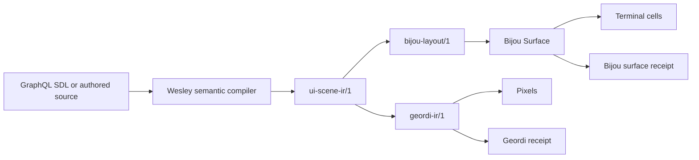

# DX-042 Shared UI Scene IR And Bijou Render Target

Legend: [DX - Developer Experience](../legends/DX-developer-experience.md)

## Linked Work

- User story: [#302](https://github.com/flyingrobots/bijou/issues/302)
- Roadmap candidate: Runtime Graph And Scene IR
- This document is a planning artifact only. It records the shared IR boundary
  for the #302 idea; it does not claim implementation of the IR, a compiler, or
  a renderer integration in this PR.

## Decision Summary

Bijou `Surface` should be treated as a deterministic terminal render target for
a portable UI scene IR, not as the portable IR itself.

The shared IR should sit above Bijou and Geordi:

```text
GraphQL SDL / authored source
  -> Wesley semantic graph and domain law
    -> ui-scene-ir/1
      -> bijou-layout/1
        -> Bijou Surface
          -> terminal cells

      -> geordi-ir/1
        -> Geordi renderer
          -> pixels and render receipts
```

This keeps the final renderer substrates honest. Geordi owns pixel-oriented
render proof. Bijou owns terminal cell rendering, input, focus, runtime
interaction, and agent-legible surfaces. The shared IR owns portable scene
structure, semantic identity, bindings, localization references, theme token
references, actions, and source maps.

## Sponsored Human

A builder wants to describe a UI scene once and render it through either Geordi
or Bijou so that browser/native artifacts and terminal artifacts stay aligned
without manually maintaining two different scene descriptions.

## Sponsored Agent

An agent wants a source-mapped, inspectable scene contract so it can audit which
localized strings, theme tokens, bindings, actions, and rendered cells came
from the same authored scene.

## Hill

A scene authored as a semantic UI contract can lower to both a Geordi render
artifact and a Bijou terminal surface, with structural receipts proving that
node identity, text keys, token references, bindings, and actions stayed in
sync across both targets.

## Core Rule

The portable IR describes scene intent.

Bijou `Surface` describes rendered terminal output.

Those are different layers:

```text
ui-scene-ir/1
  describes: nodes, text keys, token refs, bindings, actions, source maps

bijou-layout/1
  describes: terminal layout, focus graph, keymap, viewport regions

Bijou Surface
  describes: final cell grid with glyphs, colors, modifiers, opacity, masks
```

Bijou may render a shared scene IR. Geordi may render the same shared scene IR.
Neither system should pretend that terminal cells and pixels are the same final
substrate.

## Playback Questions

1. Which authored scene node produced this rendered cell or pixel region?
2. Which localization key produced this text?
3. Which theme token produced this foreground or background color?
4. Which action or key binding is attached to this node?
5. Which renderer-specific target profile lowered this scene?
6. Which target-specific claims are proven, and which are explicit nonclaims?
7. Can the Geordi and Bijou outputs prove structural parity without claiming
   pixel parity?
8. Can compile-time checks catch missing localization keys and raw color usage
   before runtime?

## Boundary

This design is about a portable scene contract and renderer-specific lowering.

It is not about:

- replacing Bijou's runtime loop
- replacing Bijou `Surface`
- making terminal cells behave like pixels
- making Geordi own terminal input or focus
- making Wesley a renderer
- forcing every existing Bijou block to be authored in GraphQL immediately
- claiming pixel-perfect parity between terminal and browser render targets

## Role Model

### Wesley

Wesley owns semantic compilation and domain law.

For this design, Wesley can:

- parse GraphQL SDL or another schema-backed authoring source
- validate schema shape
- generate TypeScript and Rust types
- validate localization requirements
- validate style token requirements
- compute schema hashes
- produce or validate `ui-scene-ir/1`

Wesley should not render terminal cells or pixels.

### Shared UI Scene IR

`ui-scene-ir/1` owns portable scene structure.

It should carry enough information for both Bijou and Geordi to lower the same
scene while preserving source identity.

It should know about:

- scene node IDs
- node kinds
- semantic roles
- layout intent
- text and localization references
- theme token references
- bindings
- actions
- source maps
- target profile requirements

It should not know about:

- terminal escape sequences
- renderer dirty-region internals
- final RGB cell caches
- subpixel antialiasing details
- host-specific input event loops

### Geordi

Geordi owns pixel-oriented render artifacts and receipts.

For this design, Geordi lowers `ui-scene-ir/1` to `geordi-ir/1`, then renders
or verifies the pixel artifact under a declared target profile.

Geordi claims:

- explicit pixel geometry
- font and asset requirements
- visual receipt hashes
- target profile facts
- browser/native renderer parity where supported

Geordi does not claim:

- terminal focus semantics
- terminal key routing
- cell-level glyph approximations
- Bijou runtime state updates

### Bijou

Bijou owns terminal runtime behavior and terminal render targets.

For this design, Bijou lowers `ui-scene-ir/1` to `bijou-layout/1`, then renders
that layout into a `Surface`.

Bijou claims:

- deterministic terminal cell output
- focus and input routing
- theme token resolution
- localization lowering
- cell-level provenance
- surface receipts
- agent-readable inspection through structured surfaces

Bijou does not claim:

- browser pixel parity
- native canvas fidelity
- subpixel antialiasing
- font-pack proof identical to Geordi

## Relationship Diagram



## Target Profile Diagram

```text
ui-scene-ir/1
  targetProfiles:
    - kind: geordi-pixel
      width: 1280
      height: 720
      colorProfile: truecolor
      claims:
        - pixel geometry
        - font metrics
        - asset hashes

    - kind: bijou-cell
      cols: 120
      rows: 40
      glyphProfile: ansi-unicode
      claims:
        - structural hierarchy
        - cell occupancy
        - token provenance
        - i18n provenance
```

The target profile makes renderer differences explicit. A Bijou terminal render
can claim structural parity and cell-level determinism without claiming that it
matches Geordi pixels exactly.

## Proposed IR Shape

The shared scene IR should be plain data. The first draft can stay intentionally
small:

```ts
type UiSceneIr = {
  irVersion: 'ui-scene-ir/1';
  id: string;
  sourceHash: string;
  rootNodeId: string;
  nodes: UiNode[];
  bindings: UiBinding[];
  actions: UiAction[];
  tokenUses: UiTokenUse[];
  i18nUses: UiI18nUse[];
  sourceMap: UiSourceMapEntry[];
  targetProfiles: UiTargetProfile[];
};
```

### Nodes

```ts
type UiNode = {
  id: string;
  kind: 'box' | 'text' | 'image' | 'group' | 'list' | 'table' | 'custom';
  role?: string;
  parentId?: string;
  children?: string[];
  layout?: UiLayoutIntent;
  text?: UiTextRef;
  style?: UiStyleRef;
  actions?: string[];
  metadata?: Record<string, unknown>;
};
```

Nodes are semantic scene members. They are not terminal cells and they are not
pixel rectangles, even when a renderer later lowers them into cells or
rectangles.

### Text

```ts
type UiTextRef =
  | { kind: 'literal'; value: string }
  | { kind: 'i18n'; key: string; fallback?: string };
```

Literal text should be allowed for fixture work and generated artifacts, but
product surfaces should prefer `i18n` references when they are user-facing.

### Style

```ts
type UiStyleRef = {
  fg?: { token: string };
  bg?: { token: string };
  border?: { token: string };
  modifiers?: string[];
};
```

The IR should carry token references, not only resolved colors. Renderers can
resolve tokens later against dark or light themes. Lower modes can preserve the
token name when color is unavailable.

### Bindings

```ts
type UiBinding = {
  id: string;
  targetNodeId: string;
  targetProperty: string;
  source: {
    kind: 'state' | 'query' | 'computed';
    path: string;
  };
  when?: string;
};
```

Bindings are data, not hidden callbacks. They make dynamic surfaces auditable
and compile-time-checkable.

### Actions

```ts
type UiAction = {
  id: string;
  label?: UiTextRef;
  command: string;
  keybindings?: string[];
  targetNodeId?: string;
};
```

Actions let Bijou preserve focus and input contracts while Geordi can still
render the same action affordances as visual artifacts.

## Bijou Lowering

Bijou lowering turns portable intent into a terminal-specific layout contract:

```ts
type BijouLayoutIr = {
  irVersion: 'bijou-layout/1';
  sceneHash: string;
  nodes: LayoutNode[];
  focusGraph: FocusGraph;
  keymap: KeyBinding[];
  viewportRegions: ViewportRegion[];
  themeRequirements: TokenRequirement[];
  localeRequirements: I18nRequirement[];
  sourceMap: UiToCellSourceMap[];
};
```

The final render target remains `Surface`.

```text
ui-scene-ir/1
  -> bijou-layout/1
    -> Surface
      -> terminal
```

The `Surface` can then be inspected, hashed, diffed, serialized for MCP, or
recorded in a renderer playback artifact.

## Geordi Lowering

Geordi lowering turns portable intent into a pixel-oriented render contract:

```text
ui-scene-ir/1
  -> geordi-ir/1
    -> browser/native renderer
      -> pixel buffer
      -> receipt
```

Geordi can preserve the same node IDs, token references, localization
references, and source maps while resolving geometry and render-profile facts
for pixel output.

## Cross-Renderer Structural Receipt

The first proof should not compare pixels to cells. It should compare shared
structure.

```ts
type SharedSceneReceipt = {
  sceneHash: string;
  sourceHash: string;
  nodeIds: string[];
  i18nKeys: string[];
  tokenRefs: string[];
  actionIds: string[];
  bindingIds: string[];
  outputs: {
    geordi?: {
      irHash: string;
      receiptHash: string;
    };
    bijou?: {
      layoutHash: string;
      surfaceHash: string;
    };
  };
};
```

This answers the important question:

```text
Did both targets render the same authored scene contract?
```

It does not falsely answer:

```text
Are terminal cells pixel-perfect replicas of browser pixels?
```

## Debug And Provenance Files

This design connects directly to the proposed stable debug logs:

```text
<repo>/.bijou/debug.i18n.jsonl
<repo>/.bijou/debug.style.jsonl
```

The logs should record first appearance or provenance changes, not every frame.

Example i18n line:

```json
{"scene":"docs.home","node":"hero.title","key":"dogfood.home.title","locale":"en","status":"resolved"}
```

Example style line:

```json
{"scene":"docs.home","node":"hero.title","slot":"fg","token":"semantic.primary","mode":"dark","status":"resolved"}
```

The eventual goal is to catch these issues earlier through IR validation:

- missing localization key
- unsupported locale
- raw color in product surface
- unresolved token
- unsafe token pair
- binding target that does not exist
- action without a command

Runtime logs remain useful as proof of what actually appeared.

## Authoring Model

GraphQL SDL remains the strongest candidate authoring source because Wesley and
Geordi already use schema-backed compilation patterns.

The authoring source may look like this in spirit:

```graphql
type DocsHomeScene
  @ui_scene(id: "docs.home")
  @ui_target(kind: "bijou-cell", cols: 120, rows: 40)
  @ui_target(kind: "geordi-pixel", width: 1280, height: 720) {
  title: String!
    @ui_node(id: "hero.title", kind: "text")
    @ui_text(key: "dogfood.home.title")
    @ui_style(fg: "semantic.primary")

  openAction: String
    @ui_action(id: "docs.open", command: "docs.open", keybindings: ["Enter"])
}
```

This is not final syntax. The important contract is that scene structure,
text, style, binding, and action identity are compile-time data.

## Lower Modes

The shared IR should make lower modes more deterministic.

For example, Bijou could render diagnostic modes:

```text
normal:
  Start Here

i18n lowering:
  dogfood.nav.startHere

token lowering:
  semantic.primary on surface.primary.bg

binding lowering:
  docs.currentPage.title <- route.currentPage.title
```

These modes are easier to test than screenshots and more useful to agents than
raw escape sequences.

## Scope

The first implementation slice should include:

- a design document for `ui-scene-ir/1`
- one tiny fixture scene
- a structural receipt format
- a Bijou lowering proof to `Surface`
- a Geordi lowering proof or adapter stub if Geordi integration is not yet
  ready inside this repository
- tests proving node IDs, token refs, i18n keys, actions, and bindings survive
  lowering

## Non-Goals

The first slice should not:

- migrate DOGFOOD wholesale to GraphQL-authored scenes
- replace existing Bijou block APIs
- implement a full Geordi renderer inside Bijou
- require Geordi as a runtime dependency of every Bijou app
- claim pixel/cell parity
- solve every binding expression shape

## Acceptance Criteria

- A `ui-scene-ir/1` fixture describes at least one text node, one token
  reference, one i18n key, and one action.
- Bijou can lower the fixture into a terminal render target without losing node
  identity.
- The resulting `Surface` can report a structural receipt or source-map facts
  tied back to the fixture.
- The design names the distinction between shared IR, Bijou layout IR, and
  Bijou `Surface`.
- The design names Geordi as the pixel-proof target and Bijou as the
  terminal-surface target.
- The validation plan proves structure, not screenshot similarity.

## Slice Plan

1. Document the shared IR contract and renderer boundaries.
2. Add a minimal `ui-scene-ir/1` fixture package or test helper.
3. Add Bijou lowering from the fixture to a simple `Surface`.
4. Add structural receipt generation for the fixture.
5. Add token and i18n provenance checks against the receipt.
6. Add a Geordi integration spike that either lowers to `geordi-ir/1` or records
   the adapter boundary needed to do so.

## Validation Plan

Focused proof should use deterministic fixture tests:

```text
npm test -- --run shared-ui-scene-ir
npm run typecheck:test
npm run lint
```

Future integration proof can add:

```text
npm run dogfood:i18n:check
npm run dogfood:i18n:debt
npm run verify:interactive-examples
```

The key invariant is that a passing test must prove software behavior or
inspectable output. A design document alone is not completion proof for the
implementation goalpost.

## Risks

### Risk: The Shared IR Becomes A Renderer

If `ui-scene-ir/1` starts carrying renderer internals, it will become too
expensive to author and too vague to validate.

Mitigation: keep final render details in `geordi-ir/1`, `bijou-layout/1`, and
`Surface`.

### Risk: Bijou Loses Terminal-Native Behavior

If the IR treats keyboard routing, focus, and terminal viewports as afterthought
metadata, Bijou scenes will look portable but feel broken.

Mitigation: make Bijou target profiles carry focus, keymap, and viewport
requirements explicitly.

### Risk: Geordi And Bijou Drift Anyway

If both lowerings are implemented independently without receipts, drift will
come back.

Mitigation: structural receipts compare node IDs, text keys, token refs,
bindings, actions, and source hashes.

### Risk: GraphQL Syntax Gets Overloaded

GraphQL SDL can describe contracts well, but directives can become JSON string
dumps if the schema is not designed carefully.

Mitigation: use Wesley domain law to validate directive shape and prefer typed
schema contracts over ad hoc JSON blobs.

## Open Questions

- Should `ui-scene-ir/1` live in Bijou, Geordi, Wesley, or a small shared
  package?
- Should Bijou expose `bijou-layout/1` as a public artifact or keep it internal
  until the contract stabilizes?
- Should Geordi consume `ui-scene-ir/1` directly, or should Wesley emit
  `geordi-ir/1` and `bijou-layout/1` as sibling artifacts?
- How much action/focus metadata belongs in the shared IR versus the Bijou
  target profile?
- Should debug JSONL files be produced by the renderer, by the lowering layer,
  or by both with different provenance phases?

## Recommended Next Step

Create a roadmap-backed issue for `ui-scene-ir/1` and start with one tiny
fixture scene. The fixture should prove that Bijou `Surface` is a render target
for the shared IR, while Geordi remains the pixel-proof target.
