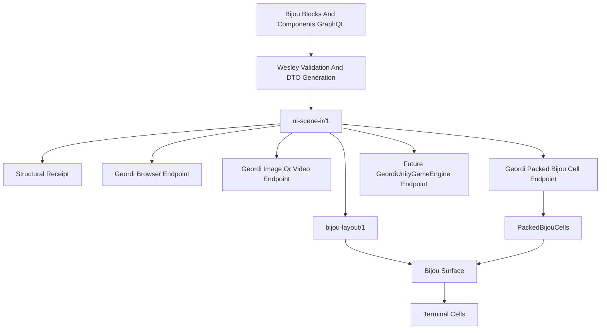

# DX-043 Portable Bijou Blocks And Multi-Endpoint IR

Legend: [DX - Developer Experience](../legends/DX-developer-experience.md)

## Linked Work

- Prior Bijou design:
  [DX-042 Shared UI Scene IR And Bijou Render Target](./DX-042-shared-ui-scene-ir-and-bijou-render-target.md)
- Geordi doctrine:
  `/Users/james/git/geordi/docs/render-everywhere.md`
- Geordi pipeline:
  `/Users/james/git/geordi/docs/end-to-end.md`
- Jedit/Geordi packed-cell seed:
  `/Users/james/git/jedit/docs/design/0107-geordi-raytraced-title-render-pipeline.md`
- Geordi-side companion design:
  `/Users/james/git/geordi/docs/design/2026-06-portable-bijou-ui-render-endpoints.md`

This document is a planning artifact. It does not claim a GraphQL compiler,
portable Bijou IR runtime, browser Dogfood endpoint, Geordi packed-cell target,
or Unity endpoint already exists in this repository.

## Decision Summary

Bijou should grow toward a portable block and component semantics layer.
Terminal rendering remains a first-class Bijou endpoint, but it should not be
the only possible endpoint for Bijou-authored UI.

The intended flow is:

```text
Bijou Blocks + Components GraphQL
  -> Wesley validation and generated DTOs
    -> ui-scene-ir/1
      -> Bijou terminal endpoint
      -> Geordi browser/WebGL/WebGPU endpoint
      -> Geordi image or video witness endpoint
      -> Geordi packed Bijou cell endpoint
      -> future engine endpoints such as GeordiUnityGameEngine
```

The reverse direction should also be possible for visual surfaces:

```text
Figma or other external design source
  -> Geordi IR or compatible scene IR
    -> BijouPackedCellRenderer
      -> PackedBijouCells
        -> Bijou Surface
          -> terminal cells
```

The important shift is this:

```text
Bijou Surface is one render target.
Bijou block and component semantics are the portable product contract.
```

## Sponsored Human

A developer wants to define an app surface once and render it in a terminal,
browser, visual witness, or future game-engine endpoint without maintaining
parallel component trees by hand.

## Sponsored Agent

An agent wants deterministic UI IR and deterministic render witnesses so it can
debug node identity, bindings, localization, theme tokens, focus, actions, and
rendered output without scraping screenshots or inferring intent from terminal
pixels.

## Hill

Dogfood can be described by a Bijou-owned semantic UI contract, compiled into a
deterministic IR, and rendered through both a terminal endpoint and a browser
endpoint, with receipts proving that node IDs, token references, localization
keys, actions, bindings, and target-specific outputs came from the same source.

## Core Rule

Bijou owns the meaning of Bijou blocks and components.

Renderers own how that meaning is drawn.

```text
GraphQL source
  describes: author intent

ui-scene-ir/1
  describes: portable semantic UI structure

bijou-layout/1
  describes: terminal layout, focus graph, keymap, and viewports

Bijou Surface
  describes: final terminal cell output

Geordi endpoint IR or prepared target
  describes: browser, image, GPU, packed-cell, or engine render state
```

No endpoint owns the semantic truth of a Bijou component. An endpoint may render
or inspect the component, but it must not silently redefine its behavior.

## Relationship Diagram



## Why This Matters

### Agent-Legible Debugging

Screenshots are weak debugging artifacts. They show that something looked odd,
but they do not directly answer what node, token, string, binding, or target
rule produced the output.

IR plus receipts can answer:

- Which source node produced this cell, pixel, or engine element?
- Which localization key produced this text?
- Which theme token produced this foreground or background?
- Which action is attached to this focusable element?
- Which endpoint lowered this scene?
- Which target claims are proven, and which are explicit nonclaims?
- Did two endpoints render the same semantic scene?

The expected debug artifact should be inspectable by agents:

```json
{
  "scene": "dogfood.docs",
  "node": "nav.guides.startHere",
  "component": "tree.item",
  "textKey": "dogfood.nav.startHere",
  "fgToken": "semantic.nav.item.active.fg",
  "bgToken": "semantic.nav.item.active.bg",
  "action": "dogfood.openDoc",
  "target": "bijou-terminal",
  "cellBounds": { "x": 12, "y": 4, "w": 22, "h": 1 }
}
```

### Render Anywhere

Bijou-authored UI should be able to leave the terminal:

```text
Bijou Blocks -> IR -> GeordiWebGL
Bijou Blocks -> IR -> GeordiWebGPU
Bijou Blocks -> IR -> GeordiImage
Bijou Blocks -> IR -> GeordiUnityGameEngine
```

This does not mean every endpoint has identical pixels. It means every endpoint
renders the same semantic contract under a declared target profile.

### Render Other UI Into The Terminal

Bijou can also become the terminal endpoint for non-Bijou UI sources:

```text
Figma -> Geordi IR -> BijouPackedCellRenderer -> terminal
```

The first claim here is visual portability: can the source be approximated as
terminal cells? Interactive portability requires additional semantics: focus,
actions, state, localization, accessibility, and key routing.

## Bijou Ownership

Bijou should own portable terminal UI semantics:

- blocks and components
- component identity
- child hierarchy
- layout intent
- state bindings
- actions and command IDs
- focus and key routing intent
- localization references
- theme token references
- accessibility labels and roles
- terminal runtime behavior
- `Surface` and cell semantics
- packed-cell validation rules when a packed target claims Bijou compatibility

Bijou should not own:

- Geordi browser renderer internals
- GPU shader dispatch
- image/video export internals
- Unity scene graph adapters
- Figma import specifics
- Bunny geometry kernels

## Proposed Source Shape

GraphQL remains the best initial source-of-truth candidate because it can carry
schema-backed fields and directives while letting Wesley generate DTOs and drift
checks.

Example shape:

```graphql
type DogfoodDocsScene
  @bijou_scene(id: "dogfood.docs")
  @ui_target(kind: "bijou-terminal", cols: 160, rows: 48)
  @ui_target(kind: "geordi-browser", width: 1440, height: 900)
  @ui_target(kind: "geordi-packed-bijou-cells", cols: 160, rows: 48) {
  navTitle: String!
    @ui_node(id: "nav.title", kind: "text", component: "heading")
    @ui_text(key: "dogfood.nav.title")
    @ui_style(fg: "semantic.nav.title.fg")

  startHere: String!
    @ui_node(id: "nav.guides.startHere", kind: "text", component: "tree.item")
    @ui_text(key: "dogfood.nav.startHere")
    @ui_style(
      fg: "semantic.nav.item.active.fg"
      bg: "semantic.nav.item.active.bg"
    )
    @ui_action(id: "dogfood.openDoc", command: "dogfood.openDoc", keys: ["Enter"])

  currentPage: String!
    @ui_node(id: "content.currentPage", kind: "markdown", component: "doc.page")
    @ui_binding(path: "docs.currentPage.markdown")
}
```

This syntax is not final. The contract matters more than the directive names:
source nodes, text keys, style tokens, bindings, actions, and target profiles
must be compile-time data.

## IR Shape

DX-042 proposes the first `ui-scene-ir/1` shape. This design extends its intent
with explicit component portability and endpoint requirements.

```ts
type UiSceneIr = {
  irVersion: 'ui-scene-ir/1';
  id: string;
  sourceHash: string;
  rootNodeId: string;
  nodes: UiNode[];
  bindings: UiBinding[];
  actions: UiAction[];
  tokenUses: UiTokenUse[];
  i18nUses: UiI18nUse[];
  sourceMap: UiSourceMapEntry[];
  targetProfiles: UiTargetProfile[];
  portability: UiPortabilityClaim;
};

type UiPortabilityClaim = {
  level: 'portable' | 'terminal-native' | 'visual-only' | 'host-adapter';
  reasons?: string[];
};
```

Portability should be explicit. Some Bijou surfaces may remain terminal-native
because they inspect terminal escape behavior, alternate-screen state, or raw
cell buffers. Those surfaces are still valuable, but they should not pretend to
render everywhere.

## Target Profiles

The first target profile vocabulary should include:

| Profile | Output | Primary owner |
| --- | --- | --- |
| `bijou-terminal` | `Surface` | Bijou |
| `geordi-browser` | browser canvas/WebGL/WebGPU output | Geordi |
| `geordi-image` | RGBA frame, PNG, video witness | Geordi |
| `geordi-packed-bijou-cells` | `PackedBijouCells` | Geordi plus Bijou contract |
| `geordi-unity` | Unity scene or UI graph | Geordi adapter |
| `external-visual-import` | visual scene imported from Figma or similar | Geordi adapter |

Every target profile should name supported features. Unsupported features must
fail before drawing.

## Bijou Terminal Lowering

The Bijou terminal endpoint lowers semantic UI IR into terminal runtime facts:

```text
ui-scene-ir/1
  -> bijou-layout/1
    -> Surface
      -> terminal cells
```

`bijou-layout/1` should carry:

- resolved terminal layout regions
- focus graph
- keymap
- viewport regions
- scroll policies
- localized text after i18n resolution
- theme token requirements
- source-map entries from nodes to cells
- target-specific nonclaims

The final `Surface` remains the rendered cell grid. It is not the portable IR.

## Packed Cell Lowering

The packed cell endpoint lets Geordi render directly into a Bijou-compatible
terminal cell target:

```text
ui-scene-ir/1 or geordi endpoint IR
  -> Geordi packed-cell renderer
    -> PackedBijouCells
      -> Bijou Surface adapter
        -> terminal cells
```

This is useful when a renderer, CPU backend, or GPU backend can produce the
terminal-native output directly instead of rendering a large image and then
sampling it on the CPU.

The contract should be explicit:

```ts
type PackedBijouCells = {
  targetVersion: 'packed-bijou-cells/1';
  widthCells: number;
  heightCells: number;
  cellFormatId: string;
  sampleGrid?: '1x1' | '2x4' | 'custom';
  colorPolicyId: string;
  glyphResolvePolicyId: string;
  cells: PackedBijouCell[];
  facts: RenderFrameFacts;
};

type PackedBijouCell = {
  char: string;
  fg?: Rgb;
  bg?: Rgb;
  modifiers?: string[];
  provenanceNodeId?: string;
  tokenRefs?: {
    fg?: string;
    bg?: string;
  };
};
```

Bijou should validate that a packed-cell buffer is structurally compatible with
Bijou cell semantics before presenting it.

## Dogfood Proof

Dogfood is the best flagship proof because it contains:

- document navigation
- panes
- markdown rendering
- theme tokens
- light and dark modes
- localization
- focus
- scrolling
- keyboard actions
- status rows
- drawers
- overlays
- debug panels

The intended proof path is:

```text
Dogfood source
  -> Dogfood IR
    -> Dogfood in the terminal
    -> Dogfood in the browser
    -> structural receipts proving semantic parity
```

The first slice should not rewrite all of Dogfood. It should make one page or
one pane undeniable.

## Structural Receipt

The shared receipt proves semantic parity, not pixel parity:

```ts
type PortableUiReceipt = {
  sceneHash: string;
  sourceHash: string;
  nodeIds: string[];
  componentIds: string[];
  i18nKeys: string[];
  tokenRefs: string[];
  actionIds: string[];
  bindingIds: string[];
  outputs: {
    terminal?: {
      layoutHash: string;
      surfaceHash: string;
    };
    browser?: {
      endpointHash: string;
      witnessHash: string;
    };
    packedCells?: {
      targetHash: string;
      surfaceHash: string;
    };
  };
};
```

Endpoint receipts can add target-specific proof:

- terminal cell hashes
- browser pixel probes
- packed-cell hashes
- image frame hashes
- engine object counts
- target profile support matrix

## Accessibility And Assistive Posture

Portable Bijou IR should preserve accessibility metadata even when a renderer
does not directly display it.

Required fields should include:

- semantic role
- accessible label or i18n key
- focusability
- keyboard action hints
- decorative vs meaningful marker
- directionality and locale posture
- reduced-motion or animation policy where relevant

Browser and engine endpoints can map this metadata to their own accessibility
systems later. Terminal endpoints can expose it through debug modes, help
surfaces, and structured MCP surfaces.

## Localization And Directionality Posture

Product text should enter the IR as localization keys, not resolved ad hoc
strings. Render endpoints may resolve keys later against locale bundles, but
receipts must preserve which key was used.

Directionality should be target-aware:

- terminal endpoint records whether a region is left-to-right or right-to-left
- browser endpoint can map direction to layout/text properties
- image endpoint records direction metadata in frame facts
- packed-cell endpoint records the resolved order it actually emitted

## Agent Inspectability

The IR and receipts should make these questions answerable by file inspection:

- What component rendered this cell?
- What action would fire if the user pressed Enter here?
- Why is this node not focusable?
- Which token produced this color?
- Which localization key produced this text?
- Which target profile rejected this component?
- Did terminal and browser outputs use the same semantic node tree?

This is the main reason the IR matters. It turns UI debugging into structured
evidence instead of screenshot interpretation.

## Scope

The first implementation arc should include:

- one portable Bijou component fixture
- one GraphQL or JSON source-of-truth fixture
- one `ui-scene-ir/1` output
- one terminal lowering to `Surface`
- one browser or Geordi endpoint stub
- one structural receipt
- one negative fixture proving fail-loud unsupported target requirements

## Non-Goals

The first arc should not:

- migrate all Dogfood pages
- replace existing block APIs
- require Geordi at runtime for every Bijou app
- claim pixel parity between terminal and browser
- implement Unity, Figma, WebGPU, or GPU packed-cell output immediately
- make GraphQL directives the permanent final authoring syntax
- erase terminal-native Bijou components

## Acceptance Criteria

- A portable Bijou component can be represented as deterministic IR.
- The IR preserves node IDs, component IDs, token refs, i18n keys, actions, and
  bindings.
- The same IR can lower to a Bijou `Surface`.
- A second endpoint stub or fixture can consume the same IR and emit a receipt.
- Receipts prove semantic parity across endpoints.
- Unsupported endpoint requirements fail before drawing.
- The design distinguishes portable components from terminal-native
  components.
- Dogfood has a concrete first-page or first-pane migration target.

## Slice Plan

1. Land this design and the Geordi companion design.
2. Define a tiny portable component fixture.
3. Define the first `ui-scene-ir/1` fixture and canonical JSON rules.
4. Add a structural receipt fixture.
5. Lower the fixture to a Bijou `Surface`.
6. Add a terminal receipt with source-map facts.
7. Add a Geordi browser endpoint stub or fixture consumer.
8. Add a fail-loud unsupported target fixture.
9. Add a Dogfood page/pane candidate map.
10. Emit Dogfood IR witness data beside the current runtime.
11. Render one Dogfood pane from IR to terminal.
12. Render the same pane through a browser witness endpoint.

## Validation Plan

Initial validation should be deterministic and file-backed:

```text
npm test -- --run portable-bijou-ir
npm run typecheck:test
npm run lint
npm run docs:inventory
git diff --check
```

Future validation should add:

```text
npm run dogfood:i18n:check
npm run dogfood:i18n:debt
npm run verify:interactive-examples
```

The important proof rule remains: design docs describe intent; executable
fixtures and receipts prove behavior.

## Risks

### Risk: Bijou Becomes Too Abstract

If portable IR hides terminal realities, Bijou components may render elsewhere
but feel broken in the terminal.

Mitigation: keep `bijou-terminal` as a first-class endpoint with focus, keymap,
viewport, scroll, and cell-source-map requirements.

### Risk: Geordi Redefines Bijou Semantics

If Geordi endpoints silently reinterpret Bijou components, parity becomes
cosmetic.

Mitigation: Bijou owns component semantics; Geordi owns endpoint rendering and
receipts.

### Risk: GraphQL Becomes An Unreadable Directive Dump

GraphQL can carry schema-backed contracts, but overly complex directives can
turn into JSON blobs.

Mitigation: keep source syntax small, use Wesley validation, and treat early
syntax as provisional.

### Risk: Visual Import Pretends To Be Interactive

A Figma-to-terminal path can render a visual mockup, but that does not mean it
has focus, actions, state, or accessibility.

Mitigation: distinguish visual portability from interactive portability in the
target profile.

## Recommended Next Step

Create the smallest possible Dogfood proof:

```text
one Dogfood nav or content pane
  -> portable source fixture
    -> ui-scene-ir/1
      -> Bijou Surface
      -> browser/Geordi endpoint receipt
      -> structural parity receipt
```

That proves the architecture without rewriting Dogfood or overbuilding the
compiler.
