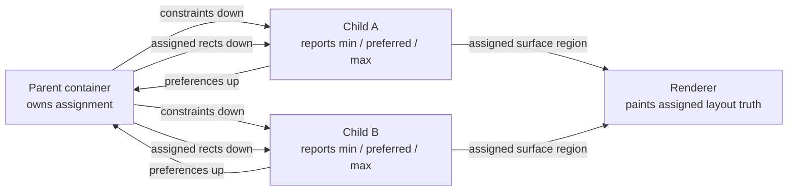
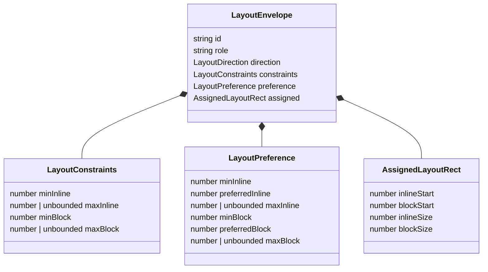
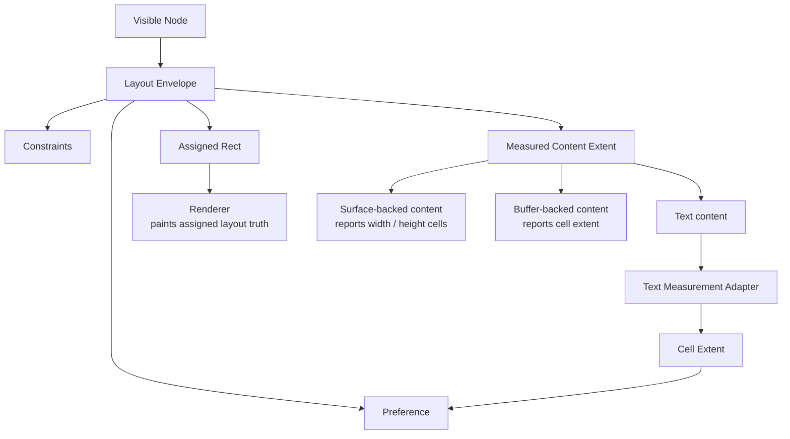
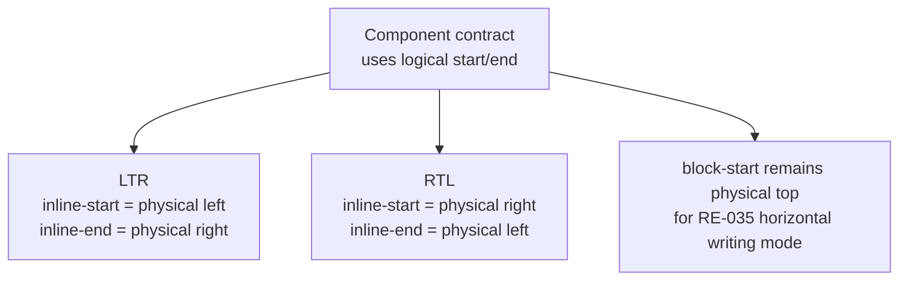

# RE-035 Mandatory Layout Envelope And Constraint Negotiation

_Cycle for making layout envelopes mandatory before any visible UI node can
render_

Legend:

- [RE - Runtime Engine](../legends/RE-runtime-engine.md)

Depends on:

- [RE-003](./RE-003-retain-layout-trees-and-layout-invalidation.md)
- [RE-004](./RE-004-route-input-through-layouts-and-layer-bubbling.md)
- [RE-006](./RE-006-formalize-component-layout-and-interaction-contracts.md)
- [DX-022 - Layout Inspector Overlay](./DX-022-layout-inspector-overlay.md)
- [DX-026 - Mode-Lowering Linter](./DX-026-mode-lowering-linter.md)

## Why This Cycle Exists

Bijou already has retained runtime seams, layout-driven routing, component
metadata, focus maps, inspectors, and mode-lowering tools. The missing floor is
that visible UI is still allowed to exist as rendered output before it resolves
through a mandatory layout envelope.

That leaves too much behavior implicit:

- components can choose private sizing rules
- renderers can effectively decide geometry while painting
- overflow and clipping have no shared prerequisite contract
- direction-aware placement can drift into physical left/right assumptions
- later workspace features can mutate geometry unless there is a stricter
  boundary to compile into

RE-035 establishes the first boring law: every visible node must resolve a
layout envelope before rendering.

## North Star

Bijou layout is a retained, semantic, cell-native constraint negotiation
system: constraints flow down, preferences flow up, assigned rectangles flow
down, and semantic truth lowers outward into interactive, static, pipe, and
accessible modes.

The boundary:

- Layout lays out.
- Workspace organizes.
- Interaction commands.
- Renderer paints.
- Modes lower.
- Inspector explains.

## Human Users / Jobs / Hill

### Primary Human Users

- Bijou maintainers turning layout from render-time convention into runtime
  truth.
- Component authors who need predictable sizing, clipping, and placement rules
  without copying CSS or Auto Layout.
- DOGFOOD builders who need narrow, standard, and wide documentation layouts to
  share one inspectable geometry model.

### Human Jobs

1. Define a visible node's layout contract before it renders.
2. Read min, preferred, max, and assigned size facts without reverse-engineering
   a renderer.
3. Trust parent-owned rectangle assignment instead of child-owned geometry
   mutation.
4. Explain why stack and place containers assigned a particular integer-cell
   rectangle.

### Human Hill

A maintainer can inspect a visible UI node and answer its identity, role,
constraints, preferences, assigned rectangle, direction, and assignment reason
before looking at the rendered surface.

## Agent Users / Jobs / Hill

### Primary Agent Users

- Agents preparing tests for layout and viewport behavior.
- Agents explaining why a component received a rectangle or could not satisfy a
  constraint.
- Agents generating future component or workspace code that must compile into
  primitive layout instead of mutating geometry directly.

### Agent Jobs

1. Read a layout envelope as plain facts.
2. Predict whether a child preference can affect parent assignment.
3. Generate deterministic assertions for stack assignment, place alignment, and
   RTL inline-start/inline-end mapping.
4. Distinguish surface or buffer cell extents from text-to-cell measurement.

### Agent Hill

An agent can explain a layout decision from mode-neutral facts: incoming
constraints, child preferences, parent assignment, integer rounding, direction,
and the reason attached to the resolved rectangle.

## Concept Diagrams

These Mermaid diagrams are explanatory mockups, not implementation artifacts.
They favor Obsidian-readable semantic structure over raw SVG detail in this
cycle doc.



Measure/assign protocol: constraints flow down, preferences flow up, assigned
rectangles flow down.



A visible node owns explicit layout facts before rendering.



Layout measures cell extents. Text measurement is one adapter into the
measurement seam, not the canonical layout model.

```text
96 inline cells

[ nav: fixed 24 ][gap 1][ content: flex 52 ][gap 1][ inspector: fixed 18 ]
```

Stack assignment proves the first slice without implementing full flexbox:
`96 available - 24 nav - 18 inspector - 2 gaps = 52 flexible cells`.



Logical axes let placement flip under RTL without changing source order; the
engine derives physical placement from direction.

## Human Playback

1. A DOGFOOD shell renders a header, navigation pane, content pane, and status
   line.
2. The root layout receives a 96-column by 24-row terminal constraint.
3. The header and status line report fixed block preferences.
4. The navigation pane reports a fixed 24-cell inline preference.
5. The content pane reports a flexible inline preference with a useful minimum.
6. The parent stack assigns concrete integer rectangles to each child.
7. The renderer receives those assigned rectangles and paints clipped surfaces
   inside them.
8. The maintainer opens the layout facts and sees the constraints, preferences,
   assignment, and reason for the content pane's 52-cell inline span.

## Agent Playback

1. An agent reads a resolved layout envelope for `docs.content`.
2. It sees the node id, role, direction, incoming constraints, min/preferred/max
   preferences, assigned rectangle, and assignment reason.
3. It verifies that `docs.content` did not force parent geometry after
   assignment.
4. It verifies that RTL direction maps inline-start to the physical right edge
   for placement tests.
5. It emits a deterministic assertion against the layout facts without parsing
   rendered text or ANSI output.

## Accessibility / Assistive Posture

RE-035 does not build the full accessible layout mode. It must still preserve
the facts that later accessible output needs:

- stable node identity
- role
- source order
- direction
- assigned rectangle
- mode-neutral reason text

The first implementation should not hide semantic identity inside surfaces.
Accessible and static output can later lower from the same layout truth rather
than trying to recover structure from painted cells.

## Localization / Directionality Posture

RE-035 introduces logical axes before any new stack or place behavior can
settle into physical left/right assumptions.

The first direction scope is intentionally narrow:

- `ltr`
- `rtl`
- `auto` as a declared direction value
- horizontal writing mode only
- inline-start and inline-end mapped through direction
- block-start and block-end kept physical top/bottom for this cycle

Full bidi text layout, cursor maps, and vertical writing modes belong to later
text and localization cycles.

## Agent Inspectability / Explainability Posture

Every resolved layout node should be explainable as data. The explanation does
not need to be a stable public API in the first slice, but tests should prove
that the engine can report:

- node id
- role
- direction
- incoming constraints
- min/preferred/max preference facts
- assigned rectangle
- assignment reason

The explanation must not require executing renderer behavior or parsing a
surface string.

## Linked Invariants

- [Runtime Truth Wins](../invariants/runtime-truth-wins.md)
- [Layout Owns Interaction Geometry](../invariants/layout-owns-interaction-geometry.md)
- [The Buffer Holds Facts](../invariants/buffer-holds-facts.md)
- [Focus Owns Input](../invariants/focus-owns-input.md)
- [Tests Are the Spec](../invariants/tests-are-the-spec.md)

## Requirements

- Introduce a pure layout envelope model for visible UI nodes.
- Represent logical axes:
  - `inline-start`
  - `inline-end`
  - `block-start`
  - `block-end`
- Represent layout direction at least as `ltr`, `rtl`, and `auto`.
- Represent size facts separately:
  - minimum size
  - preferred size
  - maximum size
  - assigned size
- Represent incoming constraints as bounded, exact, or unbounded per axis.
- Keep parent assignment authoritative.
- Add a deterministic rounding policy for flexible integer-cell tracks.
- Add initial layout containers only where needed to prove the protocol:
  - stack
  - place
- Add layout explanation facts suitable for inspectors, tests, and agent output.
- Define the content measurement seam for cell extents. Text measurement is one
  adapter into that seam, not the canonical layout model.
- Reserve the concept of fit policy so later compression, truncation, wrapping,
  clipping, and overflow work has a deterministic place to attach.

## Non-Goals

- Do not implement full text wrapping, grapheme segmentation, bidi layout, or
  cursor maps. RE-035 defines the text-to-cell measurement seam; RE-036 owns
  the text measurement work.
- Do not implement scrollbars, scroll anchoring, virtualized viewports, or
  marquee behavior.
- Do not implement the full fit-policy/compression ladder. RE-035 names the
  concept; later responsive, viewport, and text cycles define behavior.
- Do not implement docking, tab dragging, drawers, floating panels, workspace
  persistence, or drag-and-drop rearrangement.
- Do not introduce a new `LK` legend yet. This is runtime-engine work until the
  layout kernel becomes its own public subsystem, package, or doctrine track.
- Do not build CSS, Auto Layout, or a general constraint solver.

## Contract Sketch

The first public or internal names can change during implementation, but the
conceptual shape should stay small:

```ts
type LayoutDirection = 'ltr' | 'rtl' | 'auto';

type LogicalAxis = 'inline' | 'block';

type LogicalAlign = 'start' | 'center' | 'end' | 'stretch';

type LayoutFitPolicy =
  | 'fixed'
  | 'shrink'
  | 'grow'
  | 'truncate'
  | 'wrap'
  | 'overflow'
  | 'clip'
  | 'priority';

interface LayoutConstraints {
  readonly minInline: number;
  readonly maxInline: number | 'unbounded';
  readonly minBlock: number;
  readonly maxBlock: number | 'unbounded';
}

interface LayoutPreference {
  readonly minInline: number;
  readonly preferredInline: number;
  readonly maxInline: number | 'unbounded';
  readonly minBlock: number;
  readonly preferredBlock: number;
  readonly maxBlock: number | 'unbounded';
}

interface AssignedLayoutRect {
  readonly inlineStart: number;
  readonly blockStart: number;
  readonly inlineSize: number;
  readonly blockSize: number;
}

interface LayoutEnvelope {
  readonly id: string;
  readonly role: string;
  readonly direction: LayoutDirection;
  readonly constraints: LayoutConstraints;
  readonly preference: LayoutPreference;
  readonly assigned: AssignedLayoutRect;
  readonly fit?: LayoutFitPolicy;
}
```

The key rule is not the exact type names. The key rule is that a visible node
has explicit constraint, preference, assignment, identity, role, and direction
facts before rendering.

## Measure And Assign

RE-035 uses a bounded two-step protocol:

1. Measure: a parent asks children for preferences under incoming constraints.
2. Assign: the parent chooses concrete integer rectangles and gives them back
   to children.

Children may report preferences. They may not force parent size after
assignment.

Rendering happens only after assignment.

## Layout Fit Policy

RE-035 should reserve fit policy as the node's declared posture under
compression, expansion, and overflow.

Constraints say what space is possible. Preferences say what size a node wants.
Assignment says what rectangle the parent chose. Fit policy says how the node
intends to remain useful when those facts disagree.

Examples:

- `fixed`: preserve assigned size and let the parent resolve surrounding space
- `shrink`: accept less than preferred size before siblings with higher priority
- `grow`: accept extra space after fixed and preferred claims are satisfied
- `truncate`: preserve one-line or bounded content by shortening presentation
- `wrap`: trade inline space for block space through a measurement adapter
- `overflow`: report content extent beyond the assigned rect
- `clip`: hide paint outside the assigned rect without claiming scroll state
- `priority`: participate in an ordered compression ladder

The first implementation does not need to execute all of these policies. It
should only leave an explicit home for this intent so later text, viewport,
responsive, and workspace cycles do not invent private compression rules.

## Initial Containers

### Stack

`stack` proves ordered layout along one logical axis.

It should support:

- fixed tracks
- flexible tracks
- gaps
- logical direction
- deterministic leftover-cell rounding
- child explanations

The first slice does not need full flexbox.

### Place

`place` proves alignment inside an assigned rectangle.

It should support:

- inline alignment: start, center, end, stretch
- block alignment: start, center, end, stretch
- logical start/end resolution under LTR and RTL

The first slice does not need absolute positioning, anchors, portals, or
overlay placement.

## Content Measurement Seam

RE-035 layout measures cell extents, not JavaScript string length.

Bijou surfaces are already rectangular grids of cells with `width` and
`height`. A surface-backed component can report those dimensions directly as
its content extent. Text is different only because it must first be lowered
into cells through a measurement adapter.

RE-035 should define where content measurement plugs in, but should not solve
the whole text system.

The seam should make room for surface and buffer content that can already
report:

- inline cell extent
- block cell extent
- optional baseline facts
- optional semantic facts

The text adapter into that seam should make room for:

- available inline size
- wrap policy
- overflow policy
- layout direction
- ambiguous-width policy
- output mode

The implementation may use a minimal deterministic placeholder for early
component tests, but the design must make it clear that no text-bearing
component should own private `text.length` measurement in the long run.
String-to-surface conversion belongs behind the text measurement adapter.

## Mode-Neutral Facts

The resolved layout should be inspectable without depending on a rendered
surface.

Example facts:

```text
node docs.content
role viewport
direction ltr
constraints inline 0..96 block 0..24
preference inline min 32 preferred 72 max unbounded
preference block min 6 preferred 18 max unbounded
assigned inline-start 24 block-start 1 inline-size 72 block-size 22
reason took remaining inline space in stack after fixed nav and status chrome
```

Interactive, static, pipe, and accessible modes may present these facts
differently, but the underlying layout truth should be shared.

## Implementation Outline

1. Add a pure layout module that can construct and resolve layout envelopes
   without rendering.
2. Add constraint, preference, assigned-rect, direction, and explanation fact
   types.
3. Add the two-step measure/assign protocol with parent-owned assignment.
4. Add minimal stack and place helpers to prove the protocol.
5. Add deterministic integer rounding for flexible tracks.
6. Add a content measurement seam that accepts surface/buffer cell extents
   directly and leaves text-to-cell measurement behind an adapter.
7. Add a render-facing seam that receives assigned rectangles instead of
   deriving geometry from rendered output.
8. Keep the implementation pure and shell-agnostic.

## Design Thinking Slice Plan

This cycle uses the Method loop with an IBM Design Thinking posture: sponsored
users, measurable Hills, explicit assumptions, low-ceremony prototypes, and
playback after each slice. The team should keep asking whether the slice helps
a maintainer or agent inspect layout truth before render.

### Sponsored Users

- Sponsored Human: Bijou maintainer closing the v6 release boundary and
  auditing layout behavior without parsing painted terminal rows.
- Sponsored Agent: Implementation or review agent generating deterministic
  assertions against layout facts, not renderer strings.

### Hill For The First Ten Slices

A maintainer or agent can construct visible layout nodes, resolve parent-owned
integer rectangles through stack and place, inspect the explanation facts, and
hand the assigned rectangle to a renderer-facing seam without executing a
renderer.

### Assumptions To Test

- A small pure module in `@flyingrobots/bijou` can establish layout truth before
  DOGFOOD or `bijou-tui` adopts it.
- Mandatory render-facing envelopes can be proven as an adapter seam before
  every existing component is migrated.
- Surface and buffer extents are already cell-native enough to seed the
  measurement seam.
- Text measurement can remain an adapter placeholder in RE-035 without
  smuggling JavaScript string length into the canonical layout model.

### Ten Slices

| Slice | Prototype | Test Playback |
| :--- | :--- | :--- |
| 1. Active cycle guard | Record RE-035 as the active runtime-engine design and freeze out RE-036+ scope. | A cycle test proves text flow, viewport chrome, responsive variants, and workspace behavior remain out of scope. |
| 2. Envelope facts | Add constraints, preferences, assigned rects, direction, fit policy, and explanation records. | Tests assert immutable plain data for id, role, direction, constraints, preference, assignment, and reason. |
| 3. Visible render gate | Add a render-facing helper that only accepts resolved envelopes. | Tests prove a visible node cannot enter the render seam without an assigned layout envelope. |
| 4. Measurement seam | Add content extent records for surface and buffer content plus a text-adapter hook. | Tests prove surface/buffer extents flow directly and text measurement remains injectable. |
| 5. Measure/assign protocol | Add pure child measurement and parent-owned assignment helpers. | Tests prove child preferences cannot force parent geometry after assignment. |
| 6. Stack fixed/flex tracks | Add minimal logical stack resolution with gaps and fixed/flexible tracks. | Tests prove fixed and flexible tracks receive deterministic integer rectangles. |
| 7. Rounding policy | Add stable leftover-cell distribution for flexible tracks. | Tests prove extra cells are assigned by a named, repeatable policy. |
| 8. Place alignment | Add logical place alignment inside an assigned rectangle. | Tests prove start, center, end, and stretch along both axes. |
| 9. Direction mapping | Resolve inline-start/inline-end under LTR and RTL for placement. | Tests prove RTL flips inline placement without changing source order. |
| 10. Inspector facts | Add explanation summaries for resolved layout nodes and render assignments. | Tests assert layout explanations without rendering strings or ANSI output. |

### Playback Cadence

- RED: write the slice test first, tied to the playback question above.
- GREEN: add only the pure runtime code needed for that slice.
- LEARN: update this design doc's Drift Check, Playback, and Retrospective when
  a slice changes the boundary or leaves follow-on debt.

## Tests To Write First

- Cycle test proving RE-035 is the active runtime-engine design and that later
  text, viewport, chrome, responsive, and workspace work remains out of scope.
- Package-local tests proving visible nodes require a layout envelope before
  rendering.
- Package-local tests proving child preferences cannot force parent geometry.
- Package-local tests proving stack assigns fixed and flexible tracks
  deterministically.
- Package-local tests proving leftover cells are rounded by a stable policy.
- Package-local tests proving `place` aligns children at logical start, center,
  end, and stretch.
- Package-local tests proving RTL flips inline-start and inline-end placement.
- Package-local tests proving layout explanation facts include node id, role,
  constraints, preferences, assigned rect, and reason.
- Package-local tests proving a renderer receives the assigned rect from layout
  resolution.

## Acceptance Criteria

- RED tests fail before implementation and pass after.
- Visible UI nodes cannot enter the render-facing seam without a layout
  envelope.
- Parent assignment is authoritative and deterministic.
- Stack and place prove the minimum useful layout contract without full
  flexbox, scrollbars, or workspace behavior.
- Surface and buffer content can report cell extents directly.
- Text measurement remains an adapter seam, not the canonical layout model.
- Layout explanations can be asserted without rendering a string.

## Risks / Unknowns

- The first contract may be too small for later viewport or workspace needs,
  so the types should stay extensible without accepting solver complexity.
- Text measurement is the next hard problem, but it should not drag RE-035 into
  grapheme, bidi, and cursor-map work.
- Existing string-returning component APIs may need compatibility wrappers
  while the retained layout path matures.
- Mermaid diagrams in editor tooling can drift, so diagrams should stay
  conceptual and not become implementation specs.

## Future Sequence

RE-035 deliberately ships the floor, not the full system.

Follow-on cycles should stay layered:

- RE-036 Text Measurement And Inline Flow
- RE-037 Overflow, Viewports, Scroll Anchoring, And Scrollbars
- RE-038 Box Model, Chrome Regions, Hit Testing, And Focus Maps
- RE-039 Responsive Variants, Compression, And Constraint Fallbacks
- RE-040 Mode Lowering And Accessible Layout Semantics
- WS-001 Workspace Tree: Panels, Tabsets, Docks, Drawers
- WS-002 Workspace Interaction: Resize, Drag/Drop, Persistence

Workspace features compile into layout. Interaction emits commands. Rendering
paints resolved rectangles. None of those layers should mutate layout geometry
behind the layout engine's back.

## Drift Check

Started on 2026-06-02 as a pure `@flyingrobots/bijou` core layout slice.

The first ten slices intentionally landed in `packages/bijou/src/core/layout/`
instead of `bijou-tui`, DOGFOOD, or shell renderers. That keeps the contract
mode-neutral and lets tests assert layout truth before any renderer paints.

Confirmed scope boundaries:

- stack and place are proof containers, not a full flexbox or workspace model
- text content uses an injected measurement adapter, not JavaScript string
  length
- render-facing code receives assigned rectangles through a seam, but existing
  components are not migrated in this slice
- layout explanation facts are plain data and do not require ANSI output

## Playback

RED:

- Added `packages/bijou/src/core/layout/envelope.test.ts` before the module
  existed. The focused test failed because `./envelope.js` was missing.

GREEN:

- Added immutable layout constraints, preferences, assigned rectangles,
  directions, fit policy, and resolved-envelope facts.
- Added a render-facing seam that rejects unresolved visible nodes and passes
  parent-assigned rectangles to the renderer callback.
- Added surface and buffer cell extent helpers plus an injected text
  measurement seam.
- Added parent-owned child assignment, minimal stack fixed/flex layout,
  source-order largest-remainder rounding, place alignment, RTL inline
  start/end mapping, and inspectable explanation facts.
- Exported the RE-035 primitives from `@flyingrobots/bijou`.

## Retrospective

The first ten slices establish the boring floor: visible layout facts can now
exist and be tested before rendering. The main restraint was keeping RE-035
from turning into RE-036 through RE-040. The current module deliberately does
not solve text flow, overflow, hit testing, responsive fallbacks, accessible
layout lowering, or workspace behavior.

Follow-on adoption should be separate and test-led: migrate one render-facing
surface family at a time to consume assigned rectangles, then introduce text
measurement, viewport overflow, and hit-test facts as their own cycles.
