# End-To-End Terminal Scenarios

This guide walks through Bijou from small one-shot terminal output to
full-screen TUI apps and shader-driven visual renderers. It is scenario-first:
pick the thing you want to build, then follow the package boundary and control
flow that fits the job.

Use this guide when you are asking one of these questions:

- I want to print some colors.
- I want to make an interactive form.
- I want to make a basic TUI app.
- I want to make a Braille ray trace renderer.

For a live tour of the repository product surface, run:

```bash
npm run dogfood
```

For focused component and preview work, run:

```bash
npm run storybook
```

## Package Stack

Bijou is intentionally layered. Core rendering and contracts are portable;
interactive runtime behavior lives in the TUI package; host I/O lives behind
Node adapters.

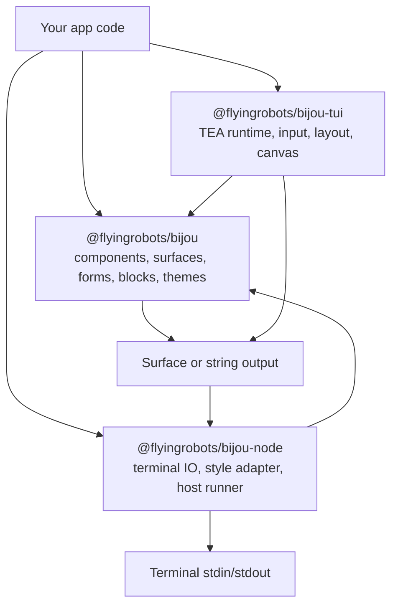
```mermaid
flowchart TD
  App[Your app code] --> Core["@flyingrobots/bijou<br/>components, surfaces, forms, blocks, themes"]
  App --> Tui["@flyingrobots/bijou-tui<br/>TEA runtime, input, layout, canvas"]
  App --> Node["@flyingrobots/bijou-node<br/>terminal IO, style adapter, host runner"]
  Tui --> Core
  Node --> Core
  Node --> Terminal[Terminal stdin/stdout]
  Core --> Surface[Surface or string output]
  Tui --> Surface
  Surface --> Node
```

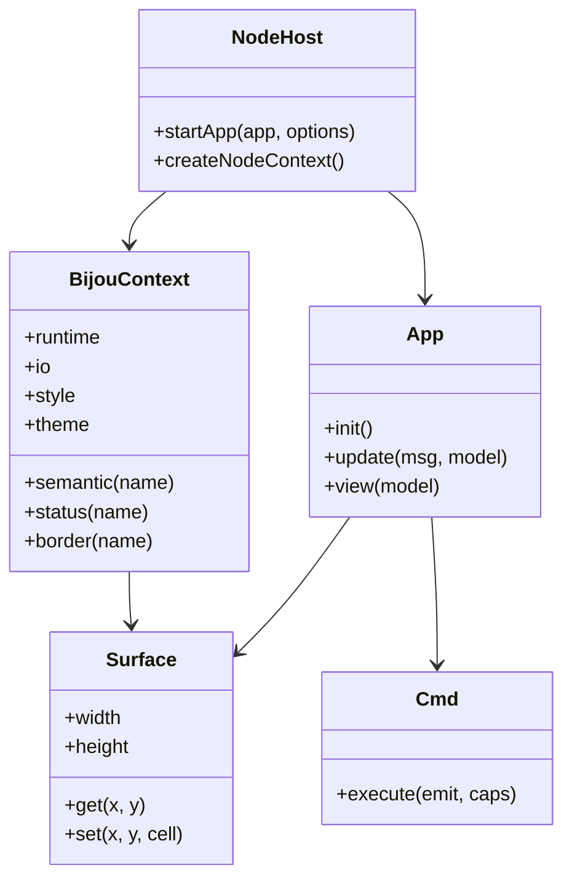
```mermaid
classDiagram
  class BijouContext {
    +runtime
    +io
    +style
    +theme
    +semantic(name)
    +status(name)
    +border(name)
  }
  class Surface {
    +width
    +height
    +get(x, y)
    +set(x, y, cell)
  }
  class App {
    +init()
    +update(msg, model)
    +view(model)
  }
  class Cmd {
    +execute(emit, caps)
  }
  class NodeHost {
    +startApp(app, options)
    +createNodeContext()
  }
  BijouContext --> Surface
  App --> Surface
  App --> Cmd
  NodeHost --> App
  NodeHost --> BijouContext
```

## Choose A Scenario

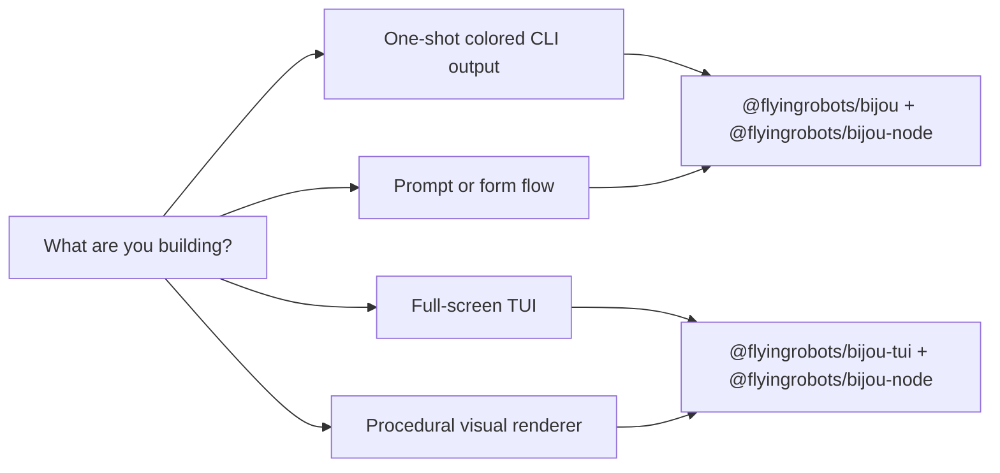
```mermaid
flowchart LR
  Start[What are you building?]
  Start --> Colors[One-shot colored CLI output]
  Start --> Form[Prompt or form flow]
  Start --> TUI[Full-screen TUI]
  Start --> Visual[Procedural visual renderer]
  Colors --> Core["@flyingrobots/bijou + @flyingrobots/bijou-node"]
  Form --> Core
  TUI --> Runtime["@flyingrobots/bijou-tui + @flyingrobots/bijou-node"]
  Visual --> Runtime
```

| Scenario | Primary packages | Main output |
| :--- | :--- | :--- |
| Print colors | `@flyingrobots/bijou`, `@flyingrobots/bijou-node` | Strings with host styling |
| Interactive form | `@flyingrobots/bijou`, `@flyingrobots/bijou-node` | Prompt results |
| Basic TUI app | `@flyingrobots/bijou-tui`, `@flyingrobots/bijou-node` | `Surface` frames |
| Braille ray trace renderer | `@flyingrobots/bijou-tui`, `@flyingrobots/bijou-node` | Shader-rendered `Surface` |

## Scenario 1: Print Some Colors

Use core components and a Node context when the program writes a result and
exits. This is the right lane for CLIs, scripts, release notes, status output,
and other non-full-screen tools.

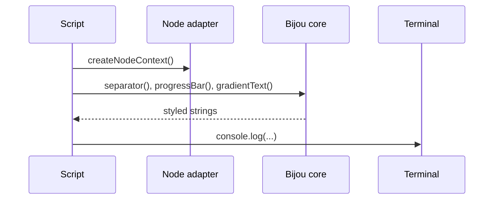
```mermaid
sequenceDiagram
  participant Script
  participant Node as Node adapter
  participant Core as Bijou core
  participant T as Terminal
  Script->>Node: createNodeContext()
  Script->>Core: separator(), progressBar(), gradientText()
  Core-->>Script: styled strings
  Script->>T: console.log(...)
```

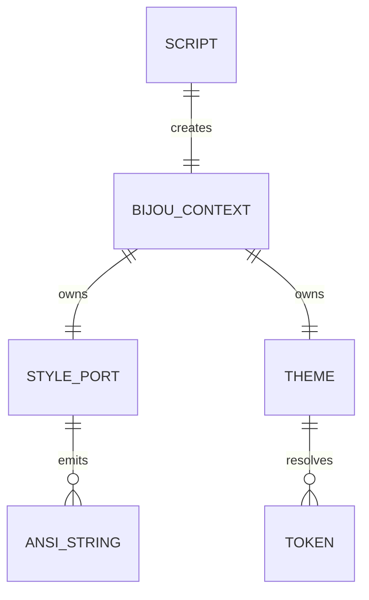
```mermaid
erDiagram
  SCRIPT ||--|| BIJOU_CONTEXT : creates
  BIJOU_CONTEXT ||--|| STYLE_PORT : owns
  BIJOU_CONTEXT ||--|| THEME : owns
  THEME ||--o{ TOKEN : resolves
  STYLE_PORT ||--o{ ANSI_STRING : emits
```

### Code

```ts
import {
  alert,
  box,
  gradientText,
  progressBar,
  separator,
} from '@flyingrobots/bijou';
import { createNodeContext } from '@flyingrobots/bijou-node';

const ctx = createNodeContext();
const brandGradient = ctx.theme.theme.gradient.brand;

console.log(separator({ label: 'deploy', width: 64, ctx }));
console.log(ctx.style.styled(ctx.status('success'), 'OK'));
console.log(gradientText('Bijou terminal output', brandGradient, {
  style: ctx.style,
  noColor: ctx.theme.noColor,
}));
console.log(progressBar(72, { width: 32, showPercent: true, ctx }));
console.log(alert('Production deploy is ready.', { variant: 'success', ctx }));
console.log(box('Use core components for one-shot terminal output.', { ctx }));
```

### Rule Of Thumb

Use string-returning components for command output. Do not start the TUI runtime
unless you need retained state, input routing, animation, or full-screen redraw.

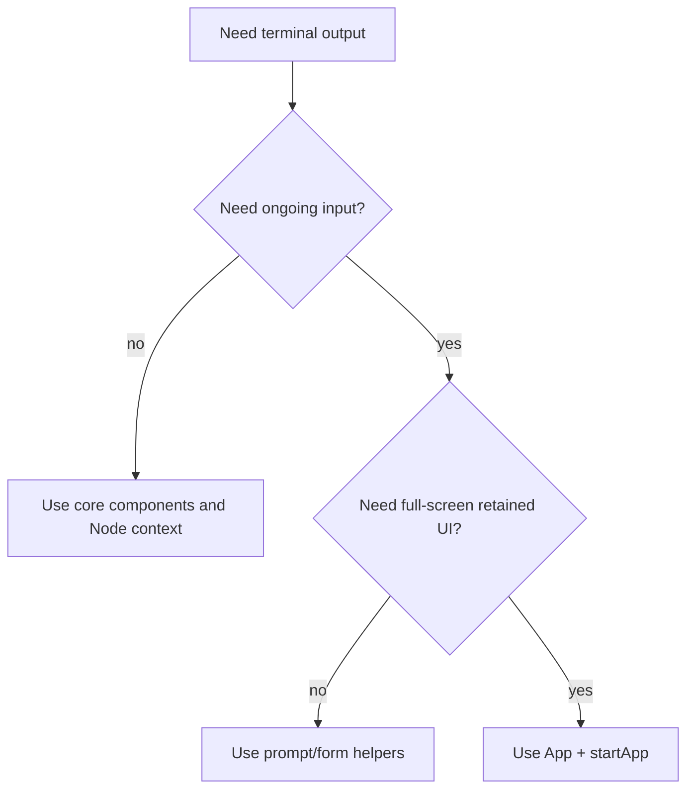
```mermaid
flowchart TD
  Need[Need terminal output] --> Input{Need ongoing input?}
  Input -- no --> Core[Use core components and Node context]
  Input -- yes --> Fullscreen{Need full-screen retained UI?}
  Fullscreen -- no --> Forms[Use prompt/form helpers]
  Fullscreen -- yes --> TUI[Use App + startApp]
```

## Scenario 2: Make An Interactive Form

Use forms when the program should ask a bounded sequence of questions and then
return to normal terminal output. Forms write through the context I/O port and
return structured values.

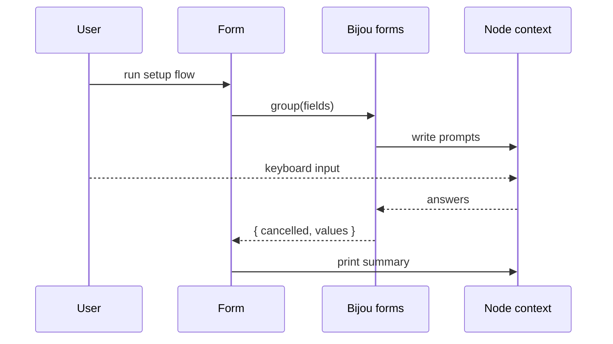
```mermaid
sequenceDiagram
  participant User
  participant Form
  participant Core as Bijou forms
  participant Host as Node context
  User->>Form: run setup flow
  Form->>Core: group(fields)
  Core->>Host: write prompts
  User-->>Host: keyboard input
  Host-->>Core: answers
  Core-->>Form: { cancelled, values }
  Form->>Host: print summary
```

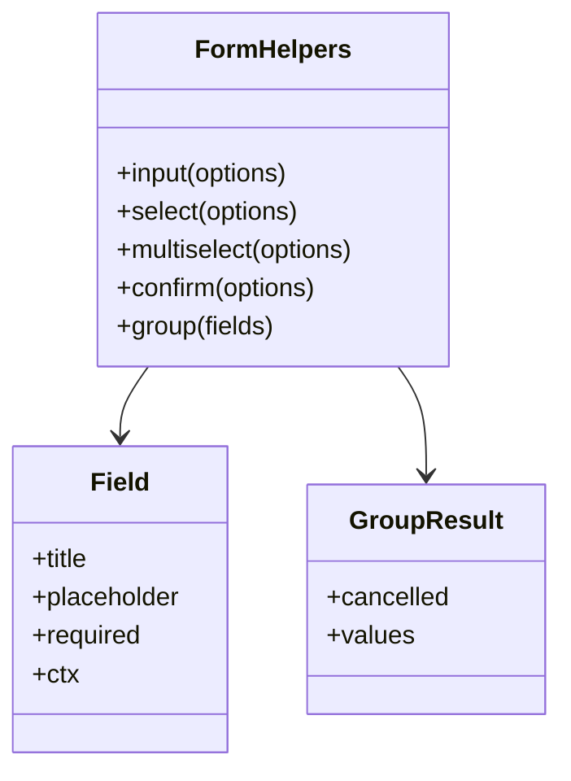
```mermaid
classDiagram
  class GroupResult {
    +cancelled
    +values
  }
  class Field {
    +title
    +placeholder
    +required
    +ctx
  }
  class FormHelpers {
    +input(options)
    +select(options)
    +multiselect(options)
    +confirm(options)
    +group(fields)
  }
  FormHelpers --> Field
  FormHelpers --> GroupResult
```

### Code

```ts
import { box, confirm, group, input, multiselect, select } from '@flyingrobots/bijou';
import { initDefaultContext } from '@flyingrobots/bijou-node';

const ctx = initDefaultContext();

const result = await group({
  name: () => input({
    title: 'Project name:',
    placeholder: 'my-app',
    required: true,
    ctx,
  }),
  framework: () => select({
    title: 'Framework:',
    options: [
      { label: 'Express', value: 'express' },
      { label: 'Fastify', value: 'fastify' },
      { label: 'Hono', value: 'hono' },
      { label: 'None', value: 'none' },
    ],
    ctx,
  }),
  features: () => multiselect({
    title: 'Features:',
    options: [
      { label: 'TypeScript', value: 'typescript' },
      { label: 'ESLint', value: 'eslint' },
      { label: 'Docker', value: 'docker' },
    ],
    ctx,
  }),
  deploy: () => confirm({
    title: 'Set up deployment?',
    defaultValue: true,
    ctx,
  }),
});

if (result.cancelled) {
  console.log('Setup cancelled.');
} else {
  console.log(box([
    `Name: ${result.values.name}`,
    `Framework: ${result.values.framework}`,
    `Features: ${result.values.features.join(', ') || 'none'}`,
    `Deploy: ${result.values.deploy ? 'yes' : 'no'}`,
  ].join('\n'), { ctx }));
}
```

### Data Shape

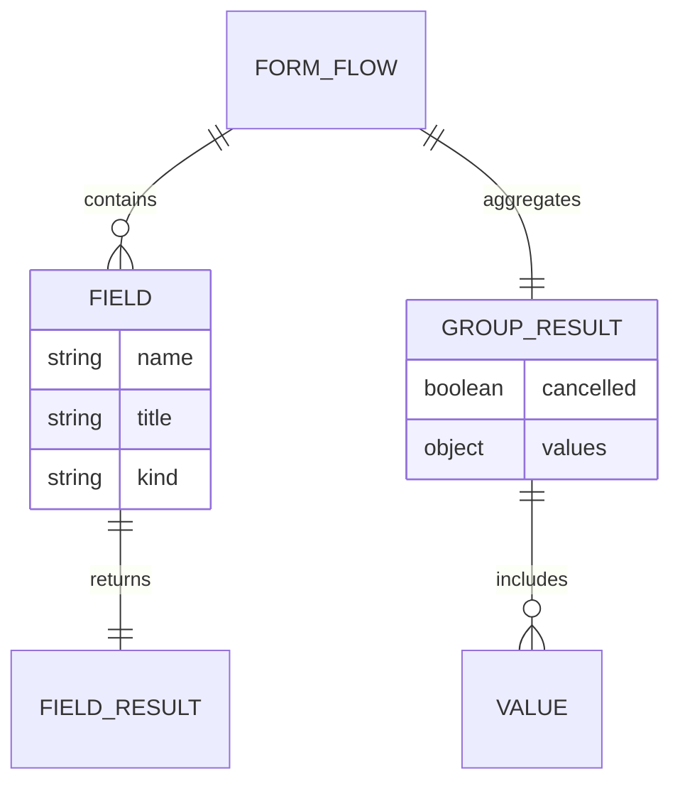
```mermaid
erDiagram
  FORM_FLOW ||--o{ FIELD : contains
  FIELD ||--|| FIELD_RESULT : returns
  FORM_FLOW ||--|| GROUP_RESULT : aggregates
  GROUP_RESULT ||--o{ VALUE : includes
  GROUP_RESULT {
    boolean cancelled
    object values
  }
  FIELD {
    string name
    string title
    string kind
  }
```

## Scenario 3: Make A Basic TUI App

Use the TEA runtime when the app needs a retained model, input handling,
commands, animation, or repeated frames.

The loop is:

1. `init()` creates the first model and commands.
2. Runtime delivers messages.
3. `update()` returns a new model and commands.
4. `view()` lowers the model to a `Surface`.
5. The host writes the minimal terminal diff.

```mermaid
flowchart TD
  Init[init] --> Model[Model]
  Init --> Cmds[Commands]
  Runtime[Runtime] --> Msg[Message]
  Msg --> Update[update(msg, model)]
  Model --> Update
  Update --> NewModel[New model]
  Update --> NewCmds[New commands]
  NewModel --> View[view(model)]
  View --> Surface[Surface]
  Surface --> Diff[ANSI diff]
  Diff --> Terminal[Terminal]
  NewCmds --> Runtime
```

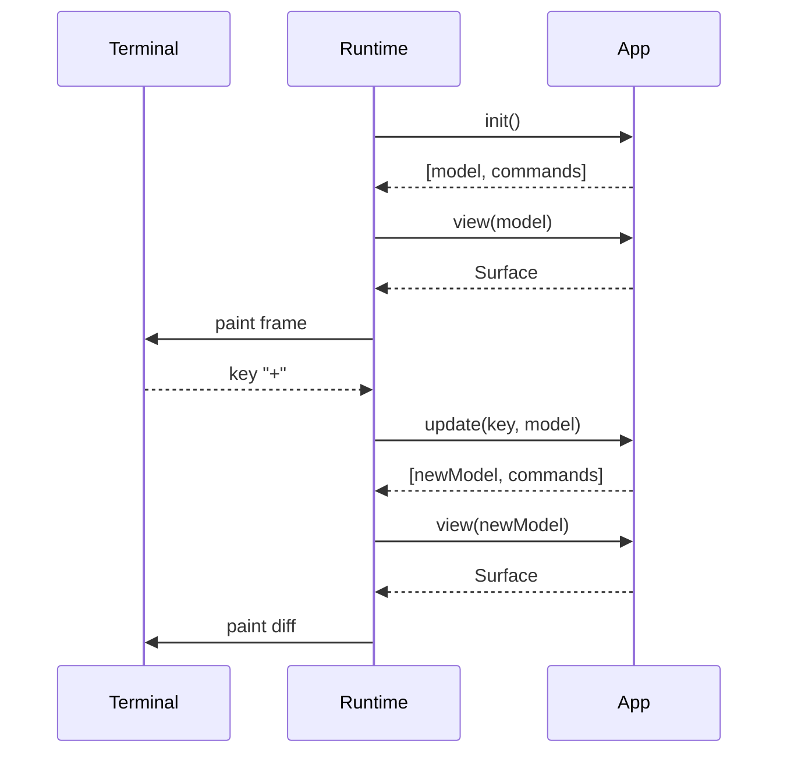
```mermaid
sequenceDiagram
  participant Terminal
  participant Runtime
  participant App
  Runtime->>App: init()
  App-->>Runtime: [model, commands]
  Runtime->>App: view(model)
  App-->>Runtime: Surface
  Runtime->>Terminal: paint frame
  Terminal-->>Runtime: key "+"
  Runtime->>App: update(key, model)
  App-->>Runtime: [newModel, commands]
  Runtime->>App: view(newModel)
  App-->>Runtime: Surface
  Runtime->>Terminal: paint diff
```

### Code

```ts
import { box, kbd, stringToSurface } from '@flyingrobots/bijou';
import { startApp } from '@flyingrobots/bijou-node';
import { isKeyMsg, quit, type App } from '@flyingrobots/bijou-tui';

interface Model {
  readonly count: number;
}

type Msg = { type: 'increment' } | { type: 'decrement' } | { type: 'quit' };

const app: App<Model, Msg> = {
  init: () => [{ count: 0 }, []],

  update: (msg, model) => {
    if (isKeyMsg(msg)) {
      if (msg.key === '+' || msg.key === 'up') {
        return [{ count: model.count + 1 }, []];
      }
      if (msg.key === '-' || msg.key === 'down') {
        return [{ count: model.count - 1 }, []];
      }
      if (msg.key === 'q' || (msg.ctrl && msg.key === 'c')) {
        return [model, [quit()]];
      }
    }

    return [model, []];
  },

  view: (model) => {
    const text = [
      box(`Count: ${model.count}`),
      '',
      `${kbd('+')} increment`,
      `${kbd('-')} decrement`,
      `${kbd('q')} quit`,
    ].join('\n');

    return stringToSurface(text, 32, 8);
  },
};

await startApp(app);
```

### Ownership Boundaries

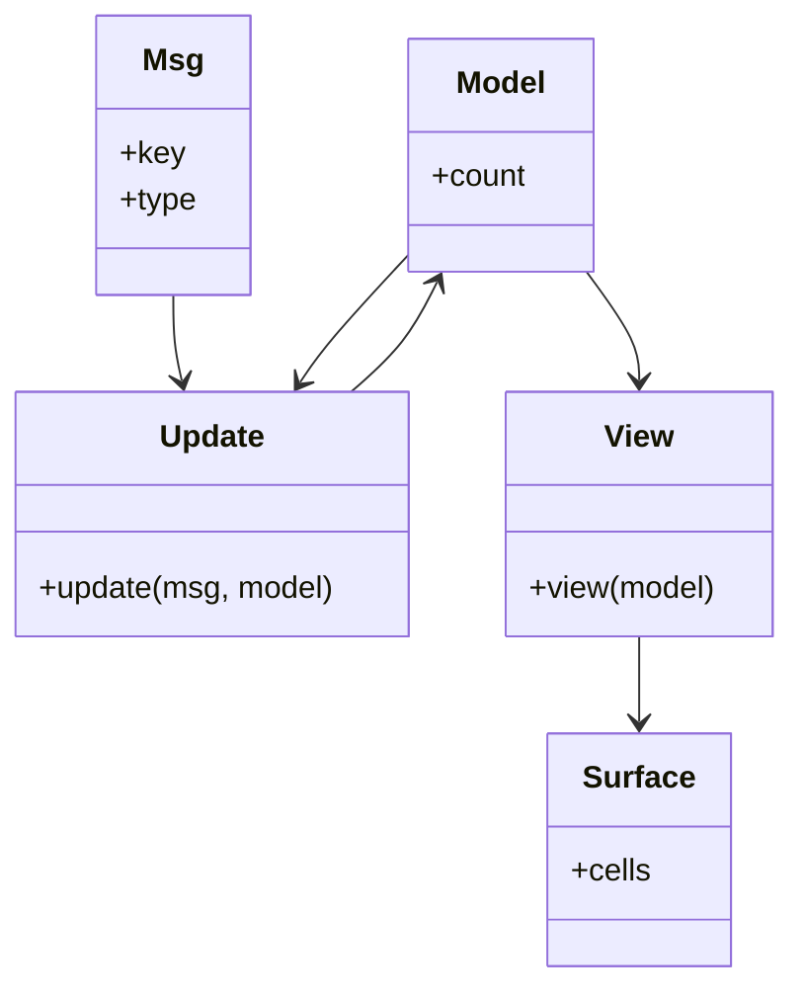
```mermaid
classDiagram
  class Model {
    +count
  }
  class Msg {
    +key
    +type
  }
  class Update {
    +update(msg, model)
  }
  class View {
    +view(model)
  }
  class Surface {
    +cells
  }
  Msg --> Update
  Model --> Update
  Update --> Model
  Model --> View
  View --> Surface
```

Do not mutate the model from inside `view()`. Views render. Updates own state
change. Commands express runtime effects such as quit or delayed messages.

## Scenario 4: Make A Braille Ray Trace Renderer

Use the TUI `canvas()` renderer when you want procedural character graphics.
The Braille resolution samples each terminal cell as a 2 by 4 sub-pixel grid,
so a small terminal surface can carry more visual detail than one character per
cell.

```mermaid
flowchart TD
  Model[Model: time and camera] --> View
  View --> Canvas[canvas(cols, rows, shader, resolution=braille)]
  Canvas --> Samples[2x4 sub-pixel samples per cell]
  Samples --> Shader[Ray shader]
  Shader --> Cell[Cell color and on/off coverage]
  Cell --> Surface[Surface]
  Surface --> Terminal
```

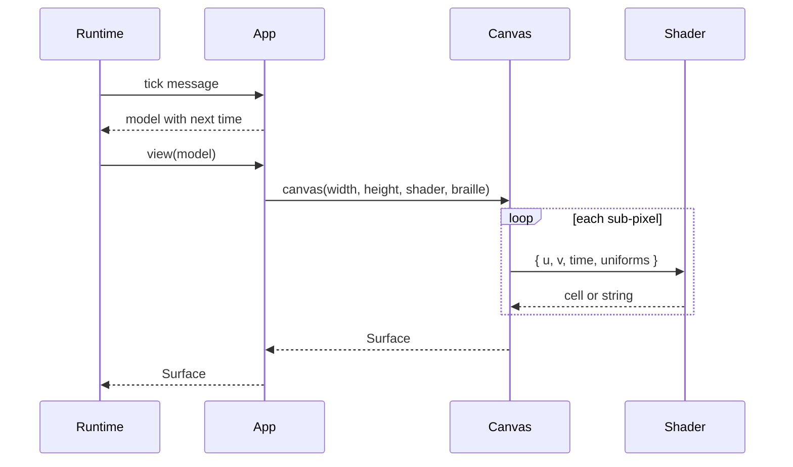
```mermaid
sequenceDiagram
  participant Runtime
  participant App
  participant Canvas
  participant Shader
  Runtime->>App: tick message
  App-->>Runtime: model with next time
  Runtime->>App: view(model)
  App->>Canvas: canvas(width, height, shader, braille)
  loop each sub-pixel
    Canvas->>Shader: { u, v, time, uniforms }
    Shader-->>Canvas: cell or string
  end
  Canvas-->>App: Surface
  App-->>Runtime: Surface
```

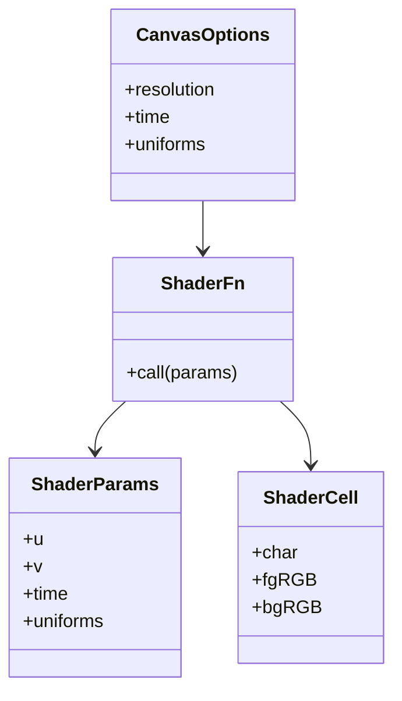
```mermaid
classDiagram
  class ShaderParams {
    +u
    +v
    +time
    +uniforms
  }
  class ShaderCell {
    +char
    +fgRGB
    +bgRGB
  }
  class ShaderFn {
    +call(params)
  }
  class CanvasOptions {
    +resolution
    +time
    +uniforms
  }
  ShaderFn --> ShaderParams
  ShaderFn --> ShaderCell
  CanvasOptions --> ShaderFn
```

### Code

```ts
import { startApp } from '@flyingrobots/bijou-node';
import {
  canvas,
  isKeyMsg,
  quit,
  tick,
  type App,
  type ShaderFn,
} from '@flyingrobots/bijou-tui';

interface Model {
  readonly time: number;
}

type Msg = { type: 'tick' };

function sphereDepth(x: number, y: number, radius: number): number | null {
  const d2 = x * x + y * y;
  if (d2 > radius * radius) return null;
  return Math.sqrt(radius * radius - d2);
}

const shader: ShaderFn = ({ u, v, time }) => {
  const x = (u - 0.5) * 2.4;
  const y = (v - 0.5) * 1.8;
  const z = sphereDepth(x, y, 0.82);

  if (z === null) {
    return { char: ' ', bgRGB: [8, 10, 22] };
  }

  const lightX = Math.cos(time * 0.8) * 0.55;
  const lightY = -0.35;
  const lightZ = 0.9;
  const lightLength = Math.hypot(lightX, lightY, lightZ);
  const shade = Math.max(0, (x * lightX + y * lightY + z * lightZ) / lightLength);
  const rim = Math.max(0, 1 - z);

  return {
    char: shade + rim * 0.2 > 0.28 ? 'x' : ' ',
    fgRGB: [
      Math.round(80 + shade * 150),
      Math.round(110 + shade * 120),
      Math.round(180 + shade * 60),
    ],
    bgRGB: [8, 10, 22],
  };
};

const app: App<Model, Msg> = {
  init: () => [{ time: 0 }, [tick(33, { type: 'tick' })]],

  update: (msg, model) => {
    if (isKeyMsg(msg) && (msg.key === 'q' || (msg.ctrl && msg.key === 'c'))) {
      return [model, [quit()]];
    }

    if ('type' in msg && msg.type === 'tick') {
      return [{ time: model.time + 0.033 }, [tick(33, { type: 'tick' })]];
    }

    return [model, []];
  },

  view: (model) =>
    canvas(72, 28, shader, {
      resolution: 'braille',
      time: model.time,
    }),
};

await startApp(app);
```

### Renderer Data Flow

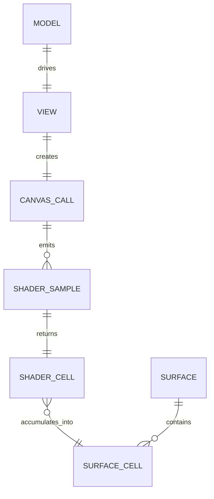
```mermaid
erDiagram
  MODEL ||--|| VIEW : drives
  VIEW ||--|| CANVAS_CALL : creates
  CANVAS_CALL ||--o{ SHADER_SAMPLE : emits
  SHADER_SAMPLE ||--|| SHADER_CELL : returns
  SHADER_CELL }o--|| SURFACE_CELL : accumulates_into
  SURFACE ||--o{ SURFACE_CELL : contains
```

### Performance Notes

- Keep shader math deterministic and bounded.
- Keep allocations out of the inner shader path.
- Use `uniforms` for static scene values instead of closing over mutable
  runtime objects.
- Prefer `resolution: 'braille'` for high-density binary coverage and
  `resolution: 'glyph'` when you want glyph fitting from coverage.
- Use `npm run bench` and `npm run soak` when changing renderer internals.

## Mode Lowering

Bijou components should degrade intentionally when output is not an interactive
terminal.

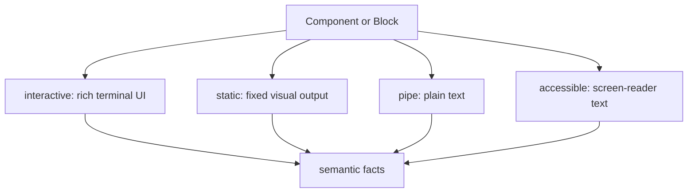
```mermaid
flowchart TD
  Component[Component or Block] --> Interactive[interactive: rich terminal UI]
  Component --> Static[static: fixed visual output]
  Component --> Pipe[pipe: plain text]
  Component --> Accessible[accessible: screen-reader text]
  Interactive --> Facts[semantic facts]
  Static --> Facts
  Pipe --> Facts
  Accessible --> Facts
```

Use this rule:

- Interactive and static modes may draw boxes, colors, charts, or Braille
  surfaces.
- Pipe mode should emit useful plain text.
- Accessible mode should prioritize meaningful spoken order.
- Semantic facts should survive lowering when tooling or agents need to inspect
  the output.

## Blocks And Data Binding

For reusable application surfaces, use Blocks. Blocks declare metadata,
variants, slots, data requirements, command intents, and mode-lowering posture.
They do not pull mutable state directly.

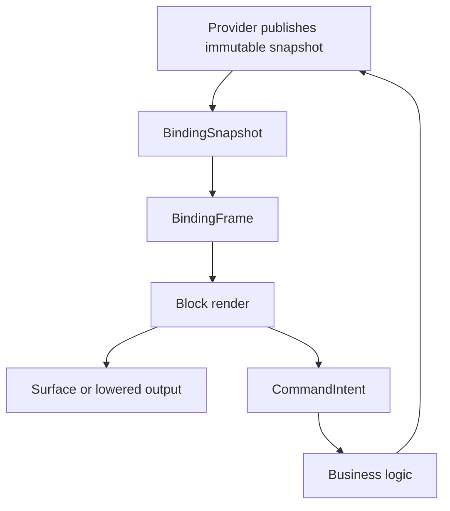
```mermaid
flowchart TD
  Provider[Provider publishes immutable snapshot] --> Snapshot[BindingSnapshot]
  Snapshot --> Frame[BindingFrame]
  Frame --> Block[Block render]
  Block --> Surface[Surface or lowered output]
  Block --> Intent[CommandIntent]
  Intent --> Business[Business logic]
  Business --> Provider
```

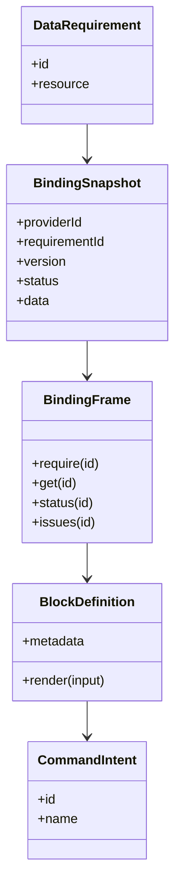
```mermaid
classDiagram
  class DataRequirement {
    +id
    +resource
  }
  class BindingSnapshot {
    +providerId
    +requirementId
    +version
    +status
    +data
  }
  class BindingFrame {
    +require(id)
    +get(id)
    +status(id)
    +issues(id)
  }
  class CommandIntent {
    +id
    +name
  }
  class BlockDefinition {
    +metadata
    +render(input)
  }
  DataRequirement --> BindingSnapshot
  BindingSnapshot --> BindingFrame
  BindingFrame --> BlockDefinition
  BlockDefinition --> CommandIntent
```

That loop is unidirectional:

```text
business logic/providers
  -> immutable snapshots
  -> render frame
  -> views/blocks render
  -> command intents leave as user intent
  -> business logic owns change
```

## Common Mistakes

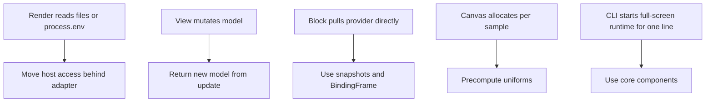
```mermaid
flowchart TD
  Bad1[Render reads files or process.env] --> Fix1[Move host access behind adapter]
  Bad2[View mutates model] --> Fix2[Return new model from update]
  Bad3[Block pulls provider directly] --> Fix3[Use snapshots and BindingFrame]
  Bad4[Canvas allocates per sample] --> Fix4[Precompute uniforms]
  Bad5[CLI starts full-screen runtime for one line] --> Fix5[Use core components]
```

| Mistake | Better path |
| :--- | :--- |
| Parsing `stdin` inside a component | Let host/runtime produce messages or form answers. |
| Calling provider refresh from render | Emit a command intent; business logic owns change. |
| Duplicating English fallback strings in translated catalogs | Load English fallback separately. |
| Using a full-screen TUI for simple output | Use core components and a Node context. |
| Treating terminal graphics as raw strings everywhere | Promote them to `Surface` when layout and diffing matter. |

## Validation Checklist

Before shipping a terminal scenario, run the narrow command for the surface you
changed, then the shared gates:

```bash
npm run lint
npm run typecheck:test
npm test
npm run docs:inventory
npm run verify:interactive-examples
```

For user-facing product proof:

```bash
npm run dogfood
npm run storybook
```

For rendering or long-running runtime changes:

```bash
npm run bench
npm run soak
```
