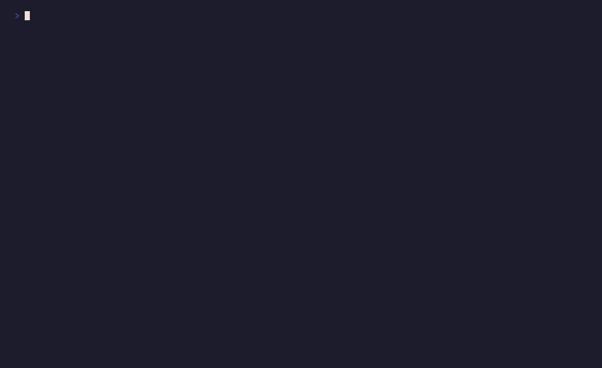

# `composable`

Tabbed dashboard combining many components



## Run

```sh
npx tsx examples/composable/main.ts
```

## Code

```typescript
import { initDefaultContext } from '@flyingrobots/bijou-node';
import {
  box, headerBox, badge, alert, separator, kbd,
  tabs, table, tree, progressBar, timeline,
} from '@flyingrobots/bijou';
import {
  run, quit, isKeyMsg, isResizeMsg, type App,
  flex, vstack,
} from '@flyingrobots/bijou-tui';

initDefaultContext();

const TAB_ITEMS = [
  { label: 'Overview' },
  { label: 'Dependencies' },
  { label: 'Timeline' },
];

interface Model {
  activeTab: number;
  cols: number;
  rows: number;
}

type Msg = { type: 'quit' };

function overviewTab(): string {
  return vstack(
    headerBox('bijou', { detail: 'v0.2.0 — physics-powered TUI engine' }),
    '',
    '  ' + [
      badge('TypeScript', { variant: 'info' }),
      badge('MIT', { variant: 'muted' }),
      badge('Zero Deps', { variant: 'success' }),
    ].join(' '),
    '',
    alert('All tests passing — 42 tests in 3 suites', { variant: 'success' }),
    '',
    '  Build progress:',
    '  ' + progressBar(100, { width: 50, showPercent: true }),
  );
}

function depsTab(): string {
  return vstack(
    '',
    table({
      columns: [
        { header: 'Package', width: 28 },
        { header: 'Version', width: 10 },
        { header: 'Type', width: 10 },
      ],
      rows: [
        ['@flyingrobots/bijou', '0.2.0', 'prod'],
        ['@flyingrobots/bijou-node', '0.2.0', 'prod'],
        ['@flyingrobots/bijou-tui', '0.2.0', 'prod'],
        ['typescript', '5.9.3', 'dev'],
        ['vitest', '4.0.18', 'dev'],
      ],
    }),
    '',
    tree([
      { label: '@flyingrobots/bijou-node', children: [
        { label: '@flyingrobots/bijou (zero deps)' },
        { label: 'chalk@5.6.2' },
      ]},
      { label: '@flyingrobots/bijou-tui', children: [
        { label: '@flyingrobots/bijou (zero deps)' },
      ]},
    ]),
  );
}

function timelineTab(): string {
  return vstack(
    '',
    timeline([
      { label: 'v0.1.0', description: 'Core components + forms', status: 'success' },
      { label: 'v0.2.0', description: 'TEA runtime + animations + layouts', status: 'success' },
      { label: 'v0.3.0', description: 'DAG renderer + examples', status: 'info' },
      { label: 'v1.0.0', description: 'Stable API', status: 'muted' },
    ]),
  );
}

const app: App<Model, Msg> = {
  init: () => [{
    activeTab: 0,
    cols: process.stdout.columns ?? 80,
    rows: process.stdout.rows ?? 24,
  }, []],

  update: (msg, model) => {
    if (isResizeMsg(msg)) {
      return [{ ...model, cols: msg.columns, rows: msg.rows }, []];
    }
    if (isKeyMsg(msg)) {
      if (msg.key === 'q' || (msg.ctrl && msg.key === 'c')) return [model, [quit()]];

      if (msg.key === 'left' || msg.key === 'h') {
        return [{ ...model, activeTab: Math.max(0, model.activeTab - 1) }, []];
      }
      if (msg.key === 'right' || msg.key === 'l') {
        return [{ ...model, activeTab: Math.min(TAB_ITEMS.length - 1, model.activeTab + 1) }, []];
      }
    }
    return [model, []];
  },

  view: (model) => {
    const tabBar = tabs(TAB_ITEMS, { active: model.activeTab });

    let content: string;
    switch (model.activeTab) {
      case 0: content = overviewTab(); break;
      case 1: content = depsTab(); break;
      case 2: content = timelineTab(); break;
      default: content = '';
    }

    return flex(
      { direction: 'column', width: model.cols, height: model.rows },
      { basis: 1, content: `  ${tabBar}` },
      { basis: 1, content: separator({ width: model.cols }) },
      { flex: 1, content: () => content },
      { basis: 1, content: `  ${kbd('←')}${kbd('→')} tabs  ${kbd('q')} quit` },
    );
  },
};

run(app);
```

[← Examples](../README.md)
