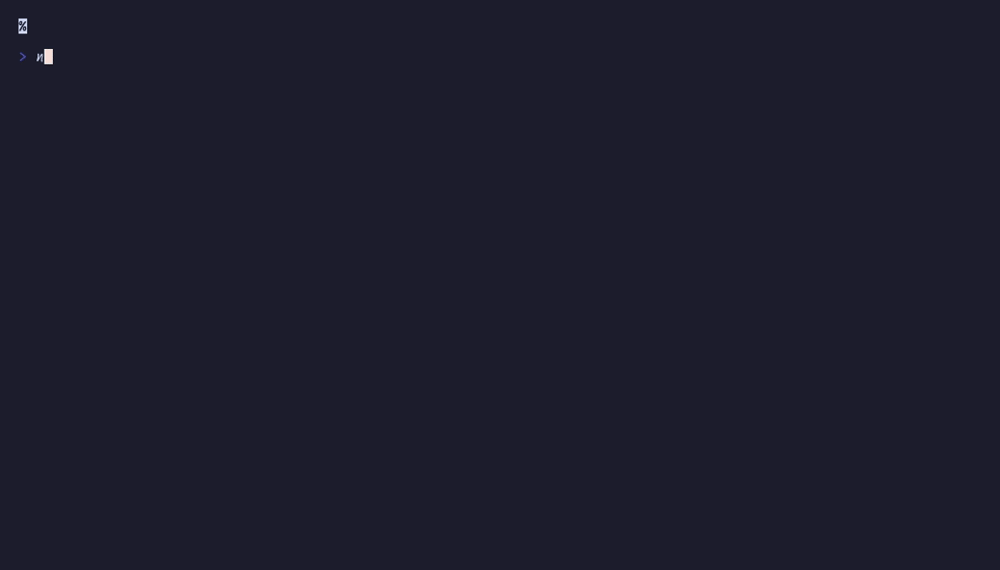

# `flex()`, `vstack()`, `hstack()`

Responsive sidebar + main layout



## Run

```sh
npx tsx examples/flex-layout/main.ts
```

## Code

```typescript
import { initDefaultContext } from '@flyingrobots/bijou-node';
import { box, badge, separator, kbd, tree } from '@flyingrobots/bijou';
import {
  run, quit, type App, type KeyMsg, type ResizeMsg,
  flex, vstack,
} from '@flyingrobots/bijou-tui';

initDefaultContext();

interface Model {
  cols: number;
  rows: number;
}

type Msg = { type: 'quit' };

const sidebarContent = tree([
  { label: 'src', children: [
    { label: 'components' },
    { label: 'forms' },
    { label: 'theme' },
  ]},
  { label: 'tests' },
  { label: 'package.json' },
]);

const app: App<Model, Msg> = {
  init: () => [{ cols: process.stdout.columns ?? 80, rows: process.stdout.rows ?? 24 }, []],

  update: (msg, model) => {
    if ('type' in msg && msg.type === 'resize') {
      const r = msg as ResizeMsg;
      return [{ cols: r.columns, rows: r.rows }, []];
    }
    if ('type' in msg && msg.type === 'key') {
      const k = msg as KeyMsg;
      if (k.key === 'q' || (k.ctrl && k.key === 'c')) return [model, [quit()]];
    }
    return [model, []];
  },

  view: (model) => {
    return flex(
      { direction: 'column', width: model.cols, height: model.rows },
      // Header
      { basis: 3, content: (w) => {
        const header = `  ${badge('bijou', { variant: 'primary' })}  Dashboard  ${badge(`${model.cols}×${model.rows}`, { variant: 'muted' })}`;
        return vstack(separator({ width: w }), header, separator({ width: w }));
      }},
      // Body: sidebar + main
      { flex: 1, content: (w, h) =>
        flex(
          { direction: 'row', width: w, height: h, gap: 1 },
          // Sidebar
          { basis: 24, content: () => {
            return vstack('  Files', '', sidebarContent);
          }},
          // Main content
          { flex: 1, content: (mw) => {
            const mainContent = box([
              'Main content area',
              '',
              `Available: ${mw} cols`,
              '',
              'Resize the terminal to see',
              'the layout reflow.',
            ].join('\n'), { padding: { top: 1, bottom: 1, left: 2, right: 2 } });
            return mainContent;
          }},
        ),
      },
      // Footer
      { basis: 1, content: (w) => {
        return `  ${kbd('q')} quit  ${'─'.repeat(Math.max(0, w - 12))}`;
      }},
    );
  },
};

run(app);
```
