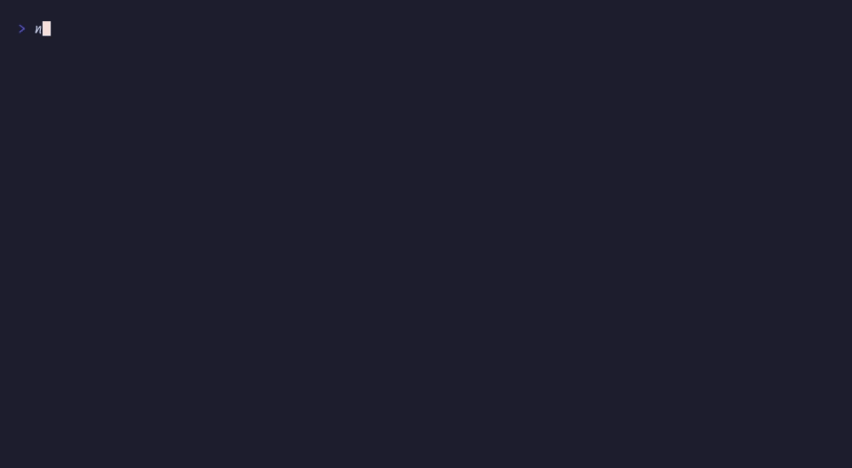

# `enterScreen()`

Alternate screen with centered content



## Run

```sh
npx tsx examples/fullscreen/main.ts
```

## Code

```typescript
import { initDefaultContext } from '@flyingrobots/bijou-node';
import { box, kbd } from '@flyingrobots/bijou';
import { run, quit, type App, type KeyMsg } from '@flyingrobots/bijou-tui';

initDefaultContext();

interface Model {
  cols: number;
  rows: number;
}

type Msg = { type: 'quit' };

const app: App<Model, Msg> = {
  init: () => [{ cols: process.stdout.columns ?? 80, rows: process.stdout.rows ?? 24 }, []],

  update: (msg, model) => {
    if ('type' in msg && msg.type === 'resize') {
      return [{ cols: msg.columns, rows: msg.rows }, []];
    }
    if ('type' in msg && msg.type === 'key') {
      const key = (msg as KeyMsg).key;
      if (key === 'q' || key === 'enter' || ((msg as KeyMsg).ctrl && key === 'c')) {
        return [model, [quit()]];
      }
    }
    return [model, []];
  },

  view: (model) => {
    const content = [
      'You are in the alternate screen.',
      '',
      `Terminal: ${model.cols}×${model.rows}`,
      '',
      `Press ${kbd('q')} or ${kbd('Enter')} to return.`,
    ].join('\n');

    const boxed = box(content, { padding: { top: 1, bottom: 1, left: 3, right: 3 } });
    const boxLines = boxed.split('\n');
    const padTop = Math.max(0, Math.floor((model.rows - boxLines.length) / 2));
    const padLeft = Math.max(0, Math.floor((model.cols - 44) / 2));
    const indent = ' '.repeat(padLeft);

    return '\n'.repeat(padTop) + boxLines.map(l => indent + l).join('\n');
  },
};

run(app);
```

[← Examples](../README.md)
