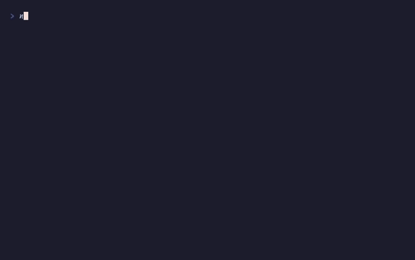

# `createInputStack()`, `viewport()`

Layered modal input dispatch



## Run

```sh
npx tsx examples/modal/main.ts
```

## Code

```typescript
import { initDefaultContext } from '@flyingrobots/bijou-node';
import { box, kbd, separator, badge } from '@flyingrobots/bijou';
import {
  run, quit, isKeyMsg, type App, type KeyMsg,
  createKeyMap, createInputStack, helpShort, vstack,
} from '@flyingrobots/bijou-tui';

initDefaultContext();

interface Model {
  items: string[];
  selected: number;
  modal: 'none' | 'help' | 'confirm';
  deleteTarget: number;
}

type Msg =
  | { type: 'up' }
  | { type: 'down' }
  | { type: 'show-help' }
  | { type: 'show-confirm' }
  | { type: 'confirm-yes' }
  | { type: 'close-modal' }
  | { type: 'quit' };

const appKeys = createKeyMap<Msg>()
  .bind('j', 'Down', { type: 'down' })
  .bind('k', 'Up', { type: 'up' })
  .bind('down', 'Down', { type: 'down' })
  .bind('up', 'Up', { type: 'up' })
  .bind('d', 'Delete', { type: 'show-confirm' })
  .bind('?', 'Help', { type: 'show-help' })
  .bind('q', 'Quit', { type: 'quit' });

const modalKeys = createKeyMap<Msg>()
  .bind('escape', 'Close', { type: 'close-modal' })
  .bind('q', 'Close', { type: 'close-modal' });

const confirmKeys = createKeyMap<Msg>()
  .bind('y', 'Yes', { type: 'confirm-yes' })
  .bind('n', 'No', { type: 'close-modal' })
  .bind('escape', 'Cancel', { type: 'close-modal' });

const ITEMS = [
  'Setup database',
  'Configure auth',
  'Build frontend',
  'Run migrations',
  'Deploy service',
];

const stack = createInputStack<KeyMsg, Msg>();

const app: App<Model, Msg> = {
  init: () => {
    stack.push(appKeys, { name: 'app' });
    return [{ items: [...ITEMS], selected: 0, modal: 'none', deleteTarget: -1 }, []];
  },

  update: (msg, model) => {
    if (isKeyMsg(msg)) {
      const action = stack.dispatch(msg);
      if (!action) return [model, []];

      switch (action.type) {
        case 'quit': return [model, [quit()]];
        case 'up': return [{ ...model, selected: Math.max(0, model.selected - 1) }, []];
        case 'down': return [{ ...model, selected: Math.min(model.items.length - 1, model.selected + 1) }, []];

        case 'show-help':
          stack.push(modalKeys, { name: 'help-modal' });
          return [{ ...model, modal: 'help' }, []];

        case 'show-confirm':
          if (model.items.length === 0) return [model, []];
          stack.push(confirmKeys, { name: 'confirm-modal' });
          return [{ ...model, modal: 'confirm', deleteTarget: model.selected }, []];

        case 'confirm-yes': {
          stack.pop();
          const items = model.items.filter((_, i) => i !== model.deleteTarget);
          const selected = Math.min(model.selected, items.length - 1);
          return [{ ...model, items, selected, modal: 'none', deleteTarget: -1 }, []];
        }

        case 'close-modal':
          stack.pop();
          return [{ ...model, modal: 'none', deleteTarget: -1 }, []];
      }
    }
    return [model, []];
  },

  view: (model) => {
    // Main list
    const listLines: string[] = ['', '  Task List', ''];
    for (let i = 0; i < model.items.length; i++) {
      const cursor = i === model.selected ? '>' : ' ';
      listLines.push(`  ${cursor} ${model.items[i]}`);
    }
    if (model.items.length === 0) listLines.push('  (empty)');
    listLines.push('');
    listLines.push(`  ${helpShort(appKeys)}`);
    listLines.push('');

    const main = listLines.join('\n');

    // Modal overlay
    if (model.modal === 'help') {
      const helpContent = [
        `${kbd('j')} ${kbd('k')}  Navigate`,
        `${kbd('d')}      Delete item`,
        `${kbd('?')}      Toggle help`,
        `${kbd('q')}      Quit`,
        '',
        `Press ${kbd('Esc')} to close`,
      ].join('\n');
      return vstack(main, box(helpContent, { padding: { top: 1, bottom: 1, left: 2, right: 2 } }), '');
    }

    if (model.modal === 'confirm') {
      const item = model.items[model.deleteTarget] ?? '';
      const confirmContent = [
        `Delete ${badge(item, { variant: 'warning' })}?`,
        '',
        `${kbd('y')} yes  ${kbd('n')} no`,
      ].join('\n');
      return vstack(main, box(confirmContent, { padding: { top: 1, bottom: 1, left: 2, right: 2 } }), '');
    }

    return main;
  },
};

run(app);
```

[← Examples](../README.md)
