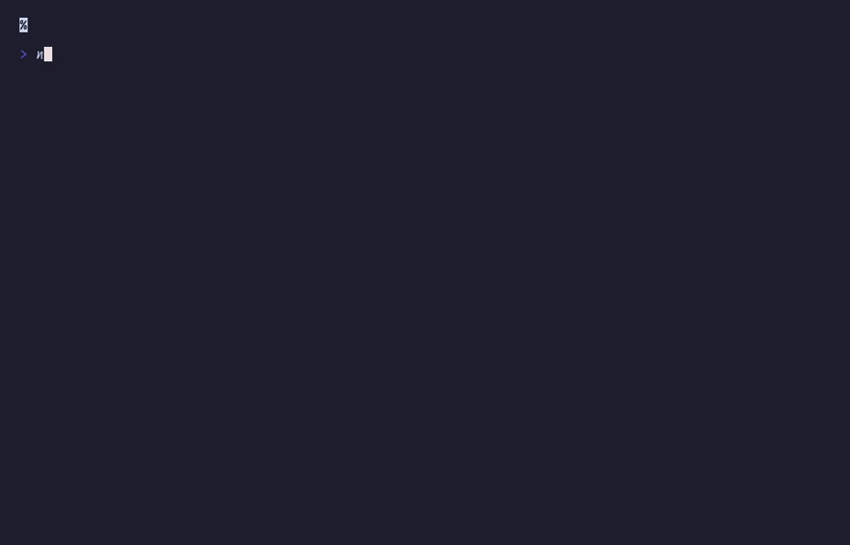

# Real-world showcase

Simulated `npm install` (resolve → download → link)



## Run

```sh
npx tsx examples/package-manager/main.ts
```

## Code

```typescript
import { initDefaultContext } from '@flyingrobots/bijou-node';
import { spinnerFrame, progressBar, badge, alert, tree, separator } from '@flyingrobots/bijou';
import { run, quit, tick, type App, type KeyMsg, vstack } from '@flyingrobots/bijou-tui';

initDefaultContext();

type Phase = 'resolving' | 'downloading' | 'linking' | 'done';

interface Package {
  name: string;
  version: string;
  progress: number;
  speed: number;
  done: boolean;
}

interface Model {
  phase: Phase;
  frame: number;
  elapsed: number;
  packages: Package[];
}

type Msg = { type: 'tick' } | { type: 'quit' };

const PACKAGES: Package[] = [
  { name: 'typescript', version: '5.9.3', progress: 0, speed: 2.5, done: false },
  { name: 'vitest', version: '4.0.18', progress: 0, speed: 4.0, done: false },
  { name: '@types/node', version: '22.0.0', progress: 0, speed: 5.5, done: false },
  { name: 'chalk', version: '5.6.2', progress: 0, speed: 12.0, done: false },
  { name: 'tsx', version: '4.19.0', progress: 0, speed: 3.0, done: false },
];

const RESOLVE_TICKS = 25;
const LINK_TICKS = 15;

const app: App<Model, Msg> = {
  init: () => [
    { phase: 'resolving', frame: 0, elapsed: 0, packages: PACKAGES.map(p => ({ ...p })) },
    [tick(80, { type: 'tick' })],
  ],

  update: (msg, model) => {
    if ('type' in msg && msg.type === 'key') {
      const k = msg as KeyMsg;
      if (k.key === 'q' || (k.ctrl && k.key === 'c')) return [model, [quit()]];
    }

    if ('type' in msg && msg.type === 'tick') {
      const frame = model.frame + 1;
      const elapsed = model.elapsed + 1;

      if (model.phase === 'resolving' && elapsed >= RESOLVE_TICKS) {
        return [{ ...model, phase: 'downloading', frame, elapsed: 0 }, [tick(60, { type: 'tick' })]];
      }

      if (model.phase === 'downloading') {
        const packages = model.packages.map(p => {
          if (p.done) return p;
          const progress = Math.min(p.progress + p.speed + Math.random() * 2, 100);
          return { ...p, progress, done: progress >= 100 };
        });
        const allDone = packages.every(p => p.done);
        if (allDone) {
          return [{ ...model, phase: 'linking', packages, frame, elapsed: 0 }, [tick(80, { type: 'tick' })]];
        }
        return [{ ...model, packages, frame, elapsed }, [tick(60, { type: 'tick' })]];
      }

      if (model.phase === 'linking' && elapsed >= LINK_TICKS) {
        return [{ ...model, phase: 'done', frame, elapsed }, [tick(2000, { type: 'quit' })]];
      }

      return [{ ...model, frame, elapsed }, [tick(80, { type: 'tick' })]];
    }

    return [model, []];
  },

  view: (model) => {
    const lines: string[] = [''];

    if (model.phase === 'resolving') {
      lines.push(`  ${spinnerFrame(model.frame)} Resolving dependencies...`);
      lines.push('');
      return lines.join('\n');
    }

    if (model.phase === 'downloading') {
      lines.push('  Downloading packages...');
      lines.push('');
      for (const p of model.packages) {
        const name = `${p.name}@${p.version}`.padEnd(28);
        if (p.done) {
          lines.push(`  ${badge('OK', { variant: 'success' })} ${name}`);
        } else {
          lines.push(`  ${spinnerFrame(model.frame, { label: '' })} ${name}`);
          lines.push(`    ${progressBar(Math.round(p.progress), { width: 36, showPercent: true })}`);
        }
      }
      lines.push('');
      const total = model.packages.reduce((s, p) => s + p.progress, 0) / model.packages.length;
      lines.push(separator({ label: 'total', width: 50 }));
      lines.push(`  ${progressBar(Math.round(total), { width: 42, showPercent: true })}`);
      lines.push('');
      return lines.join('\n');
    }

    if (model.phase === 'linking') {
      lines.push(`  ${spinnerFrame(model.frame)} Linking dependencies...`);
      lines.push('');
      return lines.join('\n');
    }

    // Done
    lines.push(alert('Packages installed successfully!', { variant: 'success' }));
    lines.push('');
    lines.push(tree([
      { label: 'node_modules', children: [
        { label: 'typescript@5.9.3' },
        { label: 'vitest@4.0.18' },
        { label: '@types/node@22.0.0' },
        { label: 'chalk@5.6.2' },
        { label: 'tsx@4.19.0' },
      ]},
    ]));
    lines.push('');
    lines.push(`  Added ${badge('5', { variant: 'primary' })} packages in 3.2s`);
    lines.push('');

    return lines.join('\n');
  },
};

run(app);
```
