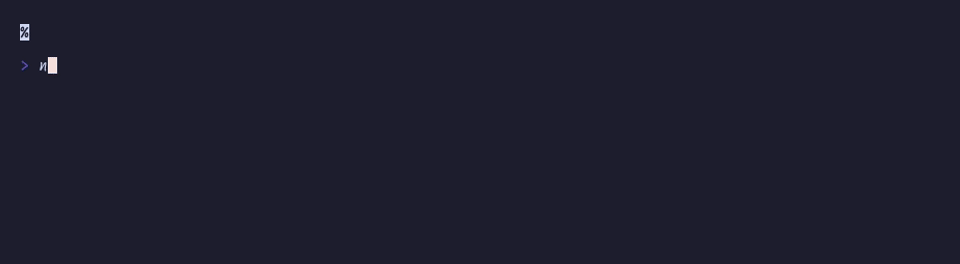

# `progressBar()` + `tick()`

TEA-driven animated determinate progress.



## Run

```sh
npx tsx examples/progress-animated/main.ts
```

## Use this when

- the app already owns a runtime loop and wants to animate determinate progress over time
- completion is known and should visibly advance toward done
- the final state should become a stable completion result, not just stop moving

## Choose something else when

- choose `createAnimatedProgressBar()` for a direct controller-style core helper outside a TEA runtime
- choose `spinnerFrame()` when progress is active but indeterminate
- avoid animation that obscures the meaning of the final completion state

## What this example proves

- a runtime-driven progress loop using `tick()`
- determinate progress advancing toward completion
- a stable completion state after the bar finishes instead of endless motion

[← Examples](../README.md)
