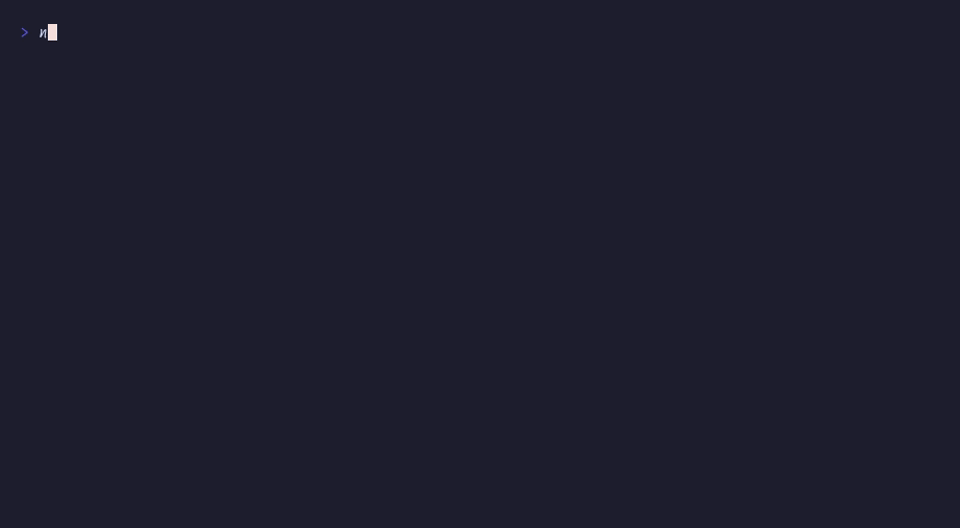

# `progressBar()`

Simulated multi-package download



## Run

```sh
npx tsx examples/progress-download/main.ts
```

## Code

```typescript
import { initDefaultContext } from '@flyingrobots/bijou-node';
import { progressBar, badge, separator, spinnerFrame } from '@flyingrobots/bijou';
import { run, quit, tick, type App, type KeyMsg, vstack } from '@flyingrobots/bijou-tui';

initDefaultContext();

interface Download {
  name: string;
  size: string;
  progress: number;
  speed: number;      // percent per tick
  done: boolean;
}

interface Model {
  downloads: Download[];
  frame: number;
}

type Msg = { type: 'tick' } | { type: 'quit' };

const PACKAGES: Omit<Download, 'progress' | 'done'>[] = [
  { name: 'typescript', size: '42.1 MB', speed: 1.8 },
  { name: 'vitest', size: '12.3 MB', speed: 3.2 },
  { name: '@types/node', size: '3.8 MB', speed: 4.5 },
  { name: 'chalk', size: '41 KB', speed: 8.0 },
];

const app: App<Model, Msg> = {
  init: () => [
    {
      downloads: PACKAGES.map(p => ({ ...p, progress: 0, done: false })),
      frame: 0,
    },
    [tick(60, { type: 'tick' })],
  ],

  update: (msg, model) => {
    if ('type' in msg && msg.type === 'key') {
      const k = msg as KeyMsg;
      if (k.key === 'q' || (k.ctrl && k.key === 'c')) return [model, [quit()]];
    }

    if ('type' in msg && msg.type === 'tick') {
      const downloads = model.downloads.map(d => {
        if (d.done) return d;
        const progress = Math.min(d.progress + d.speed + Math.random() * 1.5, 100);
        return { ...d, progress, done: progress >= 100 };
      });

      const allDone = downloads.every(d => d.done);
      const frame = model.frame + 1;

      if (allDone) {
        return [{ downloads, frame }, [tick(1500, { type: 'quit' })]];
      }

      return [{ downloads, frame }, [tick(60, { type: 'tick' })]];
    }

    return [model, []];
  },

  view: (model) => {
    const allDone = model.downloads.every(d => d.done);

    const lines: string[] = ['', '  Installing packages...', ''];

    for (const d of model.downloads) {
      const name = d.name.padEnd(16);
      const size = d.size.padStart(8);

      if (d.done) {
        lines.push(`  ${badge('DONE', { variant: 'success' })} ${name} ${size}`);
      } else {
        const spinner = spinnerFrame(model.frame, { label: '' });
        lines.push(`  ${spinner} ${name} ${size}`);
        lines.push(`    ${progressBar(Math.round(d.progress), { width: 40, showPercent: true })}`);
      }
    }

    lines.push('');

    // Overall progress
    const totalProgress = model.downloads.reduce((sum, d) => sum + d.progress, 0) / model.downloads.length;
    lines.push(separator({ label: 'total', width: 58 }));
    lines.push(`  ${progressBar(Math.round(totalProgress), { width: 50, showPercent: true })}`);

    if (allDone) {
      lines.push('');
      lines.push(`  ${badge('SUCCESS', { variant: 'success' })} All packages installed.`);
    }

    lines.push('');
    return lines.join('\n');
  },
};

run(app);
```

[← Examples](../README.md)
