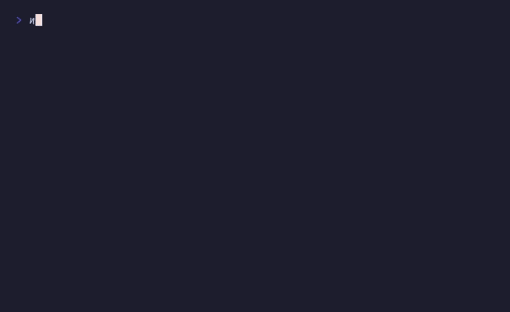

# Spring animations + `gradientText()` + `timeline()`

Animated splash screen



## Run

```sh
npx tsx examples/splash/main.ts
```

## Code

```typescript
import { initDefaultContext } from '@flyingrobots/bijou-node';
import { gradientText, separator } from '@flyingrobots/bijou';
import {
  run, quit, tick, type App, type KeyMsg,
  animate, sequence, EASINGS,
} from '@flyingrobots/bijou-tui';

const ctx = initDefaultContext();

const LOGO = [
  ' _     _  _             ',
  '| |__ (_)(_) ___  _   _ ',
  '| \'_ \\| || |/ _ \\| | | |',
  '| |_) | || | (_) | |_| |',
  '|_.__/|_|| |\\___/ \\__,_|',
  '        |__/            ',
];

interface Model {
  logoY: number;
  taglineOpacity: number;
  showPrompt: boolean;
  promptBlink: number;
}

type Msg =
  | { type: 'logo-y'; value: number }
  | { type: 'tagline'; value: number }
  | { type: 'show-prompt' }
  | { type: 'blink' }
  | { type: 'quit' };

const app: App<Model, Msg> = {
  init: () => [
    { logoY: -8, taglineOpacity: 0, showPrompt: false, promptBlink: 0 },
    [
      sequence(
        animate({
          from: -8, to: 0,
          spring: 'wobbly',
          fps: 60,
          onFrame: (v: number) => ({ type: 'logo-y', value: v }),
        }),
        animate({
          type: 'tween', from: 0, to: 1, duration: 600, ease: EASINGS.easeOut,
          fps: 30,
          onFrame: (v: number) => ({ type: 'tagline', value: v }),
          onComplete: () => ({ type: 'show-prompt' }),
        }),
      ),
    ],
  ],

  update: (msg, model) => {
    if ('type' in msg && msg.type === 'key') {
      const k = msg as KeyMsg;
      if (k.key === 'q' || (k.ctrl && k.key === 'c') || model.showPrompt) {
        return [model, [quit()]];
      }
    }

    switch (msg.type) {
      case 'logo-y': return [{ ...model, logoY: msg.value }, []];
      case 'tagline': return [{ ...model, taglineOpacity: msg.value }, []];
      case 'show-prompt': return [{ ...model, showPrompt: true }, [tick(500, { type: 'blink' })]];
      case 'blink': return [
        { ...model, promptBlink: model.promptBlink + 1 },
        [tick(500, { type: 'blink' })],
      ];
    }

    return [model, []];
  },

  view: (model) => {
    const lines: string[] = [];
    const stops = ctx.theme.theme.gradient.brand;

    // Vertical offset for logo spring animation
    const yOffset = Math.round(model.logoY);
    const padTop = Math.max(0, 3 + yOffset);
    for (let i = 0; i < padTop; i++) lines.push('');

    // Logo with gradient
    if (yOffset > -LOGO.length) {
      for (const line of LOGO) {
        lines.push('    ' + gradientText(line, stops, { style: ctx.style }));
      }
    }

    lines.push('');

    // Tagline fades in
    if (model.taglineOpacity > 0.5) {
      lines.push('    physics-powered TUI engine');
    } else {
      lines.push('');
    }

    lines.push('');

    // Blinking prompt
    if (model.showPrompt) {
      const visible = model.promptBlink % 2 === 0;
      lines.push(visible ? '    Press any key to continue...' : '');
    }

    lines.push('');
    return lines.join('\n');
  },
};

run(app);
```
