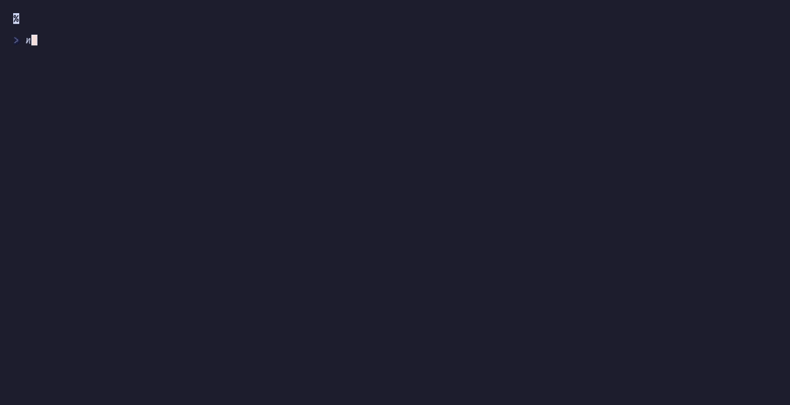

# `flex()` + `hstack()` + `createInputStack()`

Dual-pane editor with focus switching



## Run

```sh
npx tsx examples/split-editors/main.ts
```

## Code

```typescript
import { initDefaultContext } from '@flyingrobots/bijou-node';
import { box, kbd, separator, badge } from '@flyingrobots/bijou';
import {
  run, quit, type App, type KeyMsg, type ResizeMsg,
  flex, viewport, createScrollState, scrollBy, pageDown, pageUp, vstack,
} from '@flyingrobots/bijou-tui';

initDefaultContext();

const LEFT_CONTENT = `// app.ts
import { initDefaultContext } from '@flyingrobots/bijou-node';
import { box, badge, alert } from '@flyingrobots/bijou';
import { run, quit } from '@flyingrobots/bijou-tui';

initDefaultContext();

interface Model {
  count: number;
  status: string;
}

type Msg =
  | { type: 'increment' }
  | { type: 'decrement' }
  | { type: 'reset' }
  | { type: 'quit' };

const app = {
  init: () => [{ count: 0, status: 'ready' }, []],

  update: (msg, model) => {
    switch (msg.type) {
      case 'increment':
        return [{ ...model, count: model.count + 1 }, []];
      case 'decrement':
        return [{ ...model, count: model.count - 1 }, []];
      case 'reset':
        return [{ count: 0, status: 'reset' }, []];
      case 'quit':
        return [model, [quit()]];
    }
  },

  view: (model) => box(String(model.count)),
};

run(app);`;

const RIGHT_CONTENT = `// app.test.ts
import { describe, it, expect } from 'vitest';
import { createTestContext } from '@flyingrobots/bijou/adapters/test';

describe('counter app', () => {
  it('should initialize to zero', () => {
    const [model] = app.init();
    expect(model.count).toBe(0);
  });

  it('should increment', () => {
    const [model] = app.update(
      { type: 'increment' },
      { count: 5, status: 'ready' }
    );
    expect(model.count).toBe(6);
  });

  it('should decrement', () => {
    const [model] = app.update(
      { type: 'decrement' },
      { count: 3, status: 'ready' }
    );
    expect(model.count).toBe(2);
  });

  it('should reset to zero', () => {
    const [model] = app.update(
      { type: 'reset' },
      { count: 42, status: 'ready' }
    );
    expect(model.count).toBe(0);
    expect(model.status).toBe('reset');
  });

  it('should render in pipe mode', () => {
    const ctx = createTestContext({ mode: 'pipe' });
    const view = app.view({ count: 7, status: 'ready' });
    expect(view).toContain('7');
  });
});`;

interface Model {
  leftScroll: ReturnType<typeof createScrollState>;
  rightScroll: ReturnType<typeof createScrollState>;
  focusLeft: boolean;
  cols: number;
  rows: number;
}

type Msg = { type: 'quit' };

const VP_HEIGHT = 18;

const app: App<Model, Msg> = {
  init: () => [{
    leftScroll: createScrollState(LEFT_CONTENT, VP_HEIGHT),
    rightScroll: createScrollState(RIGHT_CONTENT, VP_HEIGHT),
    focusLeft: true,
    cols: process.stdout.columns ?? 80,
    rows: process.stdout.rows ?? 24,
  }, []],

  update: (msg, model) => {
    if ('type' in msg && msg.type === 'resize') {
      const r = msg as ResizeMsg;
      return [{ ...model, cols: r.columns, rows: r.rows }, []];
    }
    if ('type' in msg && msg.type === 'key') {
      const k = msg as KeyMsg;
      if (k.key === 'q' || (k.ctrl && k.key === 'c')) return [model, [quit()]];

      if (k.key === 'tab') {
        return [{ ...model, focusLeft: !model.focusLeft }, []];
      }

      const scrollKey = model.focusLeft ? 'leftScroll' : 'rightScroll';
      let scroll = model[scrollKey];

      if (k.key === 'j' || k.key === 'down') scroll = scrollBy(scroll, 1);
      else if (k.key === 'k' || k.key === 'up') scroll = scrollBy(scroll, -1);
      else if (k.key === 'd') scroll = pageDown(scroll);
      else if (k.key === 'u') scroll = pageUp(scroll);

      return [{ ...model, [scrollKey]: scroll }, []];
    }
    return [model, []];
  },

  view: (model) => {
    const paneWidth = Math.floor((model.cols - 3) / 2);
    const vpHeight = model.rows - 4;

    const leftLabel = model.focusLeft ? badge('app.ts', { variant: 'primary' }) : 'app.ts';
    const rightLabel = !model.focusLeft ? badge('app.test.ts', { variant: 'primary' }) : 'app.test.ts';

    return flex(
      { direction: 'column', width: model.cols, height: model.rows },
      { basis: 1, content: `  ${leftLabel}${''.padEnd(paneWidth - 10)}${rightLabel}` },
      { flex: 1, content: (w, h) =>
        flex(
          { direction: 'row', width: w, height: h, gap: 1 },
          { flex: 1, content: (pw, ph) =>
            viewport({ width: pw, height: ph, content: LEFT_CONTENT, scrollY: model.leftScroll.y, showScrollbar: true })
          },
          { basis: 1, content: (_, ph) => '\u2502\n'.repeat(ph).trimEnd() },
          { flex: 1, content: (pw, ph) =>
            viewport({ width: pw, height: ph, content: RIGHT_CONTENT, scrollY: model.rightScroll.y, showScrollbar: true })
          },
        )
      },
      { basis: 1, content: `  ${kbd('Tab')} switch pane  ${kbd('j')}${kbd('k')} scroll  ${kbd('q')} quit` },
    );
  },
};

run(app);
```
