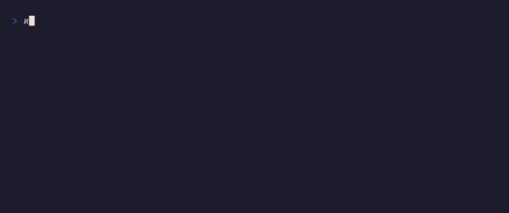

# `animate()`, `springStep()`, `SPRING_PRESETS`

Spring physics comparison (4 presets)



## Run

```sh
npx tsx examples/spring/main.ts
```

## Code

```typescript
import { initDefaultContext } from '@flyingrobots/bijou-node';
import { badge, kbd } from '@flyingrobots/bijou';
import {
  run, quit, type App, type KeyMsg,
  animate, vstack, SPRING_PRESETS,
} from '@flyingrobots/bijou-tui';

initDefaultContext();

const PRESETS = ['gentle', 'default', 'wobbly', 'stiff'] as const;
const WIDTH = 50;

interface Model {
  positions: Record<string, number>;
  running: boolean;
}

type Msg =
  | { type: 'frame'; preset: string; value: number }
  | { type: 'done' }
  | { type: 'go' }
  | { type: 'quit' };

function launchAll(from: number, to: number): ReturnType<typeof animate>[] {
  return PRESETS.map(preset =>
    animate({
      from,
      to,
      spring: preset,
      fps: 60,
      onFrame: (value: number) => ({ type: 'frame' as const, preset, value }),
      onComplete: () => ({ type: 'done' as const }),
    })
  );
}

const app: App<Model, Msg> = {
  init: () => {
    const positions: Record<string, number> = {};
    for (const p of PRESETS) positions[p] = 0;
    return [{ positions, running: true }, launchAll(0, WIDTH)];
  },

  update: (msg, model) => {
    if ('type' in msg && msg.type === 'key') {
      const k = msg as KeyMsg;
      if (k.key === 'q' || (k.ctrl && k.key === 'c')) return [model, [quit()]];
      if (k.key === 'space' && !model.running) {
        // Toggle direction
        const current = model.positions[PRESETS[0]] ?? 0;
        const target = current > WIDTH / 2 ? 0 : WIDTH;
        return [{ ...model, running: true }, launchAll(current, target)];
      }
    }

    if ('type' in msg && msg.type === 'frame') {
      return [{ ...model, positions: { ...model.positions, [msg.preset]: msg.value } }, []];
    }

    if ('type' in msg && msg.type === 'done') {
      return [{ ...model, running: false }, []];
    }

    return [model, []];
  },

  view: (model) => {
    const lines: string[] = ['', '  Spring Physics Comparison', ''];

    for (const preset of PRESETS) {
      const pos = Math.round(model.positions[preset] ?? 0);
      const bar = ' '.repeat(Math.max(0, pos)) + '\u2588';
      const label = preset.padEnd(9);
      lines.push(`  ${badge(label, { variant: 'primary' })} ${bar}`);
    }

    lines.push('');
    if (model.running) {
      lines.push('  animating...');
    } else {
      lines.push(`  ${kbd('Space')} bounce  ${kbd('q')} quit`);
    }
    lines.push('');

    return lines.join('\n');
  },
};

run(app);
```

[← Examples](../README.md)
