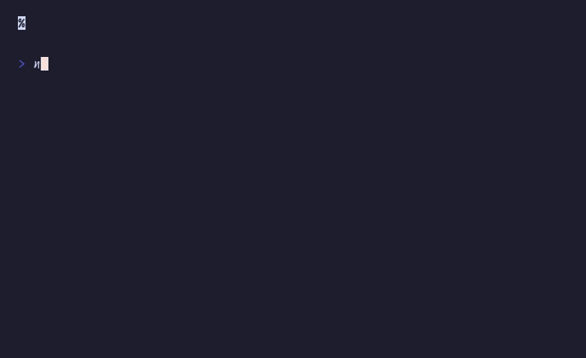

# `stopwatch`

Stopwatch with laps, start/stop/reset



## Run

```sh
npx tsx examples/stopwatch/main.ts
```

## Code

```typescript
import { initDefaultContext } from '@flyingrobots/bijou-node';
import { box, kbd, separator } from '@flyingrobots/bijou';
import { run, quit, tick, isKeyMsg, type App } from '@flyingrobots/bijou-tui';

initDefaultContext();

interface Model {
  elapsed: number;   // milliseconds
  running: boolean;
  laps: number[];    // lap times in ms
}

type Msg = { type: 'tick' } | { type: 'quit' };

const TICK_MS = 50;

function formatTime(ms: number): string {
  const mins = Math.floor(ms / 60000);
  const secs = Math.floor((ms % 60000) / 1000);
  const centis = Math.floor((ms % 1000) / 10);
  return `${String(mins).padStart(2, '0')}:${String(secs).padStart(2, '0')}.${String(centis).padStart(2, '0')}`;
}

const app: App<Model, Msg> = {
  init: () => [{ elapsed: 0, running: false, laps: [] }, []],

  update: (msg, model) => {
    if (isKeyMsg(msg)) {
      if (msg.key === 'q' || (msg.ctrl && msg.key === 'c')) return [model, [quit()]];

      if (msg.key === 'space') {
        // Toggle start/stop
        if (model.running) {
          return [{ ...model, running: false }, []];
        } else {
          return [{ ...model, running: true }, [tick(TICK_MS, { type: 'tick' })]];
        }
      }

      if (msg.key === 'l' && model.running) {
        return [{ ...model, laps: [...model.laps, model.elapsed] }, []];
      }

      if (msg.key === 'r' && !model.running) {
        return [{ elapsed: 0, running: false, laps: [] }, []];
      }
    }

    if ('type' in msg && msg.type === 'tick' && model.running) {
      return [
        { ...model, elapsed: model.elapsed + TICK_MS },
        [tick(TICK_MS, { type: 'tick' })],
      ];
    }

    return [model, []];
  },

  view: (model) => {
    const time = formatTime(model.elapsed);
    const status = model.running ? '  RUNNING' : model.elapsed > 0 ? '  PAUSED' : '';

    const lines: string[] = [
      '',
      box(`  ${time}${status}  `, { padding: { top: 0, bottom: 0, left: 2, right: 2 } }),
      '',
    ];

    if (model.laps.length > 0) {
      lines.push(separator({ label: 'laps', width: 40 }));
      for (let i = 0; i < model.laps.length; i++) {
        const lapTime = i === 0 ? model.laps[i] : model.laps[i] - model.laps[i - 1];
        lines.push(`  Lap ${i + 1}  ${formatTime(model.laps[i])}  (+${formatTime(lapTime)})`);
      }
      lines.push('');
    }

    lines.push(`  ${kbd('Space')} start/stop  ${kbd('l')} lap  ${kbd('r')} reset  ${kbd('q')} quit`);
    lines.push('');

    return lines.join('\n');
  },
};

run(app);
```

[← Examples](../README.md)
