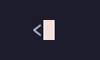

# `resolveTheme()`

Same components in all built-in themes



## Run

```sh
npx tsx examples/theme/main.ts
```

## Code

```typescript
import { createNodeContext } from '@flyingrobots/bijou-node';
import {
  box, headerBox, badge, alert, progressBar, separator,
  gradientText, PRESETS, setDefaultContext,
} from '@flyingrobots/bijou';
import { createBijou } from '@flyingrobots/bijou';
import { nodeRuntime } from '@flyingrobots/bijou-node';
import { nodeIO } from '@flyingrobots/bijou-node';
import { chalkStyle } from '@flyingrobots/bijou-node';

// Show the same components rendered in each built-in theme.

function renderTheme(themeName: string): void {
  // Set the theme via env and create a context
  process.env.BIJOU_THEME = themeName;
  const ctx = createBijou({
    runtime: nodeRuntime(),
    io: nodeIO(),
    style: chalkStyle(false),
  });

  const stops = ctx.theme.theme.gradient.brand;

  console.log(separator({ label: themeName, ctx }));
  console.log();
  console.log(gradientText(`  Theme: ${themeName}`, stops, { style: ctx.style }));
  console.log();
  console.log(box('Hello, bijou!', { ctx }));
  console.log();
  console.log([
    badge('SUCCESS', { variant: 'success', ctx }),
    badge('ERROR', { variant: 'error', ctx }),
    badge('WARNING', { variant: 'warning', ctx }),
    badge('INFO', { variant: 'info', ctx }),
    badge('MUTED', { variant: 'muted', ctx }),
  ].join(' '));
  console.log();
  console.log(alert('All systems operational.', { variant: 'success', ctx }));
  console.log();
  console.log(progressBar(75, { width: 40, showPercent: true, ctx }));
  console.log();
}

// Initialize a default context first
const defaultCtx = createNodeContext();
setDefaultContext(defaultCtx);

for (const name of Object.keys(PRESETS)) {
  renderTheme(name);
}
```

[← Examples](../README.md)
