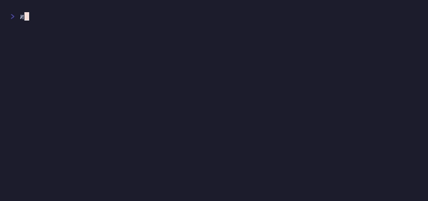

# `timeline()`, `animate()`, `sequence()`

Orchestrated GSAP-style animation



## Run

```sh
npx tsx examples/timeline-anim/main.ts
```

## Code

```typescript
import { initDefaultContext } from '@flyingrobots/bijou-node';
import { box, badge, progressBar, gradientText } from '@flyingrobots/bijou';
import {
  run, quit, tick, isKeyMsg, type App,
  animate, sequence, vstack, EASINGS,
} from '@flyingrobots/bijou-tui';

initDefaultContext();

interface Model {
  titleX: number;
  card1Opacity: number;
  card2Opacity: number;
  card3Opacity: number;
  barPercent: number;
  phase: 'animating' | 'done';
}

type Msg =
  | { type: 'title-x'; value: number }
  | { type: 'card1'; value: number }
  | { type: 'card2'; value: number }
  | { type: 'card3'; value: number }
  | { type: 'bar'; value: number }
  | { type: 'all-done' }
  | { type: 'quit' };

const app: App<Model, Msg> = {
  init: () => [
    { titleX: -30, card1Opacity: 0, card2Opacity: 0, card3Opacity: 0, barPercent: 0, phase: 'animating' },
    [
      // Orchestrated sequence: title slides in, then cards fade in, then bar fills
      sequence(
        animate({
          from: -30, to: 0,
          spring: 'wobbly',
          fps: 60,
          onFrame: (v: number) => ({ type: 'title-x', value: v }),
        }),
        animate({
          type: 'tween', from: 0, to: 1, duration: 300, ease: EASINGS.easeOut,
          fps: 30,
          onFrame: (v: number) => ({ type: 'card1', value: v }),
        }),
        animate({
          type: 'tween', from: 0, to: 1, duration: 300, ease: EASINGS.easeOut,
          fps: 30,
          onFrame: (v: number) => ({ type: 'card2', value: v }),
        }),
        animate({
          type: 'tween', from: 0, to: 1, duration: 300, ease: EASINGS.easeOut,
          fps: 30,
          onFrame: (v: number) => ({ type: 'card3', value: v }),
        }),
        animate({
          type: 'tween', from: 0, to: 100, duration: 800, ease: EASINGS.easeInOut,
          fps: 30,
          onFrame: (v: number) => ({ type: 'bar', value: v }),
          onComplete: () => ({ type: 'all-done' }),
        }),
      ),
    ],
  ],

  update: (msg, model) => {
    if (isKeyMsg(msg)) {
      if (msg.key === 'q' || (msg.ctrl && msg.key === 'c')) return [model, [quit()]];
    }

    switch (msg.type) {
      case 'title-x': return [{ ...model, titleX: msg.value }, []];
      case 'card1': return [{ ...model, card1Opacity: msg.value }, []];
      case 'card2': return [{ ...model, card2Opacity: msg.value }, []];
      case 'card3': return [{ ...model, card3Opacity: msg.value }, []];
      case 'bar': return [{ ...model, barPercent: msg.value }, []];
      case 'all-done': return [{ ...model, phase: 'done' }, [tick(3000, { type: 'quit' })]];
    }

    return [model, []];
  },

  view: (model) => {
    const lines: string[] = [];

    // Title with spring offset
    const indent = Math.max(0, Math.round(model.titleX + 4));
    lines.push('');
    lines.push(' '.repeat(indent) + '  Timeline Animation');
    lines.push('');

    // Cards fade in (use opacity to show/hide)
    const cards = [
      { opacity: model.card1Opacity, label: 'Build', variant: 'success' as const },
      { opacity: model.card2Opacity, label: 'Test', variant: 'info' as const },
      { opacity: model.card3Opacity, label: 'Deploy', variant: 'warning' as const },
    ];

    for (const card of cards) {
      if (card.opacity > 0.5) {
        lines.push(`    ${badge(card.label, { variant: card.variant })}`);
      } else {
        lines.push('');
      }
    }

    // Progress bar
    lines.push('');
    if (model.barPercent > 0) {
      lines.push(`    ${progressBar(Math.round(model.barPercent), { width: 40, showPercent: true })}`);
    }

    if (model.phase === 'done') {
      lines.push('');
      lines.push(`    ${badge('COMPLETE', { variant: 'success' })}  Sequence finished.`);
    }

    lines.push('');
    return lines.join('\n');
  },
};

run(app);
```

[← Examples](../README.md)
