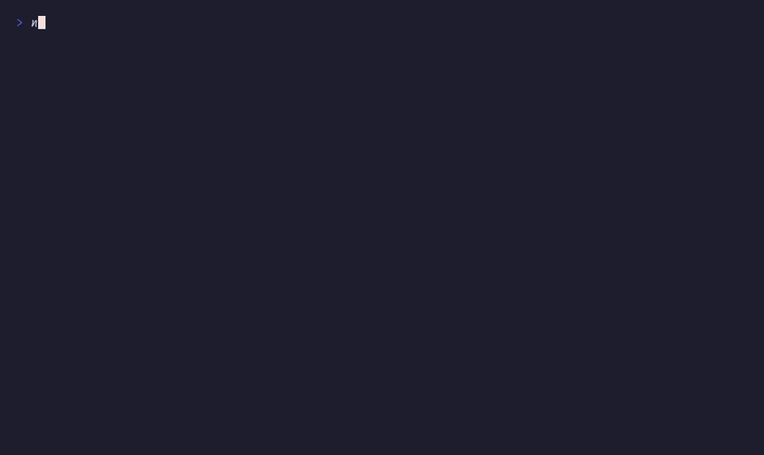

# `viewport()`, `scrollBy()`, `pageDown()`, etc.

Scrollable content pager



## Run

```sh
npx tsx examples/viewport/main.ts
```

## Code

```typescript
import { initDefaultContext } from '@flyingrobots/bijou-node';
import { kbd, separator } from '@flyingrobots/bijou';
import {
  run, quit, type App, type KeyMsg,
  viewport, createScrollState, scrollBy, pageDown, pageUp,
  scrollToTop, scrollToBottom, vstack,
} from '@flyingrobots/bijou-tui';

initDefaultContext();

const CONTENT = `MIT License

Copyright (c) 2026 Flying Robots

Permission is hereby granted, free of charge, to any person obtaining a copy
of this software and associated documentation files (the "Software"), to deal
in the Software without restriction, including without limitation the rights
to use, copy, modify, merge, publish, distribute, sublicense, and/or sell
copies of the Software, and to permit persons to whom the Software is
furnished to do so, subject to the following conditions:

The above copyright notice and this permission notice shall be included in all
copies or substantial portions of the Software.

THE SOFTWARE IS PROVIDED "AS IS", WITHOUT WARRANTY OF ANY KIND, EXPRESS OR
IMPLIED, INCLUDING BUT NOT LIMITED TO THE WARRANTIES OF MERCHANTABILITY,
FITNESS FOR A PARTICULAR PURPOSE AND NONINFRINGEMENT. IN NO EVENT SHALL THE
AUTHORS OR COPYRIGHT HOLDERS BE LIABLE FOR ANY CLAIM, DAMAGES OR OTHER
LIABILITY, WHETHER IN AN ACTION OF CONTRACT, TORT OR OTHERWISE, ARISING FROM,
OUT OF OR IN CONNECTION WITH THE SOFTWARE OR THE USE OR OTHER DEALINGS IN THE
SOFTWARE.

---

This is additional content to demonstrate scrolling.

bijou is a physics-powered TUI engine for TypeScript.

Features:
  - Zero-dependency core
  - Hexagonal architecture (ports & adapters)
  - Spring-based animations
  - Flexbox layout engine
  - Scrollable viewport with proportional scrollbar
  - Declarative keybinding manager
  - Graceful degradation across environments

The viewport component renders a window into a larger body of text,
with a proportional scrollbar on the right edge. Use j/k to scroll
line by line, or Page Up/Page Down for larger jumps.

Press q to quit.`;

const VIEWPORT_HEIGHT = 15;
const VIEWPORT_WIDTH = 72;

interface Model {
  scroll: ReturnType<typeof createScrollState>;
}

type Msg = { type: 'quit' };

const app: App<Model, Msg> = {
  init: () => [{ scroll: createScrollState(CONTENT, VIEWPORT_HEIGHT) }, []],

  update: (msg, model) => {
    if ('type' in msg && msg.type === 'key') {
      const k = msg as KeyMsg;
      if (k.key === 'q' || (k.ctrl && k.key === 'c')) return [model, [quit()]];

      let scroll = model.scroll;
      if (k.key === 'j' || k.key === 'down') scroll = scrollBy(scroll, 1);
      else if (k.key === 'k' || k.key === 'up') scroll = scrollBy(scroll, -1);
      else if (k.key === 'pagedown' || k.key === 'd') scroll = pageDown(scroll);
      else if (k.key === 'pageup' || k.key === 'u') scroll = pageUp(scroll);
      else if (k.key === 'g') scroll = scrollToTop(scroll);
      else if (k.key === 'G' || (k.shift && k.key === 'g')) scroll = scrollToBottom(scroll);

      return [{ scroll }, []];
    }
    return [model, []];
  },

  view: (model) => {
    const header = separator({ label: 'viewport', width: VIEWPORT_WIDTH });
    const body = viewport({
      width: VIEWPORT_WIDTH,
      height: VIEWPORT_HEIGHT,
      content: CONTENT,
      scrollY: model.scroll.y,
      showScrollbar: true,
    });
    const status = `  Line ${model.scroll.y + 1}/${model.scroll.totalLines}`;
    const help = `  ${kbd('j')}${kbd('k')} scroll  ${kbd('d')}${kbd('u')} page  ${kbd('g')}${kbd('G')} top/bottom  ${kbd('q')} quit`;

    return vstack('', header, body, status, help, '');
  },
};

run(app);
```
